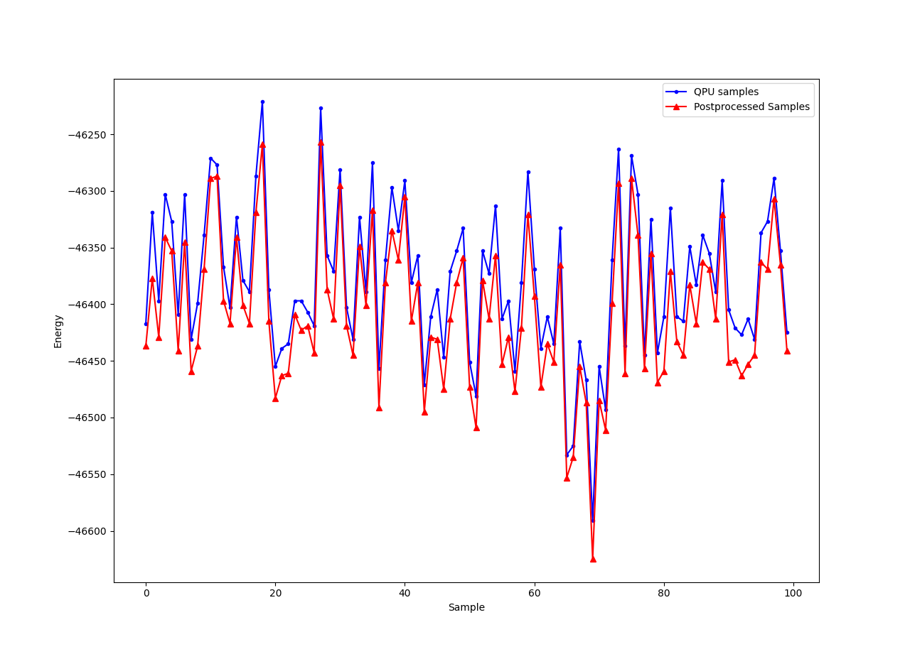

.. _qpu_example_pp_greedy:

===================================
Postprocessing with a Greedy Solver
===================================

This example uses explicit postprocessing to improve results returned
from a quantum computer.

Typically, Ocean tools do some minimal, implicit postprocessing; for
example, when you use
`embedding tools <https://docs.ocean.dwavesys.com/en/stable/docs_system/reference/embedding.html>`_
to map problem variables to qubits, *broken* :term:`chain`\ s (differing
states of the qubits representing a variable) may be resolved by majority
vote: Ocean sets the variable's value based on the state returned from
the majority of the qubits in the chain. You can often improve results,
at a low cost of classical processing time, by postprocessing.

:ref:`dwave-samplers <index_dwave_samplers>` provides an implementation of
a steepest-descent solver,  :class:`~greedy.sampler.SteepestDescentSolver`,
for binary quadratic models. This example runs this classical algorithm
initialized from QPU samples to find minima in the samples' neighbourhoods.

The purpose of this example is to illustrate the benefit of postprocessing
results from non-deterministic samplers such as quantum computers.

Example Requirements
====================

.. include:: ../shared/examples.rst
    :start-after: start_requirements
    :end-before: end_requirements

Solution Steps
==============

.. |workflow_section| replace:: :ref:`qpu_workflow`

.. include:: ../shared/examples.rst
    :start-after: start_standard_steps
    :end-before: end_standard_steps

This example adds an optional step of postprocessing the returned solution.

Formulate the Problem
=====================

This example uses a synthetic problem for illustrative purposes: for all
couplers of a QPU, it sets quadratic biases equal to random integers between
-5 to +5.

.. testcode::

    # Create a native Ising problem
    from dwave.system import DWaveSampler
    import numpy as np

    sampler = DWaveSampler()
    h = {v: 0.0 for v in sampler.nodelist}
    J = {tuple(c): np.random.choice(list(range(-5, 6))) for c in sampler.edgelist}

Solve the Problem and Run Postprocessing
========================================

Because the problem sets values of the Ising problem based on the qubits
and couplers of a selected QPU (a *native* problem), you can submit it directly
to that QPU without :term:`embedding`. The :class:`~dimod.SampleSet` returned
from the QPU is used to initialize :class:`~greedy.sampler.SteepestDescentSolver`:
for each sample, this classical solver runs its steepest-descent algorithm to
find the closest minima.

.. testcode::

    from dwave.samplers import SteepestDescentSolver

    solver_greedy = SteepestDescentSolver()

    sampleset_qpu = sampler.sample_ising(h, J, \
                                         num_reads=100, \
                                         answer_mode='raw', \
                                         label='SDK Examples - Postprocessing')
    # Postprocess
    sampleset_pp = solver_greedy.sample_ising(h, J, initial_states=sampleset_qpu)

You can graphically compare the results before and after the postprocessing.

.. note:: The next code requires `Matplotlib <https://matplotlib.org>`_\ .

>>> import matplotlib.pyplot as plt    # doctest: +SKIP
...
>>> plt.plot(list(range(100)), sampleset_qpu.record.energy, 'b.-',
...                            sampleset_pp.record.energy, 'r^-') # doctest: +SKIP
>>> plt.legend(['QPU samples', 'Postprocessed Samples'])          # doctest: +SKIP
>>> plt.xlabel("Sample")    # doctest: +SKIP
>>> plt.ylabel("Energy")    # doctest: +SKIP
>>> plt.show()              # doctest: +SKIP

The image below shows the result of one particular execution on an Advantage QPU.

   QPU samples before and after postprocessing with a steepest-descent solver.

For reference, this execution had the following median energies
before and after postprocessing, and for a running the classical solver directly on
the problem, in which case it uses random samples to initiate its local searches.

.. testcode::

    sampleset_greedy = solver_greedy.sample_ising(h, J, num_reads=100)

>>> print("Energies: \n\t
...        SteepestDescentSolver: {}\n\t
...        QPU samples: {}\n\t
...        Postprocessed: {}".format(
...        np.median(sampleset_greedy.record.energy),
...        np.median(sampleset_qpu.record.energy),
...        np.median(sampleset_pp.record.energy)))       # doctest: +SKIP
Energies:
        SteepestDescentSolver: -39834.0
        QPU samples: -46387.0
        Postprocessed: -46415.0
