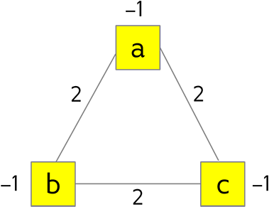
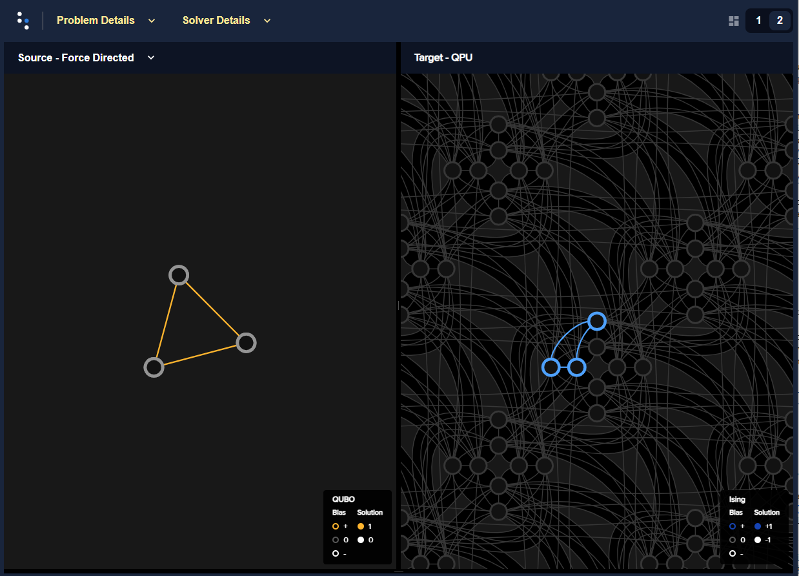
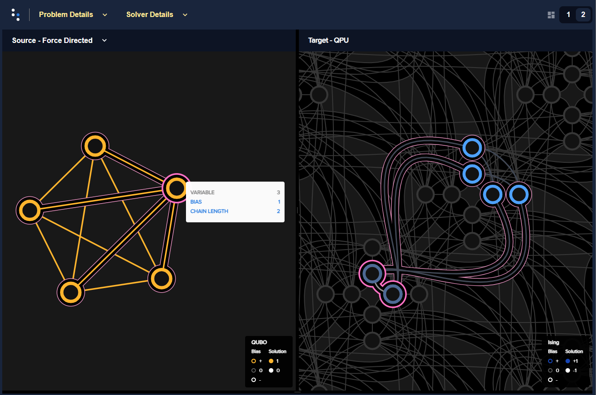

.. _qpu_example_sat_constrained:

=================================
SAT: Formulate, Embed, and Submit
=================================

The example of the :ref:`qpu_example_sat_unconstrained` section formulates an
:term:`objective function` for a simple :term:`SAT` problem. The |dwave_short|
quantum computer is also well suited to solving optimization problems with
binary variables. Real-world optimization problems often come with
:term:`constraint`\ s: conditions of the problem that any valid solution must
satisfy.

For example, when optimizing a traveling salesperson's route through a series
of cities, you need a constraint forcing the salesperson to be in exactly one
city at each stage of the trip: a solution that puts the salesperson in two or
more places at once is invalid.

.. figure:: ../_images/salesman.png
    :name: salesman
    :scale: 50 %
    :alt: Traveling salesman problem

    The traveling salesperson problem is an optimization problem that can be
    solved using exactly-one-true constraints. Map data |copy| 2017
    GeoBasis-DE/BKG (|copy| 2009), Google.

In fact, the example of the :ref:`qpu_example_sat_unconstrained` section is
actually also an example of a simple constraint, the equality (or XNOR)
constraint. The example of this section is slightly more complex. The
*exactly-one-true* constraint is the Boolean satisfiability problem of finding,
given a set of variables, when exactly one variable is TRUE (equals 1). This
example looks at an exactly-one-true constraint for three variables.

The problem-solving process is the same as described in the
:ref:`qpu_qubo_ising` section.

.. note:: Quantum samplers optimize objective functions that represent problems
    in formats that are *unconstrained* (e.g., QUBOs, or unconstrained binary
    optimization problems). As is shown in this section, any constraints in the
    original problem are represented as part of the objective function; this
    technique is known as :ref:`penalty models <concept_penalty>`.

    In addition, some of the
    `Leap service <https://cloud.dwavesys.com/leap/>`_'s quantum-classical
    hybrid solvers accept only unconstrained objective functions; for example,
    hybrid BQM solvers. Thus, for these solvers any constraints must be added
    to the objective function, typically as a penalty. However, some of the
    Leap service's hybrid solvers can handle constraints natively, as shown in
    the :ref:`opt_index_examples_beginner` examples. For more information, see
    the :ref:`opt_index_get_started` section.

.. _qpu_example_sat_constrained_formulation:

Formulating an Objective Function
=================================

For problems with a small number of binary variables (in this example three:
:math:`a`, :math:`b`, and :math:`c`), you can tabulate all the possible
permutations and identify the states when exactly one variable is 1 and the
other two are 0. You do so with a truth table:

========== ========== ========== ===================
:math:`a`  :math:`b`  :math:`c`  Exactly One is True
========== ========== ========== ===================
0          0          0          FALSE
1          0          0          TRUE
0          1          0          TRUE
1          1          0          FALSE
0          0          1          TRUE
1          0          1          FALSE
0          1          1          FALSE
1          1          1          FALSE
========== ========== ========== ===================

Notice that the three constraint-satisfying states in the truth table have in
common that the sum of variables equals :math:`1`, so you can express the
constraint mathematically as the equation,

.. math::

    a + b + c = 1.

As noted in the :ref:`qpu_qubo_ising` section, you can solve some equations by
minimization if you formulate an objective function that takes the square\ [#]_
of the subtraction of one side from another:

.. math::

    E(a,b,c) = (a + b + c - 1)^2.

.. [#]
    If you do not square, the minimum for
    :math:`\tilde{E}(a,b,c) = a + b + c - 1` is :math:`\tilde{E}(a=b=c=0) = -1`
    which is lower than for any of the three constraint-satisfying states, such
    as :math:`\tilde{E}(a=b=0;c=1)=0`.

Expanding the squared term---while remembering that for binary variables with
values 0 or 1 the square of a variable is itself, :math:`X^2 = X`---shows in
explicit form the objective function's quadratic and linear terms.

.. math::

    E(a,b,c) &= a^2 + ab + ac -a + ba + b^2 + bc -b + ca + cb + c^2
    - c - a - b - c +1 \\
    &= a^2 + b^2 + c^2 + 2ab + 2ac + 2bc - 2a - 2b - 2c + 1 \\
    &= 2ab + 2ac + 2bc - a - b - c + 1,

Notice that this objective formula matches the
:ref:`QUBO format <qpu_qubo_ising>` for three variables,

.. math::

        E_{qubo}(a_i, b_{i,j}; q_i) &= \sum_{i} a_i q_i +
        \sum_{i<j} b_{i,j} q_i q_j \\
        E_{qubo}(a_i, b_{i,j}; q_1, q_2, q_3) &= a_1 q_1 + a_2 q_2 + a_3 q_3 +
        b_{1,2} q_1 q_2 + b_{1,3} q_1 q_3 + b_{2,3} q_2 q_3 ,

where :math:`a_i=-1` and :math:`b_{i,j}=2`, with a difference of the :math:`+1`
term.\ [#]_

.. [#]
    A constant term in an objective function does not affect the solutions
    because it just increases or decreases energies (values of the objective)
    for all states by the same amount, preserving relative ordering.

Below, the truth table is shown with an additional column of the energy for
the objective function found above. The lowest energy states (best solutions)
are those that match the exactly-one-true constraint.

========== ========== ========== ==================== ==============
:math:`a`  :math:`b`  :math:`c`  Exactly One is True  Energy
========== ========== ========== ==================== ==============
0          0          0          FALSE                1
1          0          0          TRUE                 0
0          1          0          TRUE                 0
1          1          0          FALSE                1
0          0          1          TRUE                 0
1          0          1          FALSE                1
0          1          1          FALSE                1
1          1          1          FALSE                4
========== ========== ========== ==================== ==============

Clearly, a solver minimizing the objective function
:math:`2ab + 2ac + 2bc - a - b - c` can be expected to return solutions (values
of variables :math:`a, b, c`) that satisfy the original problem of an
*exactly-one-true* constraint.

As explained in the :ref:`qpu_example_sat_unconstrained` example, to solve a
QUBO with a |dwave_short| quantum computer, you must map (minor embed) it to the
QPU. That step is explained in detail in the next section.

Minor Embedding
===============

This section explains how the QUBO created in the previous section is
minor-embedded onto a QPU, in this case, an |dwave_5kq| QPU with its
:ref:`Pegasus <qpu_topologies>` graph.

|dwave_short| provides automatic minor-embedding tools, and if you are
submitting your problem to a
`Leap service <https://cloud.dwavesys.com/leap/>`_'s quantum-classical hybrid
solver, the solver handles all interactions with the QPU.

The QUBO developed for an exactly-one-true constraint with three variables in
the previous section, :math:`2ab + 2ac + 2bc - a - b - c`, can be represented by
the triangular graph shown in :numref:`Figure %s <triangle>`.

    Triangular graph for an exactly-one-true constraint with its biased nodes
    and edges.

As explained in the :ref:`qpu_embedding_intro` section, nodes that represent the
objective function's variables such as :math:`a` are mapped to :term:`qubits` on
the QPU while edges that represent the objective function's quadratic terms such
as :math:`ab` are mapped to :term:`couplers`.

:numref:`Figure %s <triangleEmbeddingPegasus>` shows such a mapping, between
the graph representing the QUBO on the left and one particular minor-embedding
on the right. (Rerunning Ocean software's :ref:`minorminer <index_minorminer>`
tool, which produced this minor embedding, generates embeddings to various
qubits across the QPU; the particular qubit numbers noted here are unimportant.)

*   Nodes :math:`a, b, c` (grey circles in the left-hand panel) map to qubits
    :math:`1812, 5169, 1827` (blue circles in the right-hand panel),
    respectively.
*   Edges :math:`ab, bc, ca` (orange lines in the left-hand panel) map to
    couplers :math:`[1812, 5619], [1827, 5619], [1812, 1827]` (blue lines in
    the right-hand panel), respectively.

    Embedding in the Pegasus topology for an exactly-one-true constraint
    rendered by Ocean software's problem inspector. The original QUBO is
    represented on the left and its embedded representation on the right.

But, as the :ref:`qpu_topologies` section notes, |dwave_short| QPUs are not
fully connected. For larger graphs than the example above, you may not always be
able to map each node to a qubit and find connecting couplers to represent all
edges.

How are more complex graphs minor-embedded? Minor embedding often requires
:term:`chains`.

.. _qpu_example_sat_constrained_chains:

Chains
------

To understand how chaining qubits overcomes the problem of sparse connectivity,
consider minor embedding the triangular graph of :numref:`Figure %s <triangle>`
into two target graphs, one sparser than the other.
:numref:`Figure %s <chainTriangleFourQubits>` shows two such embeddings:
the triangular graph is mapped on the left to a fully-connected graph of four
nodes (called a :math:`K_4` complete graph) and on the right to a sparser graph,
also of four nodes.
For the left-hand embedding, you can choose any mapping between :math:`a, b, c`
and :math:`0, 1, 2, 3`; here :math:`a, b, c` are mapped to :math:`2, 0, 1`,
respectively. For the right-hand embedding, however, no choice of just three
target nodes suffices. The same :math:`2, 0, 1` target nodes leaves :math:`b`
disconnected from :math:`c`. Chaining target nodes :math:`0` and :math:`3` to
represent node :math:`b` makes use of both the connection between :math:`0` to
:math:`2` and the connection between :math:`3` and :math:`1`.

.. figure:: ../_images/chain_triangle_four_qubits.png
    :name: chainTriangleFourQubits
    :alt: Embedding a triangular graph into the Chimera graph by using a chain.

    Embedding a triangular graph into fully connected and sparse four-node
    graphs.

On QPUs, chaining qubits is accomplished by setting the strength of their
connecting couplers negative enough to strongly correlate the states of the
chained qubits; if at the end of most anneals these qubits are in the same
classical state, representing the same binary value in the objective function,
they are in effect acting as a single variable.

As an example, consider a fully-connected graph of five nodes (a :math:`K_5`
graph). Such a graph cannot be mapped to five qubits of an |dwave_5kq| QPU
because the Pegasus graph's connectivity is too sparse. Instead, some nodes are
mapped to chains of qubits.

:numref:`Figure %s <embeddingK5Pegasus>` shows a :math:`K_5` graph of some
arbitrary problem on the left and a minor-embedding on the right. Here,
variable 3 (highlighted magenta) is represented by a two-qubit chain of qubits
4408 and 2437 (highlighted magenta) while variables 0, 1, 2, and 4 are
represented by single qubits 4333, 4348, 2497, and 2512.

    Embedding for a :math:`K_5` fully connected graph in the Pegasus topology
    rendered by Ocean software's problem inspector. The original QUBO is
    represented on the left and its embedded representation, with its two-qubit
    chain, on the right.

.. _qpu_example_sat_constrained_manual_embedding:

Manual Minor-Embedding
----------------------

Manually minor-embedding a problem is typically undertaken only for problems
that have either very few variables or a repetitive structure that maps to unit
cells of the QPU topology---in both cases you work with one or more unit cells.
Additionally, you might make minor adjustments to an embedding found by
software. You are unlikely to manually embed a random 100-variable problem.

This section provides an example of how you can calculate the biases needed for
minor-embedding on a simple problem. Ocean software's minor-embedding tools,
such as :ref:`minorminer <index_minorminer>`, do similar calculations.

.. dropdown:: Example of Manual Minor Embedding

    This example returns to the QUBO developed for an exactly-one-true
    constraint with three variables in the
    :ref:`qpu_example_sat_constrained_formulation` section above,
    :math:`2ab + 2ac + 2bc - a - b - c`, as represented by the triangular graph
    shown in :numref:`Figure %s <triangle>` above. For simplicity, it is
    minor-embedded into a :ref:`Chimera <topology_intro_chimera>` graph.

    To see how a triangular graph fits on the Chimera graph, take a closer look
    at the unit cell in the Chimera topology shown in
    :numref:`Figure %s <unit-cell>`. Notice that there is no way to make a
    triangular closed loop of three qubits and their connecting edges. However,
    you can make a closed loop of four qubits and their edges using, say,
    qubits 0, 1, 4, and 5.

    .. figure:: ../_images/unit-cell.png
        :name: unit-cell
        :scale: 35 %
        :alt: Unit cell

        Unit cell in the Chimera topology.

    As in the example of the :ref:`qpu_example_sat_constrained_chains` section,
    make a three-node loop of a four-node structure by representing a single
    variable with a chain of two qubits. :numref:`Figure %s <embedding-gs>`
    shows a chaining of qubit 0 and qubit 5 to represent variable :math:`b`.

    .. figure:: ../_images/embedding.png
        :name: embedding-gs
        :alt: Embedding a triangular graph into the Chimera graph by using a
            chain.

        Embedding a triangular graph into the Chimera graph by using a chain.

    Here, for qubits 0 and 5 to represent variable :math:`b`, the strength of
    the coupler between them must be set negative enough.

    The mapping of :numref:`Figure %s <embedding-gs>` is straightforward for
    non-chained qubits with biases being the linear coefficients of the
    objective function and coupler strengths the quadratic coefficients:

    *   Variables :math:`a` and :math:`c`, represented by qubits 4 and 1,
        respectively, have bias :math:`-1`.
    *   Edges :math:`(a,b), (a,c), (b,c)`, represented by couplers
        :math:`(0,4), (1,4), (1,5)`, respectively, have strengths :math:`2`.

    To chain qubits 0 and 5 to represent variable :math:`b` requires that you
    add a strong negative coupling strength between them. This coupling has no
    corresponding quadratic coefficient in the objective function, so other
    biases must be adjusted to compensate. This process requires a few steps:

    1.  Evenly split the bias of :math:`-1` from variable :math:`b` between
        qubits 0 and 5. Now the bias of these two qubits is :math:`-0.5`.
    2.  Choose a strong negative coupling strength for the chain between qubits
        0 and 5. This example arbitrarily chooses :math:`-3` because it is
        stronger than the values for couplers around it.\ [#]_
    3.  Compensate for the :math:`-3` added in step 2 by adding
        :math:`-\frac{-3}{2} = 1.5` to each bias of qubits 0 and 5. Now the
        biases for these qubits are :math:`1`.

    .. [#]

        Setting chain strengths is further discussed in the
        :ref:`qpu_basic_config_chain_strength` section.

    The resulting minor-embedding values are shown in the tables below.

    .. table:: Minor Embedding: Linear Coefficients.

        +------+-------------+--------+------+
        |      | Linear      |        |      |
        | Node | Coefficient | Qubits | Bias |
        +======+=============+========+======+
        | a    | -1          | 4      | -1   |
        +------+-------------+--------+------+
        | b    | -1          | 0, 5   | 1, 1 |
        +------+-------------+--------+------+
        | c    | -1          | 1      | -1   |
        +------+-------------+--------+------+

    .. table:: Minor Embedding: Quadratic Coefficients.

        +-------+-------------+---------+----------+
        |       | Quadratic   |         |          |
        | Edge  | Coefficient | Coupler | Strength |
        +=======+=============+=========+==========+
        | (a,b) | 2           | (0,4)   | 2        |
        +-------+-------------+---------+----------+
        | (a,c) | 2           | (1,4)   | 2        |
        +-------+-------------+---------+----------+
        | (b,c) | 2           | (1,5)   | 2        |
        +-------+-------------+---------+----------+
        |       |             | (0,5)   | -3       |
        +-------+-------------+---------+----------+

    You program the quantum computer to solve this problem by configuring the
    QPU's qubits with these biases and its couplers with these strengths.

    .. note::

        When using the QUBO formulation, as in this example, you compensate for
        the quadratic term a chain introduces into the objective by adding its
        negative, divided by the number of qubits in the chain, to the biases
        of the chain's qubits; this compensation is not used for the Ising
        formulation, where the the energies of valid solutions are simply
        shifted by the introduced quadratic term.

    The solutions returned from the QPU express the states of qubits at the end
    of each anneal. To translate qubit states to values of the problem
    variables, the solutions must be *unembedded*.

    For example, consider the following results for 1000 anneals:

    +----------+---+---+---+---+----------------+
    |  Energy  |      Qubit    | Occurrences    |
    +          +---+---+---+---+                +
    |          | 0 | 5 | 4 | 1 |                |
    +==========+===+===+===+===+================+
    | -1.0     | 0 | 0 | 1 | 0 |  206           |
    +----------+---+---+---+---+----------------+
    | -1.0     | 0 | 0 | 0 | 1 |  526           |
    +----------+---+---+---+---+----------------+
    | -1.0     | 1 | 1 | 0 | 0 |  267           |
    +----------+---+---+---+---+----------------+
    | 0.0      | 1 | 1 | 0 | 1 |  1             |
    +----------+---+---+---+---+----------------+

    For this simple example with its single chain, unembedding consists of
    mapping qubits 4, 1 to variables :math:`a, c`, and qubits 0, 5 to variable
    :math:`b`. The results in the table above unembedded to:

    *   Row 1: Solution :math:`(a, b, c) = (1, 0, 0)` with energy :math:`-1`
        was found 206 times.
    *   Row 2: Solution :math:`(a, b, c) = (0, 0, 1)` with energy :math:`-1`
        was found 526 times.
    *   Row 3: Solution :math:`(a, b, c) = (0, 1, 0)` with energy :math:`-1`
        was found 267 times.

    One anneal ended with result :math:`(a, b, c) = (0, 1, 1)`, which is not a
    correct solution, and has a higher energy than the correct solutions.

    .. note::

        Notice also that the energy of the valid solutions, the ground-state
        energy, is :math:`-1`, not the zero calculated in the
        :ref:`qpu_example_sat_constrained_formulation` section's truth table.
        This is because of the constant :math:`+1` dropped from the objective
        function, :math:`E(a,b,c) = 2ab + 2ac + 2bc - a - b - c + 1`.

The next section shows how you submit a problem to a |dwave_short| quantum
computer.

Submitting
==========

This section uses |dwave_short|'s open-source :ref:`Ocean SDK <index_ocean_sdk>`
to submit the exactly-one-true problem formulated in the previous subsections.

Before you can submit a problem to |dwave_short| solvers, you must have an
account and an API token; visit the
`Leap service <https://cloud.dwavesys.com/leap/>`_ to sign up for an account
and get your token.

.. note::
    To run the following steps yourself requires prior configuration of some
    requisite information for problem submission through SAPI. If you have
    installed the Ocean SDK or are using a :ref:`supported IDE <leap_dev_env>`,
    this is typically done as a first step.

For more information, including on Ocean SDK installation instructions and
detailed examples, see the
:ref:`Ocean software documentation <index_ocean_sdk>`.

The Ocean software can heuristically find minor-embeddings for your QUBO or
Ising objective functions, as shown here.

First, select a quantum computer. Ocean software provides
:meth:`feature-based solver selection <dwave.cloud.client.Client.get_solvers>`,
enabling you to select a quantum computer that meets your requirements on its
number of qubits, topology, particular features, etc. This example, uses the
default.

.. testcode::

    from dwave.system import DWaveSampler, EmbeddingComposite
    sampler = EmbeddingComposite(DWaveSampler())

Set values of the QUBO and submit to the selected QPU.

.. testcode::

    linear = {('a', 'a'): -1, ('b', 'b'): -1, ('c', 'c'): -1}
    quadratic = {('a', 'b'): 2, ('b', 'c'): 2, ('a', 'c'): 2}
    Q = {**linear, **quadratic}

    sampleset = sampler.sample_qubo(Q, num_reads=5000)

Below are results from running this problem on a |dwave_5kq| system:

>>> print(sampleset)                        # doctest: +SKIP
   a  b  c energy num_oc. chain_b.
0  0  0  1   -1.0    1591     0.0
1  1  0  0   -1.0    2040     0.0
2  0  1  0   -1.0    1365     0.0
3  1  0  1    0.0       2     0.0
4  1  1  0    0.0       1     0.0
5  0  1  1    0.0       1     0.0
['BINARY', 6 rows, 5000 samples, 3 variables]

In the results of 5000 reads, you see that the lowest energy occurs for the
three valid solutions to the problem.

