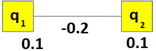

.. _qpu_example_unconstrained_sat:

============================================
Unconstrained Example: Solving a SAT Problem
============================================

The |dwave_short| quantum computer is well suited to solving optimization and
`satisfiability (SAT) <https://en.wikipedia.org/wiki/Boolean_satisfiability_problem>`_
problems with binary variables. Binary variables can only have values 0 (NO, or
FALSE) or 1 (YES, or TRUE), which are easily mapped to qubit final states of
"spin up" (:math:`\uparrow`) and "spin down" (:math:`\downarrow`). These are
problems that answer questions such as, "Should a package be shipped on this
truck?"

This section uses an example problem of a very simple SAT:

.. math::

    (x_1 \vee \overline{x}_2 ) \wedge (\overline{x}_1 \vee x_2)

This is a 2-SAT in *conjunctive normal form* (CNF), meaning it has disjunctions
of two Boolean variables (:math:`X` OR :math:`Y`) joined by an AND, and is
satisfied only if all its disjunctions are satisfied; that is, to make the SAT
true, you must find and assign appropriate values of 0 or 1 to all its
variables.

You can easily verify that the solution to this example problem is
:math:`x_1=x_2`. For example:

.. math::

    x_1 = x_2=0 \quad \rightarrow \qquad (0 \vee 1) \wedge (1 \vee 0) = 1
    \wedge 1 = 1 \\
    x_1 {=} 0 \ \ne \ x2 {=} 1 \quad \rightarrow \qquad (0 \vee 0)
    \wedge (1 \vee 1) = 0 \wedge 1 = 0

.. note::
    The simple program below poses and solves this SAT in an alternative
    format familiar to anyone with some programming experience:

    >>> import itertools
    ...
    >>> def sat(x1, x2):
    ...     return (x1 or not x2) and (not x1 or x2)
    >>> for (x1, x2) in list(itertools.product([False, True], repeat=2)):
    ...     print(x1, x2, '-->', sat(x1, x2))
    False False --> True
    False True --> False
    True False --> False
    True True --> True

Formulating an Objective Function
=================================

The first step in solving problems on QPU solvers is to formulate an
:term:`objective function`. Such an objective, usually in :term:`Ising` or
:term:`QUBO` format, represents good solutions to the problem as low-energy
states of the system. This subsection shows an intuitive approach to formulating
such a QUBO.

For two variables, the :ref:`qpu_qubo_ising_qubo` formulation reduces to,

.. math::

    \text{E}(a_i, b_{i,j}; q_i) = a_1 q_1 + a_2 q_2 + b_{1,2} q_1 q_2,

where :math:`a_1` and :math:`a_2`, the linear coefficients, and :math:`b_{1,2}`,
the quadratic coefficient, are the programmable parameters you need to set so
that :math:`q_1` and :math:`q_2`, the binary variables (values of
:math:`\{0,1\}`), represent solutions to your problem when the objective
function is minimized. For this simple example, it's easy to work out values
for these parameters.

A two-variable QUBO can have four possible values of its variables,
representing four possible states of the system, as shown here:

======== ============= ===================
State    :math:`q_1`   :math:`q_2`
======== ============= ===================
1        0             0
2        0             1
3        1             0
4        1             1
======== ============= ===================

For this objective function to represent the example SAT (i.e., to reformulate
the original problem as an objective function that can be solved through
minimization by a |dwave_short| solver), it needs to favor states 1 and 4 over
states 2 and 3. You do this by *penalizing* states that do not satisfy the SAT;
that is, by formulating the objective such that those states have higher
energy.

First, notice that when :math:`q_1` and :math:`q_2` both equal
0---state 1---the value of the objective function is 0 for any value of the
coefficients. To favor this state, you should formulate the objective function
to have a global minimum energy (the :term:`ground state` energy of the system)
equal to 0. Doing so ensures that state 1 is a good solution.

Second, you penalize states 2 and 3 relative to state 1. One way to do this is
to set both :math:`a_1` and :math:`a_2` to a positive value such as 0.1\ [#]_.
Doing so sets the the value of the objective function for those two states to
:math:`0.1`.

.. [#]
    Why not :math:`0.2` or :math:`0.5`? The :ref:`qpu_basic_config` section
    looks at scaling the problem values.

Third, you also favor state 4 along with state 1. Given that for state 4, your
objective function so far is

.. math::

    \text{E}(a_i=0.1, b_{i,j}; q_i=1) = 0.2 + b_{1,2},

you can do this by setting the quadratic coefficient :math:`b_{1,2} = -0.2`.
The resulting objective function is

.. math::

    \text{E}(q_i) = 0.1 q_1 + 0.1 q_2 - 0.2 q_1 q_2,

and the table of possible outcomes is shown below.

======== ============= =================== =======================
State    :math:`q_1`   :math:`q_2`         Objective Value
======== ============= =================== =======================
1        0             0                   0
2        0             1                   0.1
3        1             0                   0.1
4        1             1                   0
======== ============= =================== =======================

Minor Embedding
===============

You can represent this QUBO as the graph shown in
:numref:`Figure %s <obj-xnor>`.

    Objective function for the example SAT problem.

This graph can be mapped to any two QPU qubits with a shared coupler. The
:ref:`getting_started_formulation_constraints` chapter shows minor-embedding
for less simple graphs.

Solving on a QPU
================

To program a |dwave_short| quantum computer is to set values for its qubit
biases and coupler strengths. Configuring qubit biases of :math:`0.1` for the
two qubits found by minor embedding and a strength of :math:`-0.2` for the
shared coupler, and submitting to a QPU solver with a request for many
anneals---also known as *samples* or *reads*---should strongly favor ground
states 1 and 4 over excited states 2 and 3 in the returned results.

Below are results from running this problem on a |dwave_5kq| system with the
number of requested anneals set to 10,000:

======= ====== ================
Energy  State  Occurrences
======= ====== ================
0       1      4646
0       4      5349
0.1     2      2
0.1     3      3
======= ====== ================

If you run this problem again, you can expect the numbers associated with
energy 0 to vary, but to stay near the number 5,000 (50% of the samples). In a
perfect system, neither of the ground states should dominant over the other in
a statistical sense; however, each run yields different numbers.

Notice that calling the QPU enough times occasionally returns excited states 2
and 3.

The next example shows how, exactly, you submit your problem
to a |dwave_short| solver.

