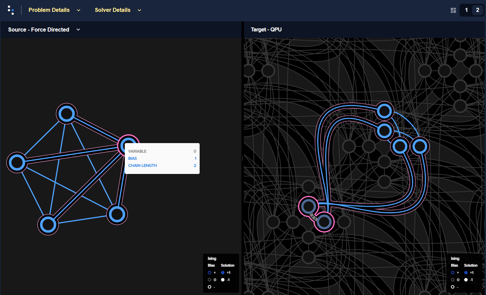
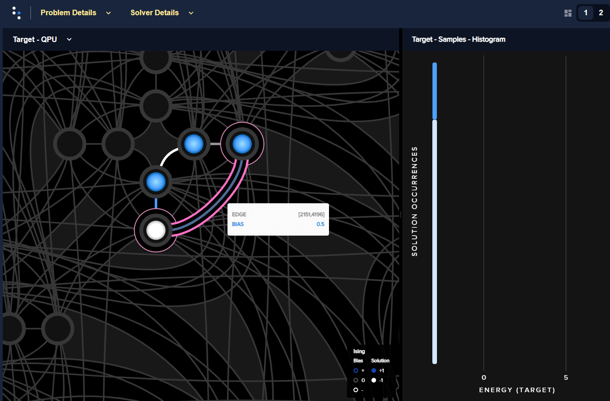
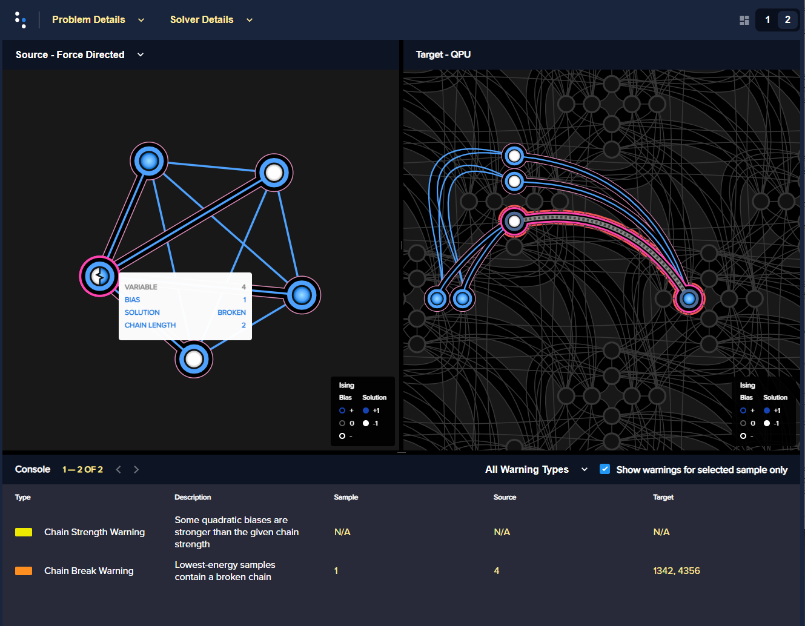

.. _qpu_problem_inspector:

===========================
Inspecting Minor-Embeddings
===========================

The :ref:`dwave-inspector <index_inspector>` tool provides a graphic interface
for examining |dwave_short| quantum computers' problems and answers. As
described in the :ref:`Ocean workflow <ocean_workflow>` section, the
|dwave_short| quantum computer solves problems formulated as binary quadratic
models (:term:`BQM`) that are mapped to its qubits in a process called
:term:`minor-embedding`. Because the way you choose to minor-embed a problem
(the mapping and related parameters) affects solution quality, it can be helpful
to see it.

For example, minor-embedding a problem represented by a :math:`K_5`
fully-connected graph into an Advantage quantum processing unit (:term:`QPU`),
with its :term:`Pegasus` topology, requires representing one of the five
variables with a :term:`chain` of two physical qubits:

    Five-variable :math:`K_5` fully-connected problem, shown on the left as a
    graph, is embedded in six qubits on an Advantage, shown on the right against
    the Pegasus topology. Variable ``0``, highlighted in dark magenta, is
    represented by two qubits, ``1975`` and ``4840`` in this particular
    embedding.

The problem inspector shows you your chains at a glance: you see lengths, any
breakages, and physical layout.

.. _qpu_problem_inspector_usage:

Usage and Examples
==================

Import the problem inspector to enable it\ [#]_ to hook into your problem
submissions.

.. [#]
    Importing the problem inspector activates for the session the capture of
    data such as problems sent to the QPU and returned responses, relevant
    details of minor-embedding, and warnings. The recommended workflow is to
    import it at the start of your coding session as is typical for Python
    packages (it is also possible, but less convenient, to specify in the
    submission that data such as embedding be returned with the response).

The following examples demonstrate the use of the :func:`~dwave.inspector.show`
method to visualize an :ref:`embedded problem <qpu_problem_inspector_embedded>`
and a :ref:`logical problem <qpu_problem_inspector_logical>` in your default
browser.

.. _qpu_problem_inspector_embedded:

Inspecting an Embedded Problem
------------------------------

This example shows the canonical usage: samples representing physical qubits on
a QPU.

>>> from dwave.system import DWaveSampler
>>> import dwave.inspector
...
>>> # Get solver
>>> sampler = DWaveSampler(solver=dict(topology__type='pegasus'))
...
>>> # Define a problem (actual qubits depend on the selected QPU's working graph)
>>> h = {}
>>> J = {(2136, 4181): -1, (2136, 2151): -0.5, (2151, 4196): 0.5, (4181, 4196): 1}
>>> all(edge in sampler.edgelist for edge in J)     # doctest: +SKIP
True
>>> # Sample
>>> response = sampler.sample_ising(h, J, num_reads=100)    # doctest: +SKIP
...
>>> # Inspect
>>> dwave.inspector.show(response)   # doctest: +SKIP

    Edge values between qubits ``2136``, ``4181``, ``2151``, and ``4196``, and
    the selected solution, are shown by color on the left; a histogram, on the
    right, shows the energies of returned samples.

.. _qpu_problem_inspector_logical:

Inspecting a Logical Problem
----------------------------

This example visualizes a problem specified logically and then automatically
minor-embedded by Ocean's :class:`~dwave.system.composites.EmbeddingComposite`
class. For illustrative purposes it sets a weak\ [#]_ ``chain_strength`` to show
broken chains.

Define a problem and sample it for solutions:

>>> from dwave.system import DWaveSampler, EmbeddingComposite
>>> import dimod
>>> import dwave.inspector
...
>>> # Define problem
>>> bqm = dimod.generators.doped(1, 5)
>>> bqm.add_linear_from({v: 1 for v in bqm.variables})
...
>>> # Get sampler
>>> sampler = EmbeddingComposite(DWaveSampler())
...
>>> # Sample with low chain strength
>>> sampleset = sampler.sample(bqm, num_reads=1000, chain_strength=1)
...
>>> # Inspect the problem::
>>> dwave.inspector.show(sampleset)     # doctest: +SKIP

    The logical problem, on the left, shows that the value for variable ``4`` is
    based on a broken chain; the embedded problem, on the right, highlights the
    broken chain (its two qubits have different values) in bold red.

.. [#]
    The default chain strength was about 3 for similar problems.
