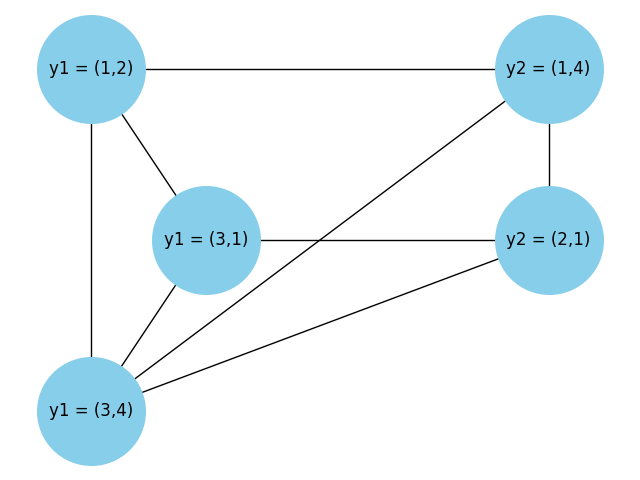
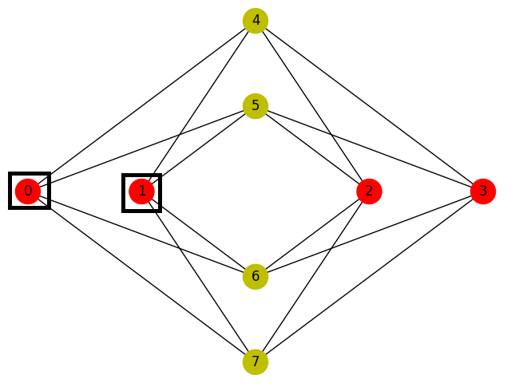
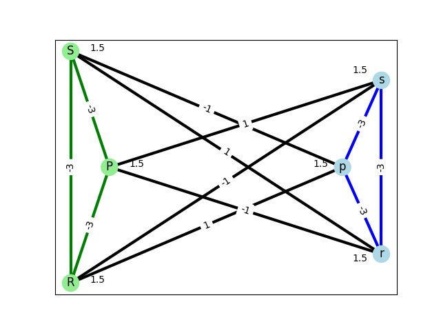
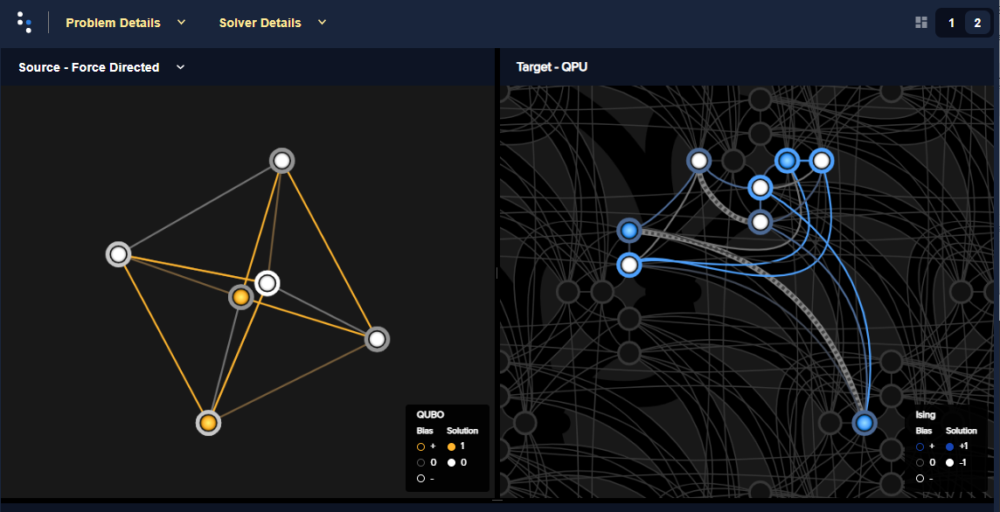
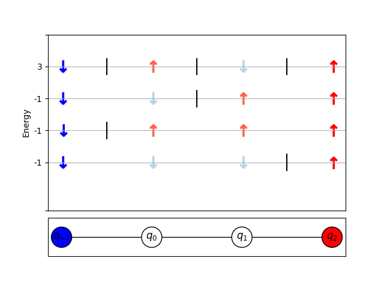
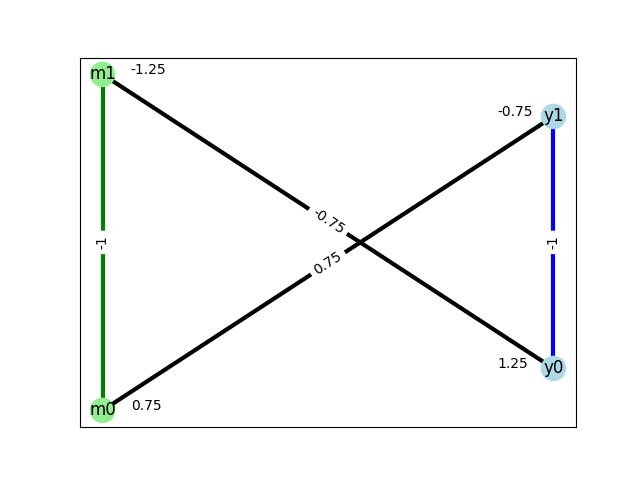
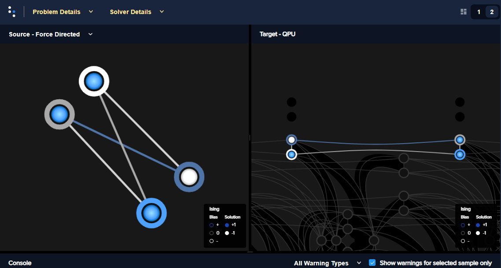

.. _qpu_reformulating:

=======================
Reformulating a Problem
=======================

As explained in the |doc_getting_started|_ guide, the **first** step of solving
your problem is to state it; for example:

*   How do I assign a color to each region of a map such that any two regions
    sharing a border have different colors? (This is the well-known
    :ref:`cb_probs_map_coloring` problem.)
*   How do I find values of the binary variables that satisfy the
    `satisfiability (SAT) <https://en.wikipedia.org/wiki/Boolean_satisfiability_problem>`_
    problem,

    .. math::
        (x_1 \vee \overline{x}_2 ) \wedge (\overline{x}_1 \vee x_2)
*   How do I place routers in a communications network for maximum coverage of
    all network nodes? (This can be posed as the
    `vertex cover <https://en.wikipedia.org/wiki/Vertex_cover>`_ problem as
    done in the :std:doc:`vertex cover <oceandocs:examples/min_vertex>`
    example.)

The **next** step is to map the problem to an
:ref:`objective function <sysdocs:concepts_objectives>`, usually in
:ref:`Ising <sysdocs:obj_ising>` or :ref:`QUBO <sysdocs:obj_qubo>`
formats\ [#]_ if you are submitting to a quantum sampler, known as the quantum
computer's *native formulations*. Low-energy states of the objective function
represent good solutions to the problem.

.. [#]
    These belong to the category of
    :std:doc:`binary quadratic models (BQM) <oceandocs:concepts/bqm>`.
    The quantum-classical
    :std:doc:`hybrid solvers <oceandocs:concepts/hybrid>` available in the Leap
    service can accept problems formulated at a higher level of abstraction; for
    example,
    :std:doc:`discrete quadratic models (DQM) <oceandocs:concepts/dqm>`,
    where variables can have more than two possible cases.

This chapter presents some
:ref:`general guidance <cb_tech_general_guidance>`, the following reformulation
techniques\ [#]_, and some extended reformulation examples:

.. [#]
    Some of these techniques are intended for use with quantum samplers and the
    hybrid solvers in the Leap service that accept binary quadratic models; for
    example, if you are using a constrained quadratic model
    (:std:doc:`CQM <oceandocs:concepts/cqm>`) solver, you can state
    constraints in a straightforward manner.

.. contents::
    :depth: 1
    :local:
    :backlinks: none

The sections also provide references to examples and literature to guide
understanding and implementation.

.. note::
    Some sections describe the techniques in formal mathematical formulation,
    which might be abstract, but those typically also provide simple examples
    for users looking for practical guidance.

.. _cb_tech_general_guidance:

General Guidance on Reformulating
=================================

While the `Leap service <https://cloud.dwavesys.com/leap/>`_'s
:std:doc:`hybrid solvers <oceandocs:concepts/hybrid>` can accept arbitrarily
structured BQMs of huge size, problems submitted directly to the quantum
computer must be formulated to be compatible with the constraints of the
physical system and as robust as possible to its control errors\ [#]_.

.. [#]
    The |doc_processor|_ guide provides details on the physical system and its
    integrated control errors (ICE).

Reformulation Steps
-------------------

.. include:: ../shared/formulation.rst
    :start-after: start_general_steps
    :end-before: end_general_steps

Reformulation Considerations
----------------------------

You can frequently reformulate a problem in a variety of ways, some of which
may be more performant than others. This section notes some general
considerations and common practices for successful reformulation.

Compare Approaches
~~~~~~~~~~~~~~~~~~

Start with the simplest possible method you can find to formulate your problem
in the supported format of your chosen solver (BQM, CQM, etc). If your
formulation does not provide good solutions (with the solver properly
:ref:`configured <cb_qpu>`), consider alternative formulations. A formulation
that has the disadvantage of increasing the number of variables might compensate
by being more amenable to :ref:`minor-embedding <cb_embedding>`; a different
formulation might produce a smaller range of bias values.

Variable Proliferation
~~~~~~~~~~~~~~~~~~~~~~

Some reformulations may create very large numbers of variables; for example,
integer-to-binary-variables conversion typically does. There may be alternative
formulations that require fewer variables.

For example, although you may be able to derive a penalty by
:ref:`conversion to a linear equality <cb_techs_constraints_linear_equality>`
or by
:ref:`conversion to a linear inequality <cb_techs_constraints_linear_inequality>`,
it may produce better solutions to apply the techniques of the
:ref:`non-linear constraints <cb_techs_constraints_nonlinear>` section to
construct a penalty with fewer ancillary variables. [#]_

.. [#]
    Equality constraints, :math:`\sum_{i=0}^N a_ix_i == b`, standardly
    formulated as BQMs,

    .. math::

        \text{E}(\vc x) = \left( \sum_{i=0}^N a_ix_i - b \right)^2

    require about :math:`N^2/2` biases. For 20 such constraints, you need about
    200 biases; for 2000 constraints you already need about two million biases.

For a particular example, consider the constraint :math:`x_1\vee x_2\vee x_3`
(which is useful for solving a 3-SAT). You can express it as the inequality
:math:`x_1+x_2+x_3\ge 1` and convert it to the penalty function

.. math::
    (x_1+x_2+x_3 - 1 -a_1-2a_2)^2.

The two ancillary variables :math:`a_1` and :math:`a_2` are necessary to
represent the possible slack values 0, 1, and 2. However, the penalty function

.. math::
    -3+ (\overline{x}_1+\overline{x}_2+\overline{x}_3)(1+a) +
    \overline{a} + x_1 x_2 + x_2 x_3 + x_3 x_1

represents the same constraint using a single ancillary variable.\ [#]_

.. [#]
    In fact, this representation is commonly used to reduce 3-SAT to MAX-2-SAT.

Section :ref:`cb_qpu_anneal_gap` shows a small example of two formulations of
the same penalty function with different numbers of ancillary variables.

Scale of Biases
~~~~~~~~~~~~~~~

The scale of biases---the difference between the smallest and largest biases
in your BQM---can affect performance. For QPU solvers, your BQM's linear and
quadratic coefficients translate in the end to qubit and coupler biases; if your
problem results in, for example, a smallest bias of :math:`h_{12}=-0.032` and a
largest bias of :math:`h_{36}=3405`, when these biases are scaled down to the
range of biases supported on the QPU, :ref:`sysdocs:property_h_range`, the small
bias is effectively zero.

Pay attention to the scale of biases in your selected formulation---sometimes
small formulation changes can produce much lower scales.

Section :ref:`cb_qpu_problem_scale` shows a code example.

Clearer Representations
~~~~~~~~~~~~~~~~~~~~~~~

Some formulations might be more intuitive than others, and therefore easier to
use and debug. For example, you can lower-bound a QUBO by rewriting without any
negative coefficients, using negative literals instead: express contributions
such as :math:`-3 x_1 x_2` as either

.. math::

    -3+3\overline{x}_2+3\overline{x}_1 x_2 \qquad \text{or} \qquad
    -3+3\overline{x}_1+3x_1\overline{x}_2.

The alternative expressions clearly show a lower bound of :math:`-3`.

Similarly, some formulations allow you to make the value of the energy
meaningful. This can be useful in understanding the quality of solutions.

Further Information
-------------------

*   [dwave1]_ provides step-by-step guidance and exercises for modeling small
    problems using BQMs.
*   [Kar2017]_ presents an approach for encoding integer variables into binary
    ones for use in representing unconstrained integer quadratic programming
    problems in QUBO format.

.. _cb_tech_available_algorithms:

Algorithms Implemented in Ocean Software
========================================

Some problem categories are common enough that you can find existing
implementations of the reformulation.

Example: Graph Problems
-----------------------

Ocean software provides algorithms for many known graph problems.

This example demonstrates a problem of finding the largest group of friends who
all know each other in a social setting.  It states the problem as the graph
problem `maximum clique <https://en.wikipedia.org/wiki/Clique_problem>`_.
Instead of working out the mathematical mapping to a BQM yourself, you can
use the :func:`dwave_networkx.clique_number` function.

>>> import networkx as nx
>>> import dwave_networkx as dnx
>>> import dimod
...
>>> # Create an illustration graph
>>> G = nx.caveman_graph(2, 4)
>>> dnx.algorithms.clique.clique_number(G, dimod.ExactSolver())
4

Example: Constraints
--------------------

Ocean software provides generic quadratic-model generators.

This example shows how you can use a
:std:doc:`dimod <oceandocs:docs_dimod/sdk_index>` BQM generator for a problem
that includes a constraint :math:`n \choose k`, which requires that exactly
:math:`k` of :math:`n` variables be selected. The
:func:`dimod.generators.combinations` function builds a BQM that is minimized
when exactly :math:`k` of its variables equal 1.

>>> import dimod
...
>>> bqm_4_2 = dimod.generators.combinations(['x1', 'x2', 'x3', 'x4'], 2)

Adding the :code:`bqm_4_2` BQM to a problem BQM with variables
:code:`x1, x2, x3, x4`, with a suitable weight (see
`penalty method <https://en.wikipedia.org/wiki/Penalty_method>`_) makes it
probable that exactly two of the four variables are 1 in returned solutions.

>>> print(dimod.ExactSolver().sample(bqm_4_2).first)     # doctest: +SKIP
Sample(sample={'x1': 1, 'x2': 1, 'x3': 0, 'x4': 0}, energy=0.0, num_occurrences=1)

Further Information
-------------------

*   See the :std:doc:`Ocean software documentation <oceandocs:index>` for
    available BQM-generating functionality.

.. _cb_techs_native_formats:

Native QPU Formulations: Ising and QUBO
=======================================

You may be able to formulate some problems directly as binary quadratic models,
as shown in the examples of the |doc_getting_started|_ guide.

.. sidebar:: Reminder: Ising and QUBO formulations

    The |dwave_short| QPU can be viewed as a heuristic that minimizes Ising
    objective functions using a physically realized version of quantum
    annealing.

    In Ising formulation, given a problem of :math:`N` variables
    corresponding to physical Ising spins, :math:`\vc s=[s_1,...,s_N]`, and a
    configuration of :math:`h_i` local fields and :math:`J_{i,j}` couplings
    between spins, the QPU (in its solution spin values) minimizes the objective
    function

    .. math::

        \begin{array}{lll} 
        E(\vc{s} | \vc{h}, \vc{J}) = & & \\
        \sum_{i=1}^N h_i s_i & & \\
        + \sum_{i<j}^N J_{i,j} s_i s_j  & &
        \end{array}

    It is straightforward to translate between Ising and QUBO representations.
    In QUBO formulation, :math:`N` binary variables are represented as an
    upper-diagonal matrix :math:`\vc{Q}`, where diagonal terms are the linear
    coefficients and the nonzero off-diagonal terms are the quadratic
    coefficients. The objective function to minimize is

    .. math::

        E(\vc{x}| \vc{Q}) &=  \sum_{i\le j}^N x_i Q_{i,j} x_j

        &=  \ip{\vc{x}}{\vc{Q}\vc{x}}

For many small problems---or large problems amenable to being broken into small
parts---you can use truth tables to construct a BQM. For many others, the
original mathematical formulation can simply be mapped to Ising or QUBO format.
Others might enable formulation through known elements such as Boolean logic or
simple penalty models.

Example: Truth-Table Formulation
--------------------------------

As shown in the |doc_getting_started|_ guide, you can formulate a QUBO in the
following steps:

a.  Tabulate all the problem's possible states in a
    `truth table <https://en.wikipedia.org/wiki/Truth_table>`_.
#.  Penalize undesirable states with higher energies.
#.  Set QUBO coefficients that result in the selected energies for each state.

This example uses a truth table to formulate the NOT constraint,
:math:`v_2 = \neg v_1`. A penalty (energy gap) of 1 is chosen.

:numref:`Table %s <TruthTableFormulateQUBONot>` shows all four possible states
of :math:`v_1, v_2` in columns two and three, whether the state is feasible for
constraint :math:`v_2 = \neg v_1` in column four, and a relative penalty of 1
for the infeasible states in the rightmost column.

.. table:: Truth Table to Formulate a QUBO for NOT constraint
    :name: TruthTableFormulateQUBONot

    ======== ============= ============ ============================== =======
    State    :math:`v_1`   :math:`v_2`  :math:`v_2 = \overline{v_1}` ? Penalty
    ======== ============= ============ ============================== =======
    1        0             0            No                             p
    2        0             1            Yes                            p-1
    3        1             0            Yes                            p-1
    4        1             1            No                             p
    ======== ============= ============ ============================== =======

Substituting the values of the table's variables for variables :math:`q_1, q_2`
in the two-variable QUBO model,

.. math::

    E(a_i, b_{i,j}; q_i) = a_1 q_1 + a_2 q_2 + b_{1,2} q_1 q_2,

and the desired penalty for the resulting energy produces for the four rows of
the table these four equalities:

.. math::

    \text{State 1:} \qquad a_1 0 + a_2 0 + b_{1,2} 00 &= p \\
    \text{State 2:} \qquad a_1 0 + a_2 1 + b_{1,2} 0 1 &= p-1 \\
    \text{State 3:} \qquad a_1 1 + a_2 0 + b_{1,2} 1 0 &= p-1 \\
    \text{State 4:} \qquad a_1 1 + a_2 1 + b_{1,2} 1 1 &= p

Giving the following four equations with four variables:

.. math::

    0 &= p \\
    a_2 &= p-1 \\
    a_1 &= p-1 \\
    a_1 + a_2 + b_{1,2}  &= p

Solving these equations by simple substitution gives
:math:`E(q_1, q_2) = -q_1 - q_2 +2 q_1 q_2`, which is equivalent to the QUBO
given in :numref:`Table %s <logicalTable>` of the :ref:`cb_techs_boolean_ops`
section, with an offset of 1 (this formulation has a ground-state energy of -1
versus the other formulation's ground-state energy of 0).

Example: Formulation by Similarity
----------------------------------

Problems formulated as either a
`maximum independent set (MIS) <https://en.wikipedia.org/wiki/Maximal_independent_set>`_,
which seeks the largest subset of vertices of graph :math:`G=(V,E)` that have no
common edge, or a `maximum cut <https://en.wikipedia.org/wiki/Maximum_cut>`_,
which seeks a subset of vertices that maximizes the number of edges between the
subset and remaining vertices, have a noticeable similarity to the Ising format.

In MIS formulation, the objective function is:

.. math::

    \text{MIS:} \qquad
        \text{E}(\vc x) = - \sum_{i\in V} x_i +
        \sum_{(i,j)\in E} M_{i,j} x_i x_{j}.

Clearly this formulation is similar to Ising with local fields :math:`h_i=-1`
and only positive coupling strengths :math:`J_{i,j}` (represented by penalties
:math:`M_{i,j} > 1`).

You can formulate such problems as BQMs yourself but Ocean software's
:std:doc:`dwave_networkx <oceandocs:docs_dnx/sdk_index>` package provides
functions for these graph problems and more.

Example: Formulation with Boolean Logic
---------------------------------------

The technique of formulating problems with Boolean operations is very versatile:
modern computing is built on Boolean gates, the scope of addressable problems is
immense.

To express a constraint that variable :math:`z` should be 1 if either or both of
variables :math:`x1` or :math:`x2` are one, you can use an OR gate. Ocean
software's :std:doc:`dimod <oceandocs:docs_dimod/sdk_index>` package provides
functionality for creating BQMs from Boolean logic:

>>> from dimod.generators import or_gate
>>> from dimod import ExactSolver
...
>>> # Create an OR constraint
>>> bqm_or = or_gate('x1', 'x2', 'z')
>>> # View best solutions
>>> print(ExactSolver().sample(bqm_or).lowest(atol=0.7))
  x1 x2  z energy num_oc.
0  0  0  0    0.0       1
1  0  1  1    0.0       1
2  1  1  1    0.0       1
3  1  0  1    0.0       1
['BINARY', 4 rows, 4 samples, 3 variables]

The lowest-energy solutions are all feasible solutions for the constraint.

The `factoring example <https://github.com/dwave-examples/factoring-notebook>`_
expresses the constraints of a CSP with Boolean logic. The approach used in that
example is to express :math:`P=ab` as a CSP with a binary multiplication
circuit.

Section :ref:`cb_techs_boolean_ops` below shows QUBO formulation for a number of
common Boolean operators.

Ising or QUBO?
--------------

Some problems are better formulated as QUBOs, some as Ising models. The maximum
independent set of the `Example: Formulation by Similarity`_ section clearly
maps well to an Ising formulation, for example, as does the structural-imbalance
problem solved in
`structural-imbalance example <https://github.com/dwave-examples/structural-imbalance-notebook>`_.

Consider both when mapping a problem and compare ease of formulation and later
solution quality.

You can use the simple arithmetic mapping, :math:`\vc{s}=2\vc{x}-\vc{1}`, where
:math:`\vc{1}` is the vector all of whose components are 1, to translate between
these native formulations:

.. math::

    \ip{\vc{x}}{\vc{Q}\vc{x}} = \frac14 \ip{\vc{1}}{\vc{Q}\vc{1}} +
    \ip{\overbrace{\vc{Q}\vc{1}/2}^{\vc{h}}}{\vc{s}} +
    \ip{\vc{s}}{\overbrace{(\vc{Q}/4)}^{\vc{J}}\vc{s}}

Thus,

.. math::

    E(\vc{x}|\vc{Q}) = \ip{\vc{1}}{\vc{Q}\vc{1}}
    + E(\vc{s}|\vc{Q}\vc{1}/2, \vc{Q}/4).

Example
-------

The :ref:`cb_techs_example_map` section develops an objective function, in QUBO
formulation,

.. math::

    \text{E}(a_i, b_{i,j}; q_i) = -q_B -q_G + 2q_B q_G,

where :math:`q_B` is a variable representing blue and :math:`q_G` green.

You can view this Ising formulation using the inverse of the
:math:`\vc{s}=2\vc{x}-\vc{1}` Ising-to-QUBO conversion. For this objective
function, the variables are

.. math::

    \vc{x} = \begin{bmatrix} q_B \\ q_G \end{bmatrix} \qquad
    \vc{s} = \begin{bmatrix} s_B \\ s_G \end{bmatrix}

The inverse conversion in scalar form, :math:`q_i=\frac{s_i+1}{2}`, is a simple
mathematical manipulation of :math:`s_i=2x_i-1`, where the QUBO variables in
scalar form are :math:`x_1,x_2=q_B,q_G`. Substituting in the objective function
yields

.. math::

    \text{E}(h_i, j_{i,j}; s_i) &= -\frac{s_B+1}{2} -\frac{s_G+1}{2}
    + 2 \frac{s_B+1}{2} \frac{s_G+1}{2}

    &= \frac{1}{2}(s_Bs_G-1).

Ocean software can automate such conversions for you:

>>> import dimod
...
>>> dimod.qubo_to_ising({('qb', 'qb'): -1, ('qg', 'qg'): -1, ('qb', 'qg'): 2})
({'qb': 0.0, 'qg': 0.0}, {('qb', 'qg'): 0.5}, -0.5)

:numref:`Table %s <IsingEquivalentQUBO>` shows the two formulations' identical
energy functions, with minimum levels for the valid states of a single selected
color, either blue (:math:`0,1` in a QUBO or :math:`-1,1` in an Ising model) or
green (:math:`1,0` or :math:`1,-1`).

.. table:: Ising Equivalent of QUBO
    :name: IsingEquivalentQUBO

    =========================  =========================  ========
    :math:`\mathbf{q_B,q_G}`   :math:`\mathbf{s_B,s_G}`   :math:`\mathbf{\text{E}(a_i, b_{i,j}; q_i)=\text{E}(h_i, j_{i,j}; s_i)}`
    =========================  =========================  ========
    :math:`0,0`                :math:`-1,-1`              :math:`0`
    :math:`0,1`                :math:`-1,1`               :math:`-1`
    :math:`1,0`                :math:`1,-1`               :math:`-1`
    :math:`1,1`                :math:`1,1`                :math:`0`
    =========================  =========================  ========

For example, the state :math:`q_B,q_G=0,1` of the second row is represented by
the QUBO penalty function,

.. math::

    \text{E}(a_i, b_{i,j}; q_i) &= -q_B -q_G + 2q_B q_G,

    &= -0 - 1 +2 \times 0 \times 1

    &= -1

while the equivalent state :math:`s_B,s_G=-1,1` of that same row is represented
by the Ising penalty function,

.. math::

    \text{E}(h_i, j_{i,j}; s_i) &= \frac{1}{2}(s_Bs_G-1)

    &= \frac{1}{2}(-1 \times 1 -1) = \frac{-2}{2}

    &= -1

with the same resulting penalty.

Note that the constant :math:`-\frac{1}{2}` in the Ising formulation above,
which does not affect the relative energies, does not map into the formulation
used to configure the |dwave_short| system, and is discarded.

Further Information
-------------------

*   [Bar1982]_ shows that Ising and QUBO problems are NP-hard.
*   [Ber1999]_ discusses a broad tractable subclass of Ising problems in the
    context of rounding algorithms.
*   [Bru1967]_ provides a history of the Lenz-Ising model and its uses.
*   [Cou2009]_ and [Sch2009]_ discuss particular cases of tractable Ising
    problems.
*   [Koc2004]_ and related papers show that QUBOs are an effective
    representation for modeling and solving a variety of discrete optimization
    problems.
*   [Kol2004]_ characterizes binary-variables energy functions that can be
    minimized by graph cuts.
*   [Luc2013]_ and [Lod2020]_ describe Ising formulations of many NP problems.

.. _cb_techs_weighted_max2sat:

Weighted MAX-2-SAT
==================

The
`SAT problem <https://en.wikipedia.org/wiki/Boolean_satisfiability_problem>`_
problem is to decide whether the literals in its clauses can be assigned values
that satisfy all the clauses; i.e., produce a value of :math:`1`. In CNF, the
SAT is satisfied only if all its clauses are satisfied.

.. sidebar:: SAT Terminology

    *   *Literal* is a Boolean variable such as :math:`x_i` and
        :math:`\overline{x_i}`.
    *   *Clause* is a disjunction of literals such as
        :math:`x_i \vee \overline{x_j}`.
    *   *conjunctive normal form (CNF)* conjoins clauses by the AND operator;
        i.e., (clause 1) :math:`\wedge` (clause 2).

The
:ref:`Simple Satisfiability (SAT) Example <sysdocs:getting_started_formulation_minimal>`
of the |doc_getting_started|_ guide demonstrated an intuitive formulation of a
small SAT as a BQM. This section provides a more methodological approach.

A 2-SAT has :math:`m` clauses of 2 literals each. A MAX-2-SAT is the problem of
assigning values that maximize the number of satisfied clauses (an optimization
problem; a second version is to decide whether some specified number of clauses
can be satisfied). Weighted MAX-SAT assigns each clause a positive weight so the
violation of clause :math:`c` incurs a cost :math:`w_c` and the problem is to
maximize the weight of satisfied clauses

.. math::

    \text{MAX-2-SAT:} \qquad
    \underbrace{(\ell_{c1,1} \vee \ell_{c1,2} ; w_{c1})}_{\text{clause 1}}
    \wedge \underbrace{(\ell_{c2,1} \vee \ell_{c2,2} ; 
    w_{c2})}_{\text{clause 2}}
    \wedge ...
    \wedge \underbrace{(\ell_{cm,1} \vee \ell_{cm,2} ;
    w_{cm})}_{\text{clause m}}

where :math:`\ell_{ci,1}` and :math:`\ell_{ci,2}` are the two literals of clause
:math:`ci`, and :math:`w_{ci}` is its weight.

To reformulate a MAX-2-SAT problem as a QUBO, note that (1) maximizing the
weight of satisfied clauses is equivalent to *minimizing* the weight of
*unsatisfied* clauses, and (2) by De Morgan's laws,
:math:`\overline{x_i \vee x_j} = \overline{x_i} \wedge \overline{x_j}`.\ [#]_
This means that the general weighted MAX-2-SAT problem can be written as a
*posiform* (in the context of machine learning problems, a polynomial expression
that conjoins AND clauses with OR operations) that minimizes the weight of
unsatisfied clauses:

.. math::
    \min_{\vc{x}} \sum_c w_c \overline{\ell}_{c,1} \overline{\ell}_{c,2}.

.. [#]
    For an intuitive understanding, verify with a truth table that clause
    :math:`x_1 \vee \overline{x}_2` is unsatisfied if
    :math:`\overline{x}_1 \wedge x_2` is true, and this conjunction is
    equivalent to the product of Boolean variables :math:`\overline{x}_1 x_2`.
    If weighted clause :math:`(x_1\vee \overline{x}_2; 3)` is unsatisfied a cost
    of 3 is incurred, thus the penalty representing the clause is
    :math:`3 \overline{x}_1 x_2`.

Example: Converting a Three-Variable MAX-2-SAT to a QUBO
--------------------------------------------------------

Consider the following weighted MAX-2-SAT on three variables, :math:`x_1,x_2,x_3`,
with weights :math:`w_{c1}=3, w_{c2}=1, w_{c1}=4`, which maximizes the number of
satisfied clauses on,

.. math::

    \underbrace{(x_1\vee \overline{x}_2; 3)}_{\text{clause 1}}
    \wedge \underbrace{(x_3;1)}_{\text{clause 2}}
    \wedge \underbrace{(\overline{x}_3 \vee x_2;4)}_{\text{clause 3}}.

Obtain the QUBO representation using these steps:

1.  Formulate as a posiform (using
    :math:`\overline{x_i \vee x_j} = \overline{x_i} \wedge \overline{x_j}`
    and minimizing the weight of unsatisfied clauses as explained above):

.. math::

    \min_{\vc{x}} \left\{
    \underbrace{3(\overline{x_1} \wedge x_2)}_{\text{clause 1}} +
    \underbrace{1(\overline{x_3})}_{\text{clause 2}} +
    \underbrace{4(x_3 \wedge \overline{x_2})}_{\text{clause 3}} \right\}
    = \min_{\vc{x}} \left\{3\overline{x_1} x_2
    +\overline{x_3}+4x_3 \overline{x_2}\right\}.

2. Write negated literals :math:`\overline{x_i}` as :math:`(1-x_i)`:

.. math::

    \min_{\vc{x}} \left\{3(1-x_1) x_2+(1-x_3)+4x_3 (1-x_2)\right\}

    = \min_{\vc{x}} \left\{3x_2 -3x_1x_2 +1 - x_3 + 4x_3 - 4x_2x_3 \right\}

    = \min_{\vc{x}} \left\{1 + 3x_2 + 3x_3 -3x_1x_2 - 4x_2x_3 \right\}

In this last expression, the example weighted MAX-2-SAT has been reformulated as
a QUBO in scalar notation,

.. math::

    \text{E}_{qubo}(a_i, b_{i,j}; x_i) = \sum_{i} a_i x_i +
        \sum_{i<j} b_{i,j} x_i x_j,

where :math:`a_1=0, a_2=3, a_3=3` are the linear coefficients and
:math:`b_{1,2}=-3, b_{2,3}=-4` the quadratic coefficients.

Further Information
-------------------

*   [Bon2007]_ generalizes the resolution rule for satisfiability
    to weighted MAX-SAT, which enables the simplification of some
    weighted MAX-2-SAT problems.
*   [Coo1971]_ and [Lev1973]_ identify satisfiability as the first NP-complete
    problem. (Finding a satisfiable assignment or proving that there is no
    satisfying assignment for 2-SAT can be done in polynomial time. However,
    3-SAT which allows clauses of up to 3 literals is NP hard and there are
    problem instances which cannot be solved in polynomial time.)
*   [Wat2006]_ discusses the average-case complexity of the MAX-2SAT problem.

.. _cb_techs_higher_order:

Non-Quadratic (Higher-Degree) Polynomials
=========================================

To reduce problems with interactions between more than pairs of variables to a
QUBO, introduce and minimize over ancillary variables.

A good procedure is to select the pair of variables that is most common amongst
all terms with more than pairwise interactions, and replace it with an ancillary
variable in all those terms. Repeat until no more terms of 3 or more variables
remain. Note that subsequent iterations may involve products of ancillary
variables if these ancillary pairs are the most common amongst the terms.

An interaction involving 4 or more variables can be reduced to pairwise by
sequentially introducing new variables and reducing the degree of the
interaction by 1 at each step.

Below are two techniques you can use. Ocean software can automate such reduction
for you:

>>> import dimod
...
>>> cubic = {('x',): -1, ('y',): 1, ('z',): 1.5, ('x', 'y'): -1, ('x', 'y', 'z'): -2}
>>> print(dimod.make_quadratic(cubic, 5, dimod.BINARY))        # doctest: +SKIP
BinaryQuadraticModel({x: -1.0, y: 1.0, z: 1.5, z*x: 15.0},
{('x', 'y'): -1, ('x', 'z'): 5.0, ('x', 'z*x'): -10.0, ('y', 'z*x'): -2,
('z', 'z*x'): -10.0}, 0.0, 'BINARY')

Polynomial Reduction by Minimum Selection
-----------------------------------------

To reformulate a non-quadratic (higher-degree) polynomial to Ising/QUBO,
substitute terms in the form of :math:`axyz`, where :math:`a` is a real number,
with one of the following quadratic terms:\ [#]_

.. math::

    axyz = aw ( x+y+z -2) \quad a<0

    axyz = a \left\{ w ( x+y+z -1) + (xy+yz+zx) - (x+y+z) +1 \right\} \quad a>0

.. [#]
    It is easy to verify, for example, that the equality for the negative
    coefficient, :math:`a<0`\ , holds. The term :math:`( x+y+z -2)` is positive
    and non-zero  only for :math:`x,y,z=1,1,1`, so multiplying by negative
    :math:`a` yields the only negative value of :math:`w ( x+y+z -2)`, which is
    preserved for :math:`w=1`. All other states of :math:`x,y,z` result in
    :math:`( x+y+z -2) \le 0`, so multiplied by :math:`a<0` yield zero or
    positive values, which are minimized to zero by :math:`w=0`.

This technique of reduction by minimum selection exploits the identity,

.. math::

    xyz = \max_w \left\{ w ( x+y+z -2) \right\}

where :math:`x,y,z` are binary variables in some pseudo-binary function being
minimized and :math:`w` is the ancillary binary variable introduced to
substitute quadratic terms for cubic terms.

:numref:`Table %s <minimumSelectionReduction>` shows that the cubic and
quadratic formulations are identical. In this table, column
:math:`\mathbf{x,y,z}` is all possible states of the :math:`xyz` term and column
:math:`\mathbf{xyz}` is the corresponding values of the :math:`xyz` term; column
:math:`\mathbf{x+y+z-2}` is an intermediate calculation, the right side of the
equality without the ancillary variable and before maximization, shown for
clarity; and column :math:`\mathbf{\max_w\left\{w(x+y+z-2)\right\}}` is the
final result of calculating the right side of the equality.

.. table:: Minimum Selection Reduction.
    :name: minimumSelectionReduction

    =======================  =====================  ========================  ===
    :math:`\mathbf{x,y,z}`   :math:`\mathbf{xyz}`   :math:`\mathbf{x+y+z-2}`  :math:`\mathbf{\max_w\left\{w(x+y+z-2)\right\}}`
    =======================  =====================  ========================  ===
    :math:`0,0,0`            :math:`0`              :math:`-2`                :math:`0|_{w=0}`
    :math:`0,0,1`            :math:`0`              :math:`-1`                :math:`0|_{w=0}`
    :math:`0,1,0`            :math:`0`              :math:`-1`                :math:`0|_{w=0}`
    :math:`0,1,1`            :math:`0`              :math:`0`                 :math:`0|_{w=0,1}`
    :math:`1,0,0`            :math:`0`              :math:`-1`                :math:`0|_{w=0}`
    :math:`1,0,1`            :math:`0`              :math:`0`                 :math:`0|_{w=0,1}`
    :math:`1,1,0`            :math:`0`              :math:`0`                 :math:`0|_{w=0,1}`
    :math:`1,1,1`            :math:`1`              :math:`1`                 :math:`1|_{w=1}`
    =======================  =====================  ========================  ===

Example
~~~~~~~

This simple example solves higher-order polynomial :math:`-x +2y +3z +xy -2xyz`
in two ways: first, using an Ocean software, higher-order solver; second, using
a quadratic solver on the reduced form.

>>> import dimod
...
>>> hubo = {('x', 'x'): -1, ('y', 'y'): 2, ('z', 'z'): 3, ('x', 'y'): 1,
...         ('x', 'y', 'z'): -2}
>>> qubo = {('x', 'x'): -1, ('y', 'y'): 2, ('z', 'z'): 3, ('w', 'w'): 4,
...         ('x', 'y'): 1, ('w', 'x'): -2, ('w', 'y'): -2, ('w', 'z'): -2}
>>> print(dimod.ExactPolySolver().sample_hubo(hubo).first)
Sample(sample={'x': 1, 'y': 0, 'z': 0}, energy=-1.0, num_occurrences=1)
>>> print(dimod.ExactSolver().sample_qubo(qubo).first)
Sample(sample={'w': 0, 'x': 1, 'y': 0, 'z': 0}, energy=-1.0, num_occurrences=1)

Polynomial Reduction by Substitution
------------------------------------

To reformulate a non-quadratic polynomial to Ising/QUBO, use this substitution
to reduce a triplet interaction to pairwise,

.. math::
    x_1 x_2 x_3 = \min_z \bigl\{ z x_3 + M P(x_1,x_2;z) \bigr\},

where :math:`M>1` is a penalty weight and :math:`P` is some penalty function
that has lowest value when :math:`z = x_1 x_2`. This reformulation is
quadratic---the lefthand term, :math:`z x_3`, multiplies two variables,
:math:`z` and :math:`x_3`, and the righthand term, :math:`P(x_1,x_2;z)` is a
quadratic penalty function---and has lowest values for configurations of
variables where :math:`z x_3 = x_1 x_2 x_3`.

Example :ref:`cb_techs_reduction_sub_bool` shows such a reduction for
binary-valued variables while :ref:`cb_techs_reduction_sub_spin` shows it for
spin-valued variables.

.. _cb_techs_reduction_sub_bool:

Example: Boolean Variables
~~~~~~~~~~~~~~~~~~~~~~~~~~

This example of reduction by substitution represents the multiplication
:math:`x_1 x_2` as Boolean\ [#]_ constraint
:math:`z\Leftrightarrow x_1\wedge x_2` (AND operation) using the quadratic
penalty function given in the :numref:`Table %s <logicalTable>` table of the
:ref:`cb_techs_boolean_ops` section,

.. math::
    P(x_1,x_2;z) = x_1 x_2 - 2(x_1+x_2)z + 3z.

.. [#]
    The Ising version (variables with :math:`\pm 1` values) of this penalty
    function is
    :math:`P(s_1,s_2;s_z) = 3+s_1 s_2 - 2(s_1+s_2)s_z - s_1-s_2 + 2s_z`.
    However, for spin-valued variables the Boolean AND operation is not
    equivalent to multiplication (for values :math:`s_1 = s_2 = -1`, for
    example, :math:`s_1s_2 = (-1) * (-1) = 1 \neq s_1 \wedge s_2`).

:numref:`Table %s <substitutionReductionBinary>` shows the equivalence between
the non-quadratic :math:`x_1x_2x_3` and the minimized replacement
:math:`\min_z \bigl\{ z x_3 + M P(x_1,x_2;z) \bigr\}` for a penalty weight of
:math:`M=2`. In this table, column :math:`x_1,x_2, x_3` is all possible states
of the triplet's variables; column :math:`x_1x_2x_3` is the corresponding values
of the triplet; column :math:`P(x_1,x_2; z)` are the penalties for solutions
that do or do not meet the constraint :math:`z = x_1 x_2`; column
:math:`zx_3 + M P` are the corresponding values of
:math:`z x_3 + M P(x_1,x_2;z)`; and finally, column
:math:`\min_z \bigl\{ z x_3 + M P \bigr\}` is the minimum value of the previous
column.

.. table:: Substitution Reduction for :math:`M=2`.
    :name: substitutionReductionBinary

    +-----------------------+---------------------+---------------------------------------+---------------------------------------+---------------------------------------------+
    | :math:`x_1,x_2,x_3`   | :math:`x_1x_2x_3`   | :math:`P(x_1,x_2;z)`                  | :math:`zx_3 + M P`                    | :math:`\min_z \bigl\{ z x_3 + M P \bigr\}`  |
    +                       +                     +------------------+--------------------+------------------+--------------------+                                             +
    |                       |                     | :math:`z=x_1x_2` | :math:`z\ne x_1x_2`| :math:`z=x_1x_2` | :math:`z\ne x_1x_2`|                                             |
    +=======================+=====================+==================+====================+==================+====================+=============================================+
    |:math:`0,0,0`          | :math:`0`           | :math:`0`        |  :math:`3`         | :math:`0`        | :math:`6`          | :math:`0`                                   |
    +-----------------------+---------------------+------------------+--------------------+------------------+--------------------+---------------------------------------------+
    |:math:`0,0,1`          | :math:`0`           | :math:`0`        |  :math:`3`         | :math:`0`        | :math:`7`          | :math:`0`                                   |
    +-----------------------+---------------------+------------------+--------------------+------------------+--------------------+---------------------------------------------+
    |:math:`0,1,0`          | :math:`0`           | :math:`0`        |  :math:`1`         | :math:`0`        | :math:`2`          | :math:`0`                                   |
    +-----------------------+---------------------+------------------+--------------------+------------------+--------------------+---------------------------------------------+
    |:math:`0,1,1`          | :math:`0`           | :math:`0`        |  :math:`1`         | :math:`0`        | :math:`3`          | :math:`0`                                   |
    +-----------------------+---------------------+------------------+--------------------+------------------+--------------------+---------------------------------------------+
    |:math:`1,0,0`          | :math:`0`           | :math:`0`        |  :math:`1`         | :math:`0`        | :math:`2`          | :math:`0`                                   |
    +-----------------------+---------------------+------------------+--------------------+------------------+--------------------+---------------------------------------------+
    |:math:`1,0,1`          | :math:`0`           | :math:`0`        |  :math:`1`         | :math:`0`        | :math:`3`          | :math:`0`                                   |
    +-----------------------+---------------------+------------------+--------------------+------------------+--------------------+---------------------------------------------+
    |:math:`1,1,0`          | :math:`0`           | :math:`0`        |  :math:`1`         | :math:`0`        | :math:`2`          | :math:`0`                                   |
    +-----------------------+---------------------+------------------+--------------------+------------------+--------------------+---------------------------------------------+
    |:math:`1,1,1`          | :math:`1`           | :math:`0`        |  :math:`1`         | :math:`1`        | :math:`2`          | :math:`1`                                   |
    +-----------------------+---------------------+------------------+--------------------+------------------+--------------------+---------------------------------------------+

.. _cb_techs_reduction_sub_spin:

Example: Spin Variables
~~~~~~~~~~~~~~~~~~~~~~~

This example of reduction by substitution represents the multiplication
:math:`s_1 s_2` as spin-valued constraint :math:`z\Leftrightarrow s_1 \odot s_2`
(where :math:`\odot` is the Boolean XNOR operation)\ [#]_ using a quadratic
penalty function,

.. math::
    P(s_1,s_2;z, a_0, a_1) = 4 - s_1 + a_0(1-s_1-s_2-z) + a_1(1-s_1+s_2+z)
        + s_2z,

with auxiliary variables :math:`z, a_0, a_1`.

.. [#]
    The table below shows how the XNOR operation (a negation of the
    XOR operation, :math:`\oplus`) is equivalent to multiplication for
    spin-valued variables. In this table, the lefthand column shows all possible
    multiplications of two spin-valued variables, the middle column shows the
    values of XOR for those same spin-valued variables, and the righthand column
    the values of XNOR.

    ==============================  ================================= ==============================
    :math:`\mathbf{s_1s_2}`         :math:`\mathbf{s_1 \oplus s_2}`   :math:`\mathbf{s_1 \odot s_2}`
    ==============================  ================================= ==============================
    :math:`(-1) * (-1) = +1`        :math:`(-1) \oplus (-1) = -1`     :math:`(-1) \odot (-1) = +1`
    :math:`(-1) * (+1) = -1`        :math:`(-1) \oplus (+1) = +1`     :math:`(-1) \odot (+1) = -1`
    :math:`(+1) * (-1) = -1`        :math:`(+1) \oplus (-1) = +1`     :math:`(+1) \odot (-1) = -1`
    :math:`(+1) * (+1) = +1`        :math:`(+1) \oplus (+1) = -1`     :math:`(+1) \odot (+1) = +1`
    ==============================  ================================= ==============================

.. note::
    There are many ways to derive such a penalty function. For example, you can
    find a penalty function for XNOR using the
    :std:doc:`dimod <oceandocs:docs_dimod/sdk_index>` package as follows:

    >>> from dimod.generators import xor_gate
    ...
    >>> bqm = xor_gate('s1', 's2', 'z', 'aux')
    >>> bqm.flip_variable('z')
    >>> bqm_xnor = bqm.change_vartype('SPIN', inplace=False)
    >>> bqm_xnor.linear
    {'s1': -0.5, 's2': -0.5, 'z': -0.5, 'aux': 1.0}

:numref:`Table %s <substitutionReductionSpin>` shows the equivalence between the
non-quadratic :math:`s_1s_2s_3` and the minimized replacement
:math:`\min_z \bigl\{ z s_3 + M P(s_1,s_2;z, a_0, a_1) \bigr\}` for a penalty
weight of :math:`M=2`. In this table, column :math:`s_1, s_2, s_3` is all
possible states of the triplet's variables; column :math:`s_1s_2s_3` is the
corresponding values of the triplet; column :math:`z, a_0, a_1` shows the values
of the auxiliary variables that minimize the penalty
:math:`P(s_1,s_2;z, a_0, a_1)`; and finally, column
:math:`\min_z \bigl\{ z x_3 + M P \bigr\}` is the minimum value of the
substitute quadratic formulation.

.. table:: Substitution Reduction for :math:`M=2`.
    :name: substitutionReductionSpin

    +-----------------------+---------------------+-------------------+---------------------------------------------+
    | :math:`s_1,s_2,s_3`   | :math:`s_1s_2s_3`   | :math:`z,a_0,a_1` | :math:`\min_z \bigl\{ z x_3 + M P \bigr\}`  |
    +=======================+=====================+===================+====================+========================+
    |:math:`-1,-1,-1`       | :math:`-1`          | :math:`1, -1, -1` |  :math:`-1`                                 |
    +-----------------------+---------------------+-------------------+---------------------------------------------+
    |:math:`-1,-1,1`        | :math:`1`           | :math:`1, -1, -1` |  :math:`1`                                  |
    +-----------------------+---------------------+-------------------+---------------------------------------------+
    |:math:`-1,1,-1`        | :math:`1`           | :math:`-1, -1, -1`|  :math:`1`                                  |
    +-----------------------+---------------------+-------------------+---------------------------------------------+
    |:math:`-1,1,1`         | :math:`-1`          |:math:`-1, -1, -1` |  :math:`-1`                                 |
    +-----------------------+---------------------+-------------------+---------------------------------------------+
    |:math:`1,-1,-1`        |:math:`1`            | :math:`-1, -1, 1` |  :math:`1`                                  |
    +-----------------------+---------------------+-------------------+---------------------------------------------+
    |:math:`1,-1,1`         |:math:`-1`           | :math:`-1, -1, 1` |  :math:`-1`                                 |
    +-----------------------+---------------------+-------------------+---------------------------------------------+
    |:math:`1,1,-1`         | :math:`-1`          | :math:`1, 1, -1`  |  :math:`-1`                                 |
    +-----------------------+---------------------+-------------------+---------------------------------------------+
    |:math:`1,1,1`          | :math:`1`           | :math:`1, 1, -1`  |  :math:`1`                                  |
    +-----------------------+---------------------+-------------------+---------------------------------------------+

Example
-------

*   The :ref:`cb_techs_example_cfd` example demonstrates the technique.

Further Information
-------------------

*   [Bor2002]_ discusses posiforms as a useful representation for
    pseudo-Boolean functions and shows that reformulating a problem of
    :math:`N` terms requires at most :math:`N` ancillary variables.
*   [Dat2014]_ and [Tan2015]_ discuss tricks to quickly reduce higher-order
    polynomials to QUBOs in the context of factoring.
*   [Ish2011]_ discusses reduction by minimum selection and by substitution and
    introduces an extension of the reduction by minimum selection.
*   [Ohz2020]_ proposes an approach to dense optimization problems using the
    Hubbard-Stratonovich transformation to change squared terms into linear
    terms via the inversion of the Gaussian integral.
*   [Yu2021]_ applies [Ohz2020]_ to a bus charging scheduling problem.
*   [Wan2020]_ provides a triplet-reduction formulation in the context of
    factoring.

.. _cb_techs_constraints_conflictgraph:

Constraints (Conflict-Graph Technique)
======================================

Many real-world problems include constraints. For example, you might have a
:std:doc:`map-coloring problem <oceandocs:examples/map_dqm>` that constrains
adjacent states to select different colors or a delivery problem with
constraints on the weights different vehicles can transport.

One standard approach of several that converts a
:std:doc:`constraint satisfaction problem (CSP) <oceandocs:concepts/csp>`
into a QUBO uses a conflict graph. Mathematically, given a set of constraints
:math:`\mathcal{C} = \{C_\alpha(\vc{x}_\alpha)\}_{\alpha=1}^{|\mathcal{C}|}`,
this reformulation seeks a solution :math:`\vc{x}` that satisfies all
constraints; i.e., :math:`\bigwedge_{C_\alpha\in\mathcal{C}} C_\alpha(\vc{x})`
is true.

Such a set of constraints could be, for example:

(1) Exactly one of three time-slots is chosen for the delivery:
    :math:`t_1 + t_2 + t_3 = 1`
(2) Two trucks cannot be serviced together: :math:`v_1 \ne v_2`

This technique introduces a *dual* variable\ [#]_\ , :math:`y_\alpha`, for each
constraint :math:`C_\alpha`. The domain of :math:`y_\alpha` is the set of
feasible solutions to :math:`C_\alpha`. Coupling between dual variables arises
from constraints :math:`C_\alpha` and :math:`C_\beta` having common variables in
their scopes. This dual constraint formulation defines a conflict graph. The
nodes of the conflict graph are the possible feasible settings for each
:math:`y_\alpha`, and you form edges between the nodes :math:`y_\alpha,y_\beta`
if there is any conflicting setting of shared variables.

.. [#]
    These are called "dual" as distinct from the ordinary variables of the
    problem.

If there is an independent set in the conflict graph of size
:math:`|\mathcal{C}|` then---because the edge constraint ensures no two
elements that are in conflict are in the independent set---selecting
each :math:`y_\alpha` in the independent set, which defines values for all the
:math:`X` variables in the scope of :math:`C_\alpha`, satisfies the constraint
problem.

The maximum independent set (MIS) is easily represented as a QUBO, as shown in
:ref:`cb_techs_native_formats`.

Example
-------

A problem has two constraints (see also the table below):

(1) :math:`C_1` has scope :math:`X_1,X_2` with feasible sets
    :math:`\{(1,2),(3,1),(3,4)\}`.
(2) :math:`C_2` has scope :math:`X_2,X_3` with feasible sets
    :math:`\{(1,4),(2,1)\}`.

.. note::
    Saying a constraint "has scope" means that the constraints are on those
    variables; e.g., :math:`C_1` constrains the values that variables
    :math:`X_1,X_2` are allowed. The "feasible sets" for those variables are
    the values that satisfy the constraint; e.g., :math:`C_1` allows values
    :math:`X_1=1; X_2=2` in the problem's solution, but a solution with values
    :math:`X_1=1; X_2=1` breaks this constraint.

To use this method, you define dual variables
:math:`y_1 \in \{(1,2),(3,1),(3,4)\}` and :math:`y_2 \in \{(1,4),(2,1)\}`.

Notice that the two constraints share variable :math:`X_2` so whatever value
:math:`X_2` is assigned, it must be the same value in both constraints. This
means that of the possible :math:`y_1,y_2` combinations only
:math:`y_1=(1,2), y_2=(2,1)` and :math:`y_1=(3,1), y_2=(1,4)` are allowed
because other combinations have conflicting values of :math:`X_2`.

.. table::

    =========== =========== =========== =========== =========== ===========
          :math:`C_1`             :math:`C_2`
    ----------------------- ----------------------- ----------- -----------
    :math:`X_1` :math:`X_2` :math:`X_2` :math:`X_3` :math:`Y_1` :math:`Y_2`
    =========== =========== =========== =========== =========== ===========
    1           2           1           4           1,2         1,4
    3           1           2           1           3,1         2,1
    3           4                                   3,4
    =========== =========== =========== =========== =========== ===========

You can now create a conflict graph: nodes are the possible feasible settings
for each :math:`y_\alpha` and edges are drawn between nodes
:math:`y_\alpha,y_\beta` if there is a conflicting setting of shared variables.

The conflict graph is shown in :numref:`Figure %s <dualGraph>`. Note that there
is no edge between nodes :math:`y_1 = (1,2)` and :math:`y_2 = (2,1)`, both of
which have :math:`X_2=2`, or between :math:`y_1 = (3,1)` and
:math:`y_2 = (1,4)`, both of which have :math:`X_2 = 1`.

    Dual graph of a small CSP consisting of three variables :math:`X_1`,
    :math:`X_2`, and :math:`X_3` each having domain :math:`\{1,2,3,4\}`, and two
    constraints :math:`C_1(X_1,X_2)`, :math:`C_2(X_2,X_3)` having scopes
    :math:`\{X_1, X_2\}` and :math:`\{X_2, X_3\}` respectively.

You can use the :std:doc:`dwave_networkx <oceandocs:docs_dnx/sdk_index>` package
to create a QUBO from the maximum independent set of the conflict graph:

>>> import dwave_networkx as dnx
>>> import networkx as nx
>>> import dimod
...
>>> G = nx.Graph()
>>> G.add_nodes_from({"y1 = (1,2)", "y1 = (3,1)", "y1 = (3,4)", "y2 = (1,4)",
...                   "y2 = (2,1)"})
>>> G.add_edges_from({("y1 = (1,2)", "y1 = (3,1)"), ("y1 = (1,2)", "y1 = (3,4)"),
...                   ("y1 = (1,2)", "y2 = (1,4)"), ("y1 = (3,1)", "y1 = (3,4)"),
...                   ("y1 = (1,2)", "y1 = (3,4)"), ("y1 = (3,1)", "y2 = (2,1)"),
...                   ("y1 = (3,4)", "y2 = (1,4)"), ("y1 = (3,4)", "y2 = (2,1)"),
...                   ("y2 = (1,4)", "y2 = (2,1)")})
>>> Q = dnx.algorithms.independent_set.maximum_weighted_independent_set_qubo(G)

Solutions to the QUBO meet the constraints (:math:`y_1=(1,2), y_2=(2,1)` and
:math:`y_1=(3,1), y_2=(1,4)`):

>>> print(dimod.ExactSolver().sample_qubo(Q).lowest())          # doctest: +SKIP
  y1 = (1,2) y1 = (3,1) y1 = (3,4) y2 = (1,4) y2 = (2,1) energy num_oc.
0          1          0          0          0          1   -2.0       1
1          0          1          0          1          0   -2.0       1
['BINARY', 2 rows, 2 samples, 5 variables]

..
    graphic code:
    >>> pos={"y1 = (1,2)":(1,3), "y1 = (3,1)":(1.5,2),"y1 = (3,4)":(1,1),
             "y2 = (1,4)":(3,3),"y2 = (2,1)":(3,2)}
    >>> nx.draw(G, node_size=6000, node_color='skyblue', with_labels=True, pos=pos)

Further Information
-------------------

*   [Bac2002]_ discusses advantages and disadvantages of dual variables in
    modeling CSPs.
*   [Fra1989]_ addresses the equivalence of binary and non-binary CSPs and
    discusses two methods of converting between these formulations through
    dual and hidden transformations.

.. _cb_techs_constraints_soft:

Constraints: Soft/Hard (Conflict-Graph Technique)
=================================================

Many CSPs used in applications are formulated with two types of constraints:

*   "Hard" constraints cannot be broken in a viable solution.
*   "Soft" constraints incur a penalty if broken.

You can represent hard and soft constraints by choosing two weights :math:`w_H`
(large magnitude) and :math:`w_S` (small magnitude) to assign to the respective
constraints. You then use the technique of
:ref:`cb_techs_constraints_conflictgraph` but in the resulting graph find a
maximum independent set of minimum weight: a weighted MIS.

The QUBO representation of weighted MIS for a graph :math:`G=(V,E)` is simply
:math:`\min_\vc{x} \bigl\{ \sum_v w_v x_v + M\sum_{(v,v')\in E} x_v x_{v'} \bigr\}`
where :math:`w_v` is the weight of vertex :math:`v`.

The :std:doc:`dwave_networkx <oceandocs:docs_dnx/sdk_index>` package lets you
set a ``weight`` attribute in the example of
:ref:`cb_techs_constraints_conflictgraph`, as shown here:

>>> import dwave_networkx as dnx
>>> import networkx as nx
>>> import dimod
...
>>> G = nx.Graph()
>>> G.add_nodes_from(["y1 = (1,2)", "y1 = (3,1)", "y1 = (3,4)"], weight=3)
>>> G.add_nodes_from(["y2 = (1,4)", "y2 = (2,1)"], weight=1)
>>> G.add_edges_from({("y1 = (1,2)", "y1 = (3,1)"), ("y1 = (1,2)", "y1 = (3,4)"),
...                   ("y1 = (1,2)", "y2 = (1,4)"), ("y1 = (3,1)", "y1 = (3,4)"),
...                   ("y1 = (1,2)", "y1 = (3,4)"), ("y1 = (3,1)", "y2 = (2,1)"),
...                   ("y1 = (3,4)", "y2 = (1,4)"), ("y1 = (3,4)", "y2 = (2,1)"),
...                   ("y2 = (1,4)", "y2 = (2,1)")})
>>> Q = dnx.algorithms.independent_set.maximum_weighted_independent_set_qubo(G,
...                                         weight="weight")

Best solutions to the QUBO still meet both constraints (first two rows with
energy :math:`-1.333333`), but notice the difference in energies for solutions
that meet just the first constraint (rows three to five with energy
:math:`-1.0`) versus solutions that meet just the second constraint (last two
rows with energy :math:`-0.333333`):

>>> print(dimod.ExactSolver().sample_qubo(Q).lowest(atol=1.1))  # doctest: +SKIP
   y1 = (1,2) y1 = (3,1) y1 = (3,4) y2 = (1,4) y2 = (2,1)    energy num_oc.
12          0          1          0          1          0 -1.333333       1
30          1          0          0          0          1 -1.333333       1
1           1          0          0          0          0      -1.0       1
3           0          1          0          0          0      -1.0       1
7           0          0          1          0          0      -1.0       1
15          0          0          0          1          0 -0.333333       1
31          0          0          0          0          1 -0.333333       1
['BINARY', 7 rows, 7 samples, 5 variables]

Using this technique on real-world problems with many constraints and
probabilistic solvers, such as |dwave_short| quantum computers, results in a
higher likelihood of finding solutions that at least meet the more heavily
weighted, "hard" constraints.

.. _cb_techs_constraints_linear_equality:

Constraints: Linear Equality (Penalty Functions)
================================================

You can express :math:`m` equality constraints on :math:`n` Boolean variables,
:math:`\vc{x}`, as :math:`\vc{C}\vc{x}=\vc{c}`, where :math:`\vc{C}` is an
:math:`m\times n` matrix and :math:`\vc{c}` an :math:`m\times 1` vector.
Mapping these constraints to QUBO formulation, the penalty function
:math:`\vc{C}\vc{x}-\vc{c}=0` is simply :math:`M \|\vc{C}\vc{x}-\vc{c}\|^2`.
For :math:`k` independently weighted constraints, the penalty function in QUBO
formulation is

.. math::
    P_=(\vc{x}) = \sum_k m^=_k \bigl(\ip{\vc{C}_k}{\vc{x}}-c_k \bigr)^2,

where :math:`m_k^=>0` is the weight of the equality constraint :math:`k`, and
:math:`\vc{C}_k` is row :math:`k` of :math:`\vc{C}`. This function is
nonnegative and equal to zero for feasible :math:`\vc{x}`.

Example
-------

This simple example solves the problem of finding a
`maximum independent set (MIS) <https://en.wikipedia.org/wiki/Maximal_independent_set>`_,
where the graph is a cell in the Chimera topology,

    A unit cell in the Chimera topology with two maximum independent sets.

but with an added constraint that requires that either node 0 or node 1, but not
both, be selected. (The example in the
:ref:`cb_techs_constraints_inverse_verification` solves it by reformulating the
constraint as a Boolean gate.)

You can express this :math:`m=1` constraint as :math:`x_0 + x_1 = 1`, an
equality that holds only if either but not both of its variables
:math:`x_0, x_1` is 1, or in the mathematical formalism of this section,
:math:`\vc{C}\vc{x}=\vc{c}`, as:

.. math::

    \begin{bmatrix} 1 & 1 & 0 & 0 & 0 & 0 & 0 & 0
    \end{bmatrix}
    \begin{bmatrix} x_0 \\ x_1 \\ x_2 \\ x_3 \\ x_4\\ x_5\\ x_6 \\ x_7
    \end{bmatrix}
    =
    \begin{bmatrix} 1 \\ 0 \\ 0 \\ 0 \\ 0 \\ 0 \\ 0 \\ 0
    \end{bmatrix}

where the :math:`x_i` variables represent the graph nodes, with a value of 1
signifying that the variable belongs to the MIS.

The penalty function for the constraint in QUBO formulation is

.. math::
    P_= (\vc{x}) &= (x_0 + x_1 -1)^2

    &= 2x_0x_1 -x_0 -x_1 +1

Dropping the constant term, which is added equally to all values of
:math:`x_0, x_1` and so does not favor any, you can see the penalty favors
states where one and only one of the two nodes are selected:

================   =======
:math:`x_0, x_1`   Penalty
================   =======
0, 0               0
0, 1               -1
1, 0               -1
1, 1               0
================   =======

You can use the :std:doc:`dwave_networkx <oceandocs:docs_dnx/sdk_index>` package
for the MIS QUBO. The code below combines the MIS and penalty QUBOs, weighting
the constraint at 1.5 so the penalty for breaking this (hard) constraint is a
bit higher than flipping a variable.

>>> import dwave_networkx as dnx
>>> import dimod
...
>>> # Create a BQM for the MIS
>>> G = dnx.chimera_graph(1, 1, 4)
>>> Q_mis = dnx.algorithms.independent_set.maximum_weighted_independent_set_qubo(G)
>>> bqm = dimod.BQM.from_qubo(Q_mis)
>>> # Create a BQM for the constraint
>>> Q_constraint = {(0, 0): -1, (1, 1): -1, (0, 1): 2}
>>> bqm_constraint = dimod.BQM.from_qubo(Q_constraint)
>>> bqm_constraint.scale(1.5)
>>> # Create a combined BQM
>>> bqm.update(bqm_constraint)
>>> # Print the best solutions
>>> print(dimod.ExactSolver().sample(bqm).lowest(atol=0.8))
   0  1  2  3  4  5  6  7 energy num_oc.
1  1  0  1  1  0  0  0  0   -4.5       1
3  0  1  1  1  0  0  0  0   -4.5       1
0  0  0  0  0  1  1  1  1   -4.0       1
2  1  1  1  1  0  0  0  0   -4.0       1
['BINARY', 4 rows, 4 samples, 8 variables]

.. graphic code
    >>> dnx.draw_chimera(G, with_labels=True, 
        node_color=['r', 'y', 'y', 'y', 'y', 'r', 'r', 'r'], 
        node_size=[500, 500, 500, 500, 500, 500, 500, 500])

The two best solutions meet the constrained MIS problem while the next two, with
higher energy, solve the unconstrained MIS problem.

Further Information
-------------------

*   [Che2021]_ compares performance of a one-hot constraint and a wall-domain
    formulation.
*   [Dec2003]_ discusses constraint programming as a declarative framework for
    modeling problems that require solutions to satisfy a number of constraints.
*   [Ven2015b]_ discusses the use of penalties versus rewards for constraints.
*   [Yur2022]_ introduces a hybrid classical-quantum framework based on the
    `Frank-Wolfe <https://en.wikipedia.org/wiki/Frank%E2%80%93Wolfe_algorithm>`_
    algorithm for solving quadratic, linearly-constrained, binary optimization
    problems.

.. _cb_techs_constraints_linear_inequality:

Constraints: Linear Inequality (Penalty Functions)
==================================================

For inequality constraints of the form :math:`\vc{D}\vc{x}\le \vc{d}`, which are
slightly more complex than
:ref:`linear equality constraints <cb_techs_constraints_linear_equality>` you
can reduce the inequalities to equalities by introducing
`slack variables <https://en.wikipedia.org/wiki/Slack_variable>`_.

The inequality constraint :math:`\ip{\vc{D}_i}{\vc{x}}-d_i \le 0`, where
:math:`\vc{D}_i` is row :math:`i` of :math:`\vc{D}`, can be rewritten as the
equality :math:`\ip{\vc{D}_i}{\vc{x}}-d_i +\xi_i = 0` by introducing a
nonnegative slack variable :math:`\xi_i\ge 0`.

The slack variable may need to take a value as large as
:math:`d_i-\min_{\vc{x}} \ip{\vc{D}_i}{\vc{x}} = d_i-\sum_j \min(D_{i,j},0)`.
This slack quantity may be naively represented with
:math:`\lceil d_i-\sum_j \min(D_{i,j},0) \rceil` bits (i.e., to represent slack
quantities up to 5, you can use 5 bits, with one bit representing 1, one bit 2,
etc). However, you can also use a more concise representation,
:math:`\xi_i = \ip{\vc{2}}{\vc{a}_i}` where :math:`\vc{a}_i` is the binary
representation of :math:`\xi_i`, and :math:`\vc{2}` is a vector whose elements
are the powers of 2. This binary representation enforces the requirement that
:math:`\xi_i\ge 0`.

Inequality :math:`i` may be enforced with the penalty
:math:`\bigl(\ip{\vc{D}_i}{\vc{x}}-d_i + \ip{\vc{2}}{\vc{a}_i}\bigr)^2` and all
constraints can be represented by summing individual inequality penalties with
independent weights :math:`m_i^\le` as

.. math::
    P_\le(\vc{x},\vc{a}) = \sum_i m_i^\le \bigl(\ip{\vc{D}_i}{\vc{x}}-d_i +
    \ip{\vc{2}}{\vc{a}_i}\bigr)^2,

where :math:`\vc{a}` is the vector collecting all binary slack variables.

:std:doc:`dimod <oceandocs:docs_dimod/sdk_index>` can automate such reduction
for you. For example, the
:meth:`~dimod.binary.BinaryQuadraticModel.add_linear_inequality_constraint`
method below adds a constraint, :math:`1 \le \sum_{i=0}^{1} x_i \le 2`, that at
least one of its two binary variables :math:`x_0, x_1` take value one in the
best solution.

>>> import dimod
...
>>> bqm = dimod.BinaryQuadraticModel("BINARY")
>>> slacks = bqm.add_linear_inequality_constraint([(f"x{i}", 1) for i in range(2)], 
...     lagrange_multiplier=1, label="min1", lb=1, ub=2)

Example
-------

The example of :ref:`cb_techs_constraints_linear_equality` solved the problem of
finding a
`maximum independent set (MIS) <https://en.wikipedia.org/wiki/Maximal_independent_set>`_,
where the graph is a cell in the Chimera topology, with an equality constraint,
:math:`x_0 + x_1 = 1`, which requires that either node 0 or node 1, but not
both, be selected. Because one of those two nodes *had* to be selected, the
equality constraint forces a selection of the MIS :math:`0/1, 2, 3` (either 0 or
1, and both of 2 and 3) and not the alternative MIS :math:`4, 5, 6, 7`.

This example uses :math:`m=2` inequality constraints to select either one of two
nodes *or neither*:

*   :math:`x_0 + x_1 \leq 1`
*   :math:`x_4 + x_5 \leq 1`

With the above two inequality constraints the constrained MIS can be either
:math:`0/1, 2, 3` or :math:`4/5, 6, 7`.

You can now use slack variables to transform the inequalities into equalities:

.. math::
    P_\le(\vc{x}, a_0) &= (x_0 + x_1 + a_0 - 1)^2

    &= 2x_0x_1 + 2x_0a_0 + 2x_1a_0 -x_0 -x_1 - a_0 +1

    P_\le(\vc{x}, a_1) &= (x_4 + x_5 + a_1 - 1)^2

    &= 2x_4x_5 + 2x_4a_1 + 2x_5a_1 -x_4 -x_5 - a_1 +1

where slack variables :math:`a_0, a_1` can take values 0 or 1.

:numref:`Table %s <PenaltyForInequalityConstraints>` shows that a relative
penalty is applied to the case of :math:`x_0 = x_1 = 1` or :math:`x_4 + x_5 = 1`
when this penalty function is minimized (when this function is part of a BQM
being minimized, its value is lowest for at least one of the possible values of
ancillary variable :math:`a_0` or :math:`a_1`). In this table, column
:math:`\vc{x}` is all possible states of :math:`x_0,x_1` or :math:`x_4, x_5`;
column :math:`\mathbf{P_{a=0}}` and :math:`\mathbf{P_{a=1}}` are the values of
the penalty function if the ancillary variable :math:`a_0/a_1=0` or
:math:`a_0/a_1=1` respectively; and the final column,
:math:`\mathbf{\min_{a}P}`, is the value the penalty function adds to the
minimized BQM (the minimum penalty of :math:`\mathbf{P_{a=0}}` or
:math:`\mathbf{P_{a=1}}`).

.. table:: Penalty for Inequality Constraints.
    :name: PenaltyForInequalityConstraints

    ==============  ========================  =========================  =========================
    :math:`\vc{x}`  :math:`\mathbf{P_{a=0}}`  :math:`\mathbf{P_{a=1}}`   :math:`\mathbf{\min_{a}P}`
    ==============  ========================  =========================  =========================
    :math:`0,0`     :math:`0`                 :math:`-1`                 :math:`-1`
    :math:`0,1`     :math:`-1`                :math:`0`                  :math:`-1`
    :math:`1,0`     :math:`-1`                :math:`0`                  :math:`-1`
    :math:`1,1`     :math:`0`                 :math:`3`                  :math:`0`
    ==============  ========================  =========================  =========================

As in the previous section, you can use the
:std:doc:`dwave_networkx <oceandocs:docs_dnx/sdk_index>` package for the MIS
QUBO. The code below combines the MIS and penalty QUBOs, weighting the
constraint at 1.5 so the penalty for breaking these (hard) constraints is a bit
higher than flipping a variable.

>>> import dwave_networkx as dnx
>>> import dimod
...
>>> # Create a BQM for the MIS
>>> G = dnx.chimera_graph(1, 1, 4)
>>> Q_mis = dnx.algorithms.independent_set.maximum_weighted_independent_set_qubo(G)
>>> bqm = dimod.BQM.from_qubo(Q_mis)
>>> # Create BQMs for the constraints
>>> Q_constraint1 = {(0, 0): -1, (1, 1): -1, ('a0', 'a0'): -1,
...                  (0, 1): 2, (0, 'a0'): 2, (1, 'a0'): 2}
>>> Q_constraint2 = {(4, 4): -1, (5, 5): -1, ('a1', 'a1'): -1,
...                  (4, 5): 2, (4, 'a1'): 2, (5, 'a1'): 2}
>>> bqm_constraint1 = dimod.BQM.from_qubo(Q_constraint1)
>>> bqm_constraint1.scale(1.5)
>>> bqm_constraint2 = dimod.BQM.from_qubo(Q_constraint2)
>>> bqm_constraint2.scale(1.5)
>>> # Create a combined BQM
>>> bqm.update(bqm_constraint1)
>>> bqm.update(bqm_constraint2)
>>> # Print the best solutions
>>> print(dimod.ExactSolver().sample(bqm).lowest(atol=0.8))
   0  4  5  6  7  1  2  3 a0 a1 energy num_oc.
0  0  0  1  1  1  0  0  0  1  0   -6.0       1
2  0  1  0  1  1  0  0  0  1  0   -6.0       1
3  0  0  0  0  0  1  1  1  0  1   -6.0       1
5  1  0  0  0  0  0  1  1  0  1   -6.0       1
1  0  1  1  1  1  0  0  0  1  0   -5.5       1
4  1  0  0  0  0  1  1  1  0  1   -5.5       1
['BINARY', 6 rows, 6 samples, 10 variables]

The four best solutions meet the constrained MIS problem,

*   {5, 6, 7} selects 5, not 4, and neither 0 nor 1
*   {4, 6, 7} selects 4, not 5, and neither 0 nor 1
*   {1, 2, 3} selects 1, not 0, and neither 4 nor 5
*   {0, 2, 3} selects 0, not 1, and neither 4 nor 5

while the next two, with higher energy, solve the unconstrained MIS problem.

.. _cb_techs_constraints_nonlinear:

Constraints: Nonlinear (Penalty Functions)
==========================================

The previous sections show how penalty functions for equality and inequality
constraints may be constructed, with inequality constraints requiring ancillary
variables.

Given sets of feasible :math:`F` and infeasible :math:`\overline{F}`
configurations, and a requirement that
:math:`\min_{\vc{a}} P(\vc{x},\vc{a}) = o` for :math:`\mathbf{x}\in F` and
:math:`\min_{\vc{a}} P(\mathbf{x},\vc{a}) \ge o+1` for
:math:`\mathbf{x}\in \overline{F}` for some constant :math:`o` representing the
objective value of feasible configurations, you can formulate a quadratic
penalty as

.. math::
    P(\vc{x},\vc{a}) =
    \begin{bmatrix} \vc{x} & \vc{a}
    \end{bmatrix}
    \begin{bmatrix} \vc{Q}^{x,x} & \vc{Q}^{x,a} \\ 0 & \vc{Q}^{a,a}
    \end{bmatrix}
    \begin{bmatrix} \vc{x} \\ \vc{a}
    \end{bmatrix}

with

.. math::
    \vc{Q}^{x,x} = \sum_i w_i^{x,x} \vc{M}_i^{x,x}, \qquad
    \vc{Q}^{x,a} = \sum_i w_i^{x,a} \vc{M}_i^{x,a}, \qquad
    \vc{Q}^{a,a} = \sum_i w_i^{a,a} \vc{M}_i^{a,a}.

For Boolean indicator variables :math:`\{\alpha_k(j)\}` for each
:math:`1 \le j \le |F|` and for each allowed configuration :math:`\vc{a}_k` you
then have

.. math::
    \langle \vc{1}, \vc{\alpha}(j)\rangle = 1 \quad \forall j\in F \\
    \sum_{k'} \bigl\{ \langle \alpha_{k'}(j) \vc{w}^{x,a}, \vc{c}^{x,a}_{k'}(j)
    \rangle +
    \langle \alpha_{k'}(j) \vc{w}^{a,a}, \vc{c}^{a,a}_{k'}
    \rangle \bigr\} \le
    \langle \vc{w}^{x,a}, \vc{c}^{x,a}_k(j)
    \rangle +
    \langle \vc{w}^{a,a}, \vc{c}^{a,a}_k
    \rangle \quad \forall k,j.

To break the coupling of :math:`\alpha_k(j)` to :math:`\vc{w}^{x,a}` and
:math:`\vc{w}^{a,a}` and obtain a linear problem, introduce
:math:`\vc{v}_k^{x,a}(j) = \alpha_k(j) \vc{w}^{x,a}` and
:math:`\vc{v}_k^{a,a}(j) = \alpha_k(j) \vc{w}^{a,a}`. This requirement is
enforced with

.. math::
    \vc{v}_k^{x,a}(j) &\le \alpha_k(j) \\
    \vc{v}_k^{a,a}(j) &\le \alpha_k(j) M \\
    -\vc{v}_k^{x,a}(j) &\le \alpha_k(j) M \\
    -\vc{v}_k^{a,a}(j) &\le \alpha_k(j) M \\
    \sum_k \vc{v}_k^{x,a}(j) &= \vc{w}^{x,a} \\
    \sum_k \vc{v}_k^{a,a}(j) &= \vc{w}^{a,a}.

The resulting mixed integer program can then be solved with any MIP solver. If
there is no feasible solution for a given number of ancillary variables or
specified connectivity, then these requirements must be relaxed by introducing
additional ancillary variables of additional connectivity.

Further Information
-------------------

*   [Qui2021]_ transforms to QUBOs the constrained combinatorial optimization
    (COPT) problem of maximum k-colorable subgraph (MkCS) with its linear
    constraints stated as (1) linear constraints and (2) nonlinear equality
    constraints.

.. _cb_techs_constraints_inverse_verification:

CSP (Inverse Verification Technique)
====================================

One approach to solving a
:std:doc:`constraint satisfaction problem (CSP) <oceandocs:concepts/csp>`,
:math:`C(\vc{x}) \equiv \bigwedge_{\alpha=1}^{|\mathcal{C}|} C_\alpha(\vc{x}_\alpha)`,
exploits the fact that NP-hard decision problems can be verified in polynomial
time. If the CSP corresponding to :math:`C(\vc{x})` is in NP, you can write the
output :math:`z \Leftrightarrow C(\vc{x})` as a Boolean circuit whose size is
polynomial in the number of Boolean input variables. The Boolean circuit
:math:`z\Leftrightarrow C(\vc{x})` can be converted to an optimization objective
using Boolean operations formulated as QUBO penalty functions, with each gate
contributing the corresponding penalty function---see
:ref:`cb_techs_boolean_ops`.

The resulting optimization objective---which also has a polynomial number of
variables and at a feasible solution :math:`\vc{x}^\star`, :math:`z_\star=1`
evaluates to 0---may be run in reverse to infer inputs from the desired true
output.

To accomplish this, clamp the output of the circuit to :math:`z=1` by adding
:math:`-Mz` (for sufficiently large :math:`M`) to the objective, and then
minimize with respect to all variables.\ [#]_ If you obtain a solution for which
the objective evaluates to 0, you have a feasible solution to the CSP.

.. [#]
    Alternatively, substitute :math:`z=1` into the objective and eliminate
    :math:`z` from the problem.

Example
-------

The example of :ref:`cb_techs_constraints_linear_equality` solved the problem of
finding a
`maximum independent set (MIS) <https://en.wikipedia.org/wiki/Maximal_independent_set>`_,
where the graph is a cell in the Chimera topology, with an equality constraint,
:math:`x_0 + x_1 = 1`, which requires that either node 0 or node 1, but not
both, be selected. (Because one of those two nodes has to be selected, the
equality constraint forces a selection of the constrained MIS :math:`0, 2, 3` or
:math:`1, 2, 3` and not the unconstrained MIS :math:`4, 5, 6, 7`.) That example
converted the constraint into a QUBO by squaring the subtraction of the
equation's right side from the left.

This example solves the same problem but converts the constraint into a Boolean
gate, in this case, the `XOR <https://en.wikipedia.org/wiki/XOR_gate>`_ gate.

You can mathematically formulate a QUBO for the XOR gate as shown in
:ref:`cb_techs_boolean_ops`; this example use the
:std:doc:`dimod <oceandocs:docs_dimod/sdk_index>` package for the XOR QUBO. The
code below combines the MIS and penalty QUBOs, weighting the XOR constraint at
1.5 so the penalty for breaking this (hard) constraint is a bit higher than
flipping a variable, and setting :math:`z` to a negative value substantially
lower than other linear biases.

>>> import dwave_networkx as dnx
>>> import dimod
...
>>> from dimod.generators import xor_gate
>>> # Create a BQM for the MIS
>>> G = dnx.chimera_graph(1, 1, 4)
>>> Q_mis = dnx.algorithms.independent_set.maximum_weighted_independent_set_qubo(G)
>>> bqm = dimod.BQM.from_qubo(Q_mis)
>>> # Create a BQM for the constraint
>>> bqm_xor = xor_gate(0, 1, 'z', 'aux')
>>> bqm_xor.scale(1.5)
>>> # Fix z to 1
>>> Q_fix = {('z', 'z'): -3}
>>> bqm_fix = dimod.BQM.from_qubo(Q_fix)
>>> # Create a combined BQM
>>> bqm.update(bqm_xor)
>>> bqm.update(bqm_fix)
>>> # Print the best solutions
>>> print(dimod.ExactSolver().sample(bqm).lowest(atol=0.8))   # doctest: +SKIP
   0  4  5  6  7  1  2  3  z aux0 aux1 energy num_oc.
0  1  0  0  0  0  0  1  1  1    0    0   -6.0       1
1  0  0  0  0  0  1  1  1  1    0    1   -6.0       1
['BINARY', 2 rows, 2 samples, 11 variables]

The two best solutions meet the constrained MIS problem

Further Information
-------------------

*   The
    `dwave-examples Factoring <https://github.com/dwave-examples/factoring>`_
    example uses this technique to solve a factoring problem as QUBOs. It shows
    that this formulation yields low requirements on both connectivity and
    precision constraints, making it suitable for the |dwave_short| system.
*   The :ref:`cb_techs_example_cfd` example may also benefit from this
    technique.

.. _cb_techs_boolean_ops:

Elementary Boolean Operations
=============================

As demonstrated in the :ref:`cb_techs_constraints_inverse_verification` section,
an often useful approach to consider it to reformulate your problem using BQMs
derived from Boolean operations.

:numref:`Table %s <logicalTable>` shows several constraints useful in building
Boolean circuits.

.. table:: QUBO Penalty Functions for Elementary Boolean Operations
    :name: logicalTable

    ======================================== ===============================================================
    Constraint                               Penalty\ [#]_
    ======================================== ===============================================================
    :math:`z \Leftrightarrow \neg x`         :math:`2xz-x-z+1`
    :math:`z \Leftrightarrow x_1 \vee x_2`   :math:`x_1 x_2 + (x_1+x_2)(1-2z) + z`
    :math:`z \Leftrightarrow x_1 \wedge x_2` :math:`x_1 x_2 - 2(x_1+x_2)z +3z`
    :math:`z \Leftrightarrow x_1 \oplus x_2` :math:`2x_1x_2 -2(x_1+x_2)z - 4(x_1+x_2)a +4az +x_1+x_2+z + 4a`
    ======================================== ===============================================================

.. [#]
    The XOR operator, :math:`\oplus`, requires the introduction of a single
    ancillary variable :math:`a`.

Example: OR Gate as a Penalty
-----------------------------

This example shows how the Boolean OR formulation given in the
:numref:`Table %s <BooleanOrConstraintAsPenalty>` table works.

In :numref:`Table %s <BooleanOrConstraintAsPenalty>`, column
:math:`\mathbf{x_1,x_2}` is all possible states of the gate's inputs; column
:math:`\mathbf{x_1 \vee x_2}` is the corresponding output values of a
functioning gate; column :math:`\mathbf{P(z=x_1 \vee x_2)}` is the value the
penalty function adds to the energy of the objective function when the gate is
functioning (zero, a functioning gate must not be penalized) while column
:math:`\mathbf{P(z \ne x_1 \vee x_2)}` is the value the penalty function adds
when the gate is malfunctioning (nonzero, the objective function must be
penalized with a higher energy).

.. table:: Boolean OR Constraint as a Penalty.
    :name: BooleanOrConstraintAsPenalty

    =========================  ==============================  ===================================  ===
    :math:`\mathbf{x_1,x_2}`   :math:`\mathbf{x_1 \vee x_2}`   :math:`\mathbf{P(z=x_1 \vee x_2)}`   :math:`\mathbf{P(z \ne x_1 \vee x_2)}`
    =========================  ==============================  ===================================  ===
    :math:`0,0`                :math:`0`                       :math:`0`                            :math:`1`
    :math:`0,1`                :math:`1`                       :math:`0`                            :math:`1`
    :math:`1,0`                :math:`1`                       :math:`0`                            :math:`1`
    :math:`1,1`                :math:`1`                       :math:`0`                            :math:`3`
    =========================  ==============================  ===================================  ===

For example, for the state :math:`x_1, x_2=1,1` of the fourth row, when
:math:`z=x_1 \vee x_2 = 1`,

.. math::
    x_1 x_2 + (x_1+x_2)(1-2z) + z = 1+(1+1)(1-2)+1=1-2+1=0,

not penalizing the valid solution, whereas for :math:`z \ne x_1 \vee x_2 = 0`,

.. math::
    x_1 x_2 + (x_1+x_2)(1-2z) + z = 1+(1+1)(1-0)+0=1+2+0=3,

adding an energy cost of :math:`3` to the solution that violates the constraint.

Examples
--------

*   Section :ref:`cb_techs_native_formats` above derives a QUBO for a NOT gate
    as a constraint.
*   The :ref:`cb_techs_example_cfd` example derives AND and XOR gates.
*   The :ref:`cb_techs_higher_order` also derives an AND gate.

Further Information
-------------------

*   [Jue2016]_ provides numerous Boolean operations in the Ising model. These
    can be converted to QUBO penalty functions as shown in
    :ref:`cb_techs_native_formats`.

.. _cb_techs_example_map:

Example Reformulation: Map Coloring
===================================

The map-coloring problem is to assign a color to each region of a map such that
any two regions sharing a border have different colors.

.. figure:: ../_images/Problem_MapColoring.png
    :name: Problem_MapColoring
    :alt: image
    :align: center
    :scale: 70 %

    Coloring a map of Canada with four colors.

A solution to a map-coloring problem for a map of Canada with four colors is
shown in :numref:`Figure %s <Problem_MapColoring>`.

**This example is intended to demonstrate the use of the reformulations**
**techniques of this chapter.** In practice, you could simply use the
:func:`~dwave_networkx.algorithms.coloring.min_vertex_color` function to solve
the problem. :std:doc:`Ocean software documentation <oceandocs:index>`
demonstrates solutions to the map-coloring problem in the
:std:doc:`Large Map Coloring <oceandocs:examples/map_kerberos>` and
:std:doc:`Map Coloring: Hybrid DQM Sampler <oceandocs:examples/map_dqm>`
examples. The `dwave-examples <https://github.com/dwave-examples>`_ GitHub
repo also demonstrates solutions to the map-coloring problem.
[Dwave4]_ describes this procedure.

Step 1: State the Objectives and Constraints
--------------------------------------------

As noted in the :ref:`cb_tech_general_guidance` section, the first step in
solving a problem is to state objectives and constraints. For this problem, the
colors selected must meet two constraints:

*   Each region is assigned one color only, of :math:`C` possible colors.
*   The color assigned to one region cannot be assigned to adjacent regions.

Any solution that meets both constraints is a good solution. Because this
problem has no preferences among such good solutions, it has no objective, just
constraints. (For a map problem that ranks colors---for example, it prefers to
color regions in yellow rather than green---you would also formulate an
objective that minimizes the use of the least preferred colors.)

Step 2: Select Variables
------------------------

One approach to mathematically stating this problem is to think of the regions
as variables representing the possible set of colors. What type of values should
these variables represent?

To represent a set of values such as :code:`[blue, green, red, yellow]` you
can use various numerical schemes: integer, discrete, and binary variables.
The :std:doc:`Map Coloring: Hybrid DQM Sampler <oceandocs:examples/map_dqm>`
example uses discrete variables and the DQM solver in the Leap service; this
example uses binary variables to enable solution directly on a QPU solver.

More specifically, this example maps the :math:`C` possible colors to a unary
encoding: represent each region by :math:`C` binary variables, one for each
possible color, which is set to value :math:`1` if selected, while the remaining
:math:`C-1` variables are :math:`0`. These are known as *one-hot* variables.

:numref:`Table %s <ColorToBinary>` shows a unary encoding for representing
colors for a map with :math:`C=4` possible colors, where :math:`q_B` is a
variable representing blue, :math:`q_G` green, :math:`q_R` red, and :math:`q_Y`
yellow.

.. table:: Translating Color to Binary.
    :name: ColorToBinary

    ===========  =================================
    **Color**    **Unary Encoding**
    ===========  =================================
    Blue         :math:`q_B,q_G,q_R,q_Y = 1,0,0,0`
    Green        :math:`q_B,q_G,q_R,q_Y = 0,1,0,0`
    Red          :math:`q_B,q_G,q_R,q_Y = 0,0,1,0`
    Yellow       :math:`q_B,q_G,q_R,q_Y = 0,0,0,1`
    ===========  =================================

Step 3: Formulate Constraints (Constraint 1)
--------------------------------------------

The first constraint is that each region is assigned one color only, of
:math:`C` possible colors. It is formulated here using the truth-table approach
of the :ref:`cb_techs_native_formats` section.

Simplify the problem by first considering a two-color problem. Given :math:`C=2`
colors that are unary encoded as :math:`q_B,q_G`, the constraint is reduced to
feasible states being either blue selected, :math:`q_B,q_G=1,0`, or green
selected, :math:`q_B,q_G=0,1`, but not both or neither selected.

Try to fit this simple constraint to the QUBO format for two variables:

.. math::

    \text{E}(a_i, b_{i,j}; q_i) = a_B q_B + a_G q_G + b_{B,G} q_B q_G.

:numref:`Table %s <TwoColorsStates>` shows all the possible states for a
single-region, two-color problem. In this table, columns :math:`\mathbf{q_B}`
and :math:`\mathbf{q_G}` are all possible states of the two variables encoding
the region's two colors; column **Constraint** shows whether or not the state of
the variables meet the constraint that one color is selected; column
:math:`\mathbf{\text{E}(a_i, b_{i,j}; q_i)}` is the QUBO's energy for each
state.

.. table:: States for a Constraint Selecting One of Two Colors.
    :name: TwoColorsStates

    ====================  ====================  ==============  =========
    :math:`\mathbf{q_B}`  :math:`\mathbf{q_G}`  **Constraint**  :math:`\mathbf{\text{E}(a_i, b_{i,j}; q_i)}`
    ====================  ====================  ==============  =========
    0                     0                     Violates        :math:`0`
    0                     1                     Meets           :math:`a_G`
    1                     0                     Meets           :math:`a_B`
    1                     1                     Violates        :math:`a_B+a_G+b_{B,G}`
    ====================  ====================  ==============  =========

QUBO coefficients to represent this constraint can be guessed from looking at
:numref:`Table %s <TwoColorsStates>` and the following considerations:

*   Both colors are equally preferred, so setting :math:`a_B=a_G` ensures
    identical energy for both states that meet the constraint
    (:math:`q_B, q_G=0,1` and :math:`q_B, q_G=1,0`).
*   The state :math:`q_B, q_G=0,0`, which violates the constraint, has energy
    :math:`0`, so to ensure that the non-violating states have lower energy, set
    :math:`a_B = a_G < 0`.
*   Having set the minimum energy to negative for the valid states, setting
    :math:`a_B+a_G+b_{B,G}=0` for non-valid state :math:`q_B, q_G=1,1` ensures
    that state has a higher energy.

One solution\ [#]_ is to set :math:`a_B=a_G=-1` and :math:`b_{B,G}=2`. Setting
these values for the linear and quadratic coefficients sets the minimum energy
for this QUBO to :math:`-1` for both valid states and zero for the states that
violate the constraint; that is, this QUBO has lowest energy if just one color
is selected (only one variable is :math:`1`), where either color (variable
:math:`q_B` or :math:`q_G`) has an equal probability of selection.

.. [#]
    |doc_getting_started|_ discusses the effects of different choices of values
    in the section on :ref:`problem scaling<sysdocs:gsg_auto_scale>`. See also
    the considerations discussed in the :ref:`cb_qpu_precision` section.

The two-color formulation above can be easily expanded to a three-color problem:
:math:`C=3` possible colors are encoded as :math:`q_B,q_G,q_R`. The constraint
to minimize in QUBO format is

.. math::

    \text{E}(a_i, b_{i,j}; q_i) =
    a_B q_B + a_G q_G + a_R q_R
    +b_{B,G} q_B q_G + b_{B,R} q_B q_R +b_{G,R} q_G q_R.

Coefficients that minimize the QUBO can be guessed by applying the previous
considerations more generically. All colors are equally preferred, so set
:math:`a_i=a` to ensure identical energy for states that meet the constraint.
Simplify by setting :math:`b_{i,j}=b=2` and :math:`a=-1` for a QUBO,

.. math::

    \text{E}(a, b; q_i) &=
    a(q_B + q_G + q_R)
    +b(q_B q_G + q_B q_R + q_G q_R)

    &= -(q_B + q_G + q_R)
    +2(q_B q_G + q_B q_R + q_G q_R).

:numref:`Table %s <ThreeColorsStates>` enumerates all states of the constraint
for three possible colors. The meanings of the columns in this table are
identical to those for :numref:`Table %s <TwoColorsStates>` above.

.. table:: States for a Constraint Selecting One of Three Colors.
    :name: ThreeColorsStates

    ============================  ==============  ====
    :math:`\mathbf{q_B,q_G,q_R}`  **Constraint**  :math:`\mathbf{\text{E}(a=-1, b=2; q_i)}`
    ============================  ==============  ====
    0,0,0                         Violates        :math:`-(0) +2(0)=0`
    0,0,1                         Meets           :math:`-(1) + 2(0)=-1`
    0,1,0                         Meets           :math:`-(1) + 2(0)=-1`
    0,1,1                         Violates        :math:`-(2) + 2(1)=0`
    1,0,0                         Meets           :math:`-(1) + 2(0)=-1`
    1,0,1                         Violates        :math:`-(2) + 2(1)=0`
    1,1,0                         Violates        :math:`-(2) + 2(1)=0`
    1,1,1                         Violates        :math:`-(3) + 2(3)=3`
    ============================  ==============  ====

Again, the minimum energy for this QUBO is :math:`-1` for valid states and
higher for states that violate the constraint; that is, this QUBO has lowest
energy if just one color is selected (one variable is :math:`1`), where the
three colors (variables) have equal probability of selection.

For the four-color map problem, the one-color-per-region constraint can likewise
be simplified to a QUBO objective, with :math:`b_{i,j}=b=2` and
:math:`a_i=a=-1`,

.. math::

    \text{E}(a, b; q_i) =
    -(q_B + q_G + q_R + q_Y)
    +2(q_B q_G + q_B q_R + q_B q_Y + q_G q_R + q_G q_Y + q_R q_Y).

Step 3: Formulate Constraints (Constraint 2)
--------------------------------------------

The second constraint is that a color assigned to one region cannot be assigned
to adjacent regions.

What degree is such a constraint's formulation likely to have? Because the
constraint acts between variable pairs representing adjacent regions, you can
expect that relationships between variables are reducible to quadratic. That is,
this constraint too should fit a QUBO format.

Such a QUBO should have a highest energy (a penalty) when the same colors are
selected for adjacent regions. That is, if blue is selected on one side of a
shared border, for example, the QUBO has higher energy if blue is also selected
on the other side.

Similar to the previous constraint, start with a simplified problem of
two variables: the variable for green in region :math:`r1`, :math:`q_{G}^{r1}`,
and for green in adjacent region :math:`r2`, :math:`q_{G}^{r2}`. The constraint
is that these variables (representing color green in adjacent regions :math:`r1`
and :math:`r2`) not have the same value (True for both regions).

:numref:`Table %s <TwoColorsTwoRegions>` shows all the possible states for a
problem with a single color, :math:`c`, and two adjacent regions,
:math:`r1, r2`. The meanings of the columns in this table are identical to those
for :numref:`Table %s <TwoColorsStates>` above.

.. table:: States for a Constraint on Color :math:`c` in Adjacent Regions.
    :name: TwoColorsTwoRegions

    ===========================  ==========================  ==============  =========
    :math:`\mathbf{q_c^{r1}}`    :math:`\mathbf{q_c^{r2}}`   **Constraint**  :math:`\mathbf{\text{E}(a_i, b_{i,j}; q_i)}`
    ===========================  ==========================  ==============  =========
    0                            0                           Meets           :math:`0`
    0                            1                           Meets           :math:`a_c^{r2}`
    1                            0                           Meets           :math:`a_c^{r1}`
    1                            1                           Violates        :math:`a_c^{r1}+a_c^{r2}+b_c^{r1,r2}`
    ===========================  ==========================  ==============  =========

Coefficients to represent this constraint in the two-variable QUBO,

.. math::

    \text{E}(a_i, b_{i,j}; q_i) = a^{r1}_{c} q_{c}^{r1} + a^{r2}_{c} q_c^{r2}
    + b_{c}^{r1,r2} q_{c}^{r1} q_c^{r2}

can be derived from the following considerations:

*   The state :math:`q_c^{r1}, q_c^{r2}=0,0`, which meets the constraint, has
    energy :math:`0`, so to ensure that other non-violating states have similar
    low energy, set :math:`a_c^{r1} = a_c^{r2} = 0`.
*   Having set the minimum energy to zero for the valid states, requiring
    :math:`a_c^{r1}+a_c^{r2}+b_c^{r1, r2}>0` for non-valid state
    :math:`q_c^{r1}, q_c^{r2}=1,1` ensures that state has a higher energy. It
    also means that :math:`b_c^{r1, r2}` must be positive.

Configuring :math:`a^{r1}_{c} = a^{r2}_{c} = 0` and :math:`b_{c}^{r1,r2} = 1`
sets a higher energy for the state :math:`q_{c}^{r1} = q_c^{r2}` (color
:math:`c` selected in both regions), penalizing that invalid state, while
leaving the valid three states with an energy of :math:`0`.

The sum of QUBOs for both types of constraints has lowest energy when
simultaneously each region is assigned a single color and adjacent regions do
not select the same colors.

.. _cb_techs_example_cfd:

Example Reformulation: Circuit Fault Diagnosis
==============================================

Fault diagnosis is the combinational problem of quickly localizing failures as
soon as they are detected in systems. Circuit fault diagnosis (CFD) is the
problem of identifying a minimum-sized set of gates that, if faulty, explains an
observation of incorrect outputs given a set of inputs.

.. raw:: latex

    \begin{figure}
    \begin{centering}
    \begin{circuitikz}

    \node (in1) at (0, 4.5) {$x_1=1$};
    \node (in2) at (0, 3.9) {$x_2=1$};
    \node (in3) at (0, 3) {$x_3=1$};

    \node(out1) at  (10, 2.3) {\color{red} $z_1=1$};
    \node(out2) at  (10, 0.3) {$z_2=0$} ;

    \draw

    (2,4) node[and port] (myand1) {1}

    (6,3) node[and port] (myand2) {2}
    (6, 0) node[and port] (myand3) {3}

    (9,2) node[xor port] (myxor4) {4}
    (8.25, 0) node[not port] (mynot5) {5}

    (0.1, 4.28) -- (myand1.in 1)
    (0.1, 3.72) -- (myand1.in 2)
    (0.1, 2.73) -- (myand2.in 2)

    (myxor4.out) -| (9.9, 2)
    (mynot5.out) -| (9.9, 0)

    (myxor4.in 2) -| (3.75,2.73)
    (myand3.in 1) -| (3.75,2.73)

    (myand1.out) |- (myand2.in 1)
    (myand1.out) |- (myand3.in 2)
    (myand3.out) |- (mynot5.in)
    (myand2.out) |- (myxor4.in 1) ;

    \end{circuitikz}\\

    \end{centering}

    \caption{The correct output of this circuit
    for  inputs $x_1,x_2,x_3=1,1,1$ is $z_1,z_2=0,0$. The circuit fault diagnosis
    problem is to find a minimum number of faulty gates that explains an incorrect
    output such as $z_1,z_2=1,0$.  }
    \label{fig:circuitFaultDetection}
    \end{figure}

    A simple circuit is shown in Figure \ref{fig:circuitFaultDetection}.

.. only:: html

    .. figure:: ../_images/Problem_CFD_HTML_Circuit_BadInput.png
        :name: Problem_CFD_HTML_Circuit_BadInput
        :alt: image
        :align: center
        :scale: 90 %

        A simple circuit is shown in
        :numref:`Figure %s <Problem_CFD_HTML_Circuit_BadInput>`.

This example is intended to demonstrate the use of the reformulations
techniques of this chapter. In practice, you could use Ocean software's
:ref:`Boolean constraints <cb_techs_boolean_ops>` as in the
:std:doc:`Multiple-Gate Circuit <oceandocs:examples/multi_gate>` example.

A Short Digression: An Intuitive Explanation of the CFD Solution
----------------------------------------------------------------

To understand the relationship between the CFD solutions and low-energy
configurations, it's helpful to look at an even smaller example.

.. raw:: latex

    \begin{figure}
    \begin{centering}
    \begin{circuitikz}

    \node (in0) at (0.75, 0.3) {$q_0$};
    \node (in1) at (3, 0.3) {$q_1$};
    \node (in2) at (5, 0.3) {$q_2$};

    \node(out2) at  (7, 0.3) {$q_3$} ;

    \draw

    (2,0) node[not port] (mynot1) {1}
    (4,0) node[not port] (mynot2) {2}
    (6,0) node[not port] (mynot3) {3}

    (0.5, 0) -- (mynot1.in)
    (mynot3.out) -- (7.5,0)

    (mynot1.out) |- (mynot2.in)
    (mynot2.out) |- (mynot3.in);

    \end{circuitikz}\\

    \end{centering}

    \caption{A small example to understand the connection between energy levels
    and the CFD solution: three serial NOT gates.}
    \label{fig:exampleCircuitSmall}
    \end{figure}

    The circuit in Figure \ref{fig:exampleCircuitSmall} has three NOT gates in
    series, with an input $q_0$, an output $q_3$, and intermediate input/outputs
    $q_1$ and $q_2$.

.. only:: html

    .. figure:: ../_images/Problem_CFD_HTML_Circuit_ThreeNOTs.png
        :name: Problem_CFD_HTML_Circuit_ThreeNOTs
        :alt: image
        :align: center
        :scale: 90 %

        The circuit in :numref:`Figure %s <Problem_CFD_HTML_Circuit_ThreeNOTs>`
        has three NOT gates in series, with an input :math:`q_0`, an output
        :math:`q_3`, and intermediate input/outputs :math:`q_1` and :math:`q_2`.

:numref:`Table %s <SerialNOTenergyLevels>` shows energy levels for all possible
circuit states with an incorrect output for an objective function that penalizes
by a value of :math:`1` any malfunctioning gate.

In this table, the first column, **Circuit Input** (\ :math:`\mathbf{q_0}`\ ),
is the binary input value applied to the circuit in testing, and the second
column, **Incorrect Output** (\ :math:`\mathbf{q_3}`\ ), is the measured output
of the circuit with an error detected. Columns :math:`\mathbf{q_1}` and
:math:`\mathbf{q_2}` are all possible intermediate input/outputs of the
circuit's gates. Column **Faulty Gate** shows which gates are malfunctioning
given the input and output states. Column **Energy** is the energy level of the
objective function.

.. table:: Serial NOT Energy Levels
    :name: SerialNOTenergyLevels

    +----------------------------+----------------------------+-----------------------+----------------------------+---------------------+-------------+
    | **Circuit Input**          | **Incorrect Output**       | :math:`\mathbf{q_1}`  | :math:`\mathbf{q_2}`       | **Faulty Gate**     | **Energy**  |
    | (\ :math:`\mathbf{q_0}`\ ) | (\ :math:`\mathbf{q_3}`\ ) |                       |                            |                     |             |
    +============================+============================+=======================+============================+=====================+=============+
    | :math:`0`                  | :math:`0`                  | :math:`0`             | :math:`0`                  | 1,2,3               | :math:`3`   |
    +                            +                            +-----------------------+----------------------------+---------------------+-------------+
    |                            |                            | :math:`0`             | :math:`1`                  | 1                   | :math:`1`   |
    +                            +                            +-----------------------+----------------------------+---------------------+-------------+
    |                            |                            | :math:`1`             | :math:`0`                  | 3                   | :math:`1`   |
    +                            +                            +-----------------------+----------------------------+---------------------+-------------+
    |                            |                            | :math:`1`             | :math:`1`                  | 2                   | :math:`1`   |
    +----------------------------+----------------------------+-----------------------+----------------------------+---------------------+-------------+
    | :math:`1`                  | :math:`1`                  | :math:`0`             | :math:`0`                  | 2                   | :math:`1`   |
    +                            +                            +-----------------------+----------------------------+---------------------+-------------+
    |                            |                            | :math:`0`             | :math:`1`                  | 3                   | :math:`1`   |
    +                            +                            +-----------------------+----------------------------+---------------------+-------------+
    |                            |                            | :math:`1`             | :math:`0`                  | 1                   | :math:`1`   |
    +                            +                            +-----------------------+----------------------------+---------------------+-------------+
    |                            |                            | :math:`1`             | :math:`1`                  | 1,2,3               | :math:`3`   |
    +----------------------------+----------------------------+-----------------------+----------------------------+---------------------+-------------+

The minimum-sized set of gates that, if faulty, explains the observation of
incorrect outputs given a set of inputs, are the single malfunctioning gates of
rows 2--7. These have the lowest non-zero energy for the serial NOT circuit.

Step 1: State the Objectives and Constraints
--------------------------------------------

As noted in the :ref:`cb_tech_general_guidance` section, the first step in
solving a problem is to state objectives and constraints. For this problem, the
Boolean gates constrain outputs based on gates' inputs; for example, the output
of AND gate 1 should be :math:`x_1 \wedge x_2`.

The objective to be minimized is the number of faulty gates given the circuit
inputs and outputs.

Good solution are those that violate the fewest of the constraints representing
the circuits gates while still producing the tested inputs and outputs.

Step 2: Select Variables
------------------------

The approach used in this example is to represent gate inputs and outputs with
variables---the circuit is binary and so, naturally, are the variables.

Step 3: Formulate Constraints
-----------------------------

This example maps the circuit's gates to penalty functions using the
formulations of the :ref:`cb_techs_boolean_ops` section. These penalty functions
increase the energy level of the problem's objective function by penalizing
non-valid states of the Boolean operations, which represent malfunctioning
gates.

1.  The NOT gate

    NOT can be represented as penalty function

    .. math::

        z \Leftrightarrow \neg x: \qquad 2xz-x-z+1.

    :numref:`Table %s <BooleanNOTAsPenalty>` shows that this function penalizes
    states that represent a malfunctioning gate while no penalty is applied to a
    functioning gate. In this table, column **in** is all possible states of the
    gate's inputs; column :math:`\mathbf{out_{valid}}` is the corresponding
    output values of a functioning gate while :math:`\mathbf{out_{fault}}` is
    the corresponding output values of a malfunctioning gate, which are simply
    :math:`out_{fault} = \neg out_{valid}`; column  :math:`\mathbf{P_{valid}}`
    is the value the penalty function adds to the energy of the objective
    function when the gate is functioning (zero because a functioning gate must
    not be penalized) while column :math:`\mathbf{P_{fault}}` is the value the
    penalty function adds when the gate is malfunctioning (nonzero, the
    objective function must be penalized with a higher energy).

    .. table:: Boolean NOT Operation as a Penalty.
        :name: BooleanNOTAsPenalty

        ===========  ============================  =============================  ===========================  ===
        **in**       :math:`\mathbf{out_{valid}}`  :math:`\mathbf{out_{fault}}`   :math:`\mathbf{P_{valid}}`   :math:`\mathbf{P_{fault}}`
        ===========  ============================  =============================  ===========================  ===
        :math:`0`    :math:`1`                     :math:`0`                      :math:`0`                    :math:`1`
        :math:`1`    :math:`0`                     :math:`1`                      :math:`0`                    :math:`1`
        ===========  ============================  =============================  ===========================  ===

    For example, the state :math:`in, out_{valid}=0,1` of the first row is
    represented by the penalty function with :math:`x=0` and
    :math:`z = 1 = \neg x`. For this functioning gate, the value of
    :math:`P_{valid}` is

    .. math::

        2xz-x-z+1 = 2 \times 0 \times 1 - 0 - 1 + 1 = -1+1=0,

    not penalizing the valid configuration. In contrast, the state :math:`in,
    out_{fault}=0,0` of the first row is represented by the penalty function
    with :math:`x=0` and :math:`z = 0 \ne \neg x`. For this malfunctioning gate,
    the value of :math:`P_{fault}` is

    .. math::

        2xz-x-z+1 = 2 \times 0 \times 0 -0 -0 +1 =1,

    adding an energy cost of :math:`1` to the incorrect configuration.

2.  The AND gate

    AND can be represented as penalty function

    .. math::

        z \Leftrightarrow x_1 \wedge x_2: \qquad x_1 x_2 - 2(x_1+x_2)z +3z.

    :numref:`Table %s <BooleanANDAsPenalty>` shows that this function penalizes
    states that represent a malfunctioning gate while no penalty is applied to a
    functioning gate. The meanings of the columns in this table are identical to
    those for the NOT gate above.

    .. table:: Boolean AND Operation as a Penalty.
        :name: BooleanANDAsPenalty

        ===========  ============================  =============================  ===========================  ===
        **in**       :math:`\mathbf{out_{valid}}`  :math:`\mathbf{out_{fault}}`   :math:`\mathbf{P_{valid}}`   :math:`\mathbf{P_{fault}}`
        ===========  ============================  =============================  ===========================  ===
        :math:`0,0`  :math:`0`                     :math:`1`                      :math:`0`                    :math:`3`
        :math:`0,1`  :math:`0`                     :math:`1`                      :math:`0`                    :math:`1`
        :math:`1,0`  :math:`0`                     :math:`1`                      :math:`0`                    :math:`1`
        :math:`1,1`  :math:`1`                     :math:`0`                      :math:`0`                    :math:`1`
        ===========  ============================  =============================  ===========================  ===

3.  The XOR gate

    XOR can be represented as penalty function

    .. math::

        z \Leftrightarrow x_1 \oplus x_2: \qquad 2x_1x_2 - 2(x_1+x_2)z -
        4(x_1+x_2)a + 4az + x_1 + x_2 + z + 4a,

    where :math:`a` is an ancillary variable as described in the
    :ref:`cb_techs_higher_order` section (and shown below).

    :numref:`Table %s <BooleanXORAsPenaltyFunctioning>` shows that no penalty is
    applied to a functioning gate when this penalty function is minimized (when
    this function is part of an objective function being minimized, its value is
    zero for at least one of the possible values of ancillary variable
    :math:`a`). In this table, column **in** is all possible states of the
    gate's inputs :math:`x_1,x_2`; column :math:`\mathbf{out}` is the
    corresponding output values of a functioning gate :math:`x_1 \oplus x_2`;
    columns :math:`\mathbf{P_{a=0}}` and :math:`\mathbf{P_{a=1}}` are the values
    of the penalty function if the ancillary variable :math:`a=0` or :math:`a=1`
    respectively; and the final column, :math:`\mathbf{\min_{a}P}`, is the value
    the penalty function adds to the minimized objective function (the minimum
    penalty of :math:`\mathbf{P_{a=0}}` or :math:`\mathbf{P_{a=1}}`).

    .. table:: Boolean XOR Operation as a Penalty: Functioning Gate.
        :name: BooleanXORAsPenaltyFunctioning

        ===========  =====================  =========================  =========================  ===
        **in**       :math:`\mathbf{out}`   :math:`\mathbf{P_{a=0}}`   :math:`\mathbf{P_{a=1}}`   :math:`\mathbf{\min_{a}P}`
        ===========  =====================  =========================  =========================  ===
        :math:`0,0`  :math:`0`              :math:`0`                  :math:`4`                  :math:`0`
        :math:`0,1`  :math:`1`              :math:`0`                  :math:`4`                  :math:`0`
        :math:`1,0`  :math:`1`              :math:`0`                  :math:`4`                  :math:`0`
        :math:`1,1`  :math:`0`              :math:`4`                  :math:`0`                  :math:`0`
        ===========  =====================  =========================  =========================  ===

    :numref:`Table %s <BooleanXORAsPenaltyMalfunctioning>` shows that a non-zero
    penalty is applied to a malfunctioning gate. In this table, column
    :math:`\mathbf{out}` is the output values of a malfunctioning gate
    :math:`out = \neg (x_1 \oplus x_2)`; the other columns are
    identical to those for :numref:`Table %s <BooleanXORAsPenaltyFunctioning>`
    above.

    .. table:: Boolean XOR Operation as a Penalty: Malfunctioning Gate.
        :name: BooleanXORAsPenaltyMalfunctioning

        ===========  =====================  =========================  =========================  ===
        **in**       :math:`\mathbf{out}`   :math:`\mathbf{P_{a=0}}`   :math:`\mathbf{P_{a=1}}`   :math:`\mathbf{\min_{a}P}`
        ===========  =====================  =========================  =========================  ===
        :math:`0,0`  :math:`1`              :math:`1`                  :math:`9`                  :math:`1`
        :math:`0,1`  :math:`0`              :math:`1`                  :math:`1`                  :math:`1`
        :math:`1,0`  :math:`0`              :math:`1`                  :math:`1`                  :math:`1`
        :math:`1,1`  :math:`1`              :math:`1`                  :math:`1`                  :math:`1`
        ===========  =====================  =========================  =========================  ===

Normalizing the Penalty Functions
~~~~~~~~~~~~~~~~~~~~~~~~~~~~~~~~~

To solve the CFD problem by finding a minimum-sized set of faulty gates, a
search for lowest energy levels of the objective function should identify all
single faults. However, if functions impose different penalties for faulty
states---if some faults are penalized to a higher value than others---two faults
with low penalties might produce a lower energy level than a strongly penalized
single fault.

The penalty functions of the previous section impose a penalty of :math:`1` on
all gate faults with one exception: :numref:`Table %s <BooleanANDAsPenalty>`
shows that when the state :math:`in=0,0` of the AND gate incorrectly outputs
:math:`out=1`, the penalty imposed is :math:`P_{fault}=3`. This section aims to
normalize the penalty functions; that is, to adjust the penalty functions so any
single fault has an identical penalty, contributing equally to the objective
function of the CFD problem.

One approach to normalizing the penalty function of the AND gate is to add a
penalty function that imposes a reward on (a negative penalty to compensate for)
the state :math:`in=0,0; out=1` with its higher penalty value. The additional
penalty function, :math:`P^*`, rewards this state with a negative penalty of
value,

.. math::

    P_{fault}(0,0;1)+ P^*(0,0;1) &= 1

    3+P^*(0,0;1) &= 1

    P^*(0,0;1) &= -2

Because both penalties are activated together in state :math:`in=0,0; out=1`,
the total penalty they impose is :math:`1`, identical to the penalties of other
single faults for the circuit's gates.

The binary equivalence,

.. math::

    in_1, in_2, out = 0,0,1 \longleftrightarrow \overline{in}_1,
    \overline{in}_2, out=1,1,1,

makes it straightforward to guess a penalty function, :math:`P^*`, that
activates a reward of :math:`-2` for the AND gate state of
:math:`\overline{in}_1,\overline{in}_2,out=1,1,1`:

.. math::

    P^*= -2\overline{in}_1\overline{in}_2out.

Clearly this penalty function is non-zero only for faulty state
:math:`in_1,in_2,out=0,0,1`, in which case it is equal to :math:`-2`. Adding
this penalty to the problem's objective function normalizes the penalty function
for the AND operation.

For example, recalculating the penalty given as an example in the previous
section, the state :math:`in=0,0; out_{valid}=0` of the first row of
:numref:`Table %s <BooleanANDAsPenalty>` is represented by the penalty function
with :math:`x_1=x_2=0` and :math:`z = 0 = x_1 \wedge x_2`. For this functioning
gate, the value of :math:`P_{valid}+P^*` is

.. math::

    &\overbrace{x_1 x_2 - 2(x_1+x_2)z +3z}^{P_{valid}}
    + \overbrace{-2\overline{x}_1\overline{x}_2z}^{P^*}

    &= \overbrace{0}^{P_{valid}} +
    \overbrace{-2 \times 1 \times 1 \times 0}^{P^*}

    &= 0,

not penalizing the valid solution. In contrast, the state
:math:`in=0,0; out_{fault}=1` of the same table row is represented by the
penalty function with :math:`x_1=x_2=0` and :math:`z = 1 \ne x_1 \wedge x_2`.
For this malfunctioning gate, the value of :math:`P_{fault}+P^*` is

.. math::

    &\overbrace{x_1 x_2 - 2(x_1+x_2)z +3z}^{P_{fault}}
    + \overbrace{-2\overline{x}_1\overline{x}_2z}^{P^*}

    &= \overbrace{3}^{P_{fault}} +
    \overbrace{-2 \times 1 \times 1 \times 1}^{P^*}

    &= 3-2

    &= 1,

reducing the energy cost of the original AND gate from :math:`3` to :math:`1`
for the incorrect configuration. For all other states, both valid and faulty,
the normalizing penalty, :math:`P^*`, is zero and has no other affect on the
penalty function for AND.

Reformulating Non-Quadratic Penalties as Quadratic
~~~~~~~~~~~~~~~~~~~~~~~~~~~~~~~~~~~~~~~~~~~~~~~~~~

The normalizing penalty introduced in the previous section,
:math:`P^* = -2\overline{in}_1\overline{in}_2out`, is cubic and must be
reformulated as quadratic to be mapped onto the native (Ising or QUBO) quadratic
formulations used by the |dwave_short| system.

Typically, you use a tool such as :func:`dimod.higherorder.utils.make_quadratic`
to reduce the degree of your penalty function. This example reformulates the
normalizing penalty function using the technique of reduction by minimum
selection, as described in section :ref:`cb_techs_higher_order`, with the
substitution,

.. math::

    axyz = aw ( x+y+z -2) \quad a<0,

where :math:`a` is just a constant that must be negative (and for :math:`P^*`
equals :math:`-2`\ ), :math:`x,y,z` are the relevant variables (here
:math:`\overline{in}_1, \overline{in}_2, out`), and :math:`w` an ancillary
variable\ [#]_ used by this technique to reduce the cubic term, :math:`xyz`, to
a summation of quadratic terms (e.g., :math:`awx`).

.. [#]

    Similar to ancillary variable :math:`a` used in the previous section for the
    penalty function of the AND gate.

Applying that to :math:`P^*`, with ancillary variable :math:`w` of the general
formula renamed to :math:`b`, gives :math:`P^q`, a quadratic formulation of the
cubic normalizing penalty function:

.. math::

    P^*= -2\overline{in}_1\overline{in}_2out \quad \rightarrow
    P^q = -2b ( \overline{in}_1+\overline{in}_2+out -2)

:numref:`Table %s <quadraticNormalizingPenaltyFunction>` shows that the cubic
and quadratic formulations of the normalizing penalty function produce identical
results. In this table, column  :math:`\mathbf{in_1,in_2,out}` is all possible
states of the gate's inputs and output; column  :math:`\mathbf{P^*}` is the
corresponding values of the cubic normalizing penalty function,
:math:`P^*= -2\overline{in}_1\overline{in}_2out`; column 
:math:`\mathbf{P^q|_{b=0}}` the values of the quadratic substitute if the
ancillary variable :math:`b=0` and column  :math:`\mathbf{P^q|_{b=1}}` the
values if :math:`b=1`; column :math:`\mathbf{\min_{b}P^q}` is the value the
penalty function adds to the minimized objective function (the minimum penalty
of :math:`\mathbf{P^q|_{b=0}}` or :math:`\mathbf{P^q|_{b=1}}`).

.. table:: Quadratic Normalizing Penalty Function.
    :name: quadraticNormalizingPenaltyFunction

    ==============================  =====================  ============================  ============================  ==
    :math:`\mathbf{in_1,in_2,out}`  :math:`\mathbf{P^*}`   :math:`\mathbf{P^q|_{b=0}}`   :math:`\mathbf{P^q|_{b=1}}`   :math:`\mathbf{\min_{b}P^q}`
    ==============================  =====================  ============================  ============================  ==
    :math:`0,0,0`                   :math:`0`              :math:`0`                     :math:`0`                     :math:`0`
    :math:`0,0,1`                   :math:`-2`             :math:`0`                     :math:`-2`                    :math:`-2`
    :math:`0,1,0`                   :math:`0`              :math:`0`                     :math:`2`                     :math:`0`
    :math:`0,1,1`                   :math:`0`              :math:`0`                     :math:`0`                     :math:`0`
    :math:`1,0,0`                   :math:`0`              :math:`0`                     :math:`2`                     :math:`0`
    :math:`1,0,1`                   :math:`0`              :math:`0`                     :math:`0`                     :math:`0`
    :math:`1,1,0`                   :math:`0`              :math:`0`                     :math:`4`                     :math:`0`
    :math:`1,1,1`                   :math:`0`              :math:`0`                     :math:`2`                     :math:`0`
    ==============================  =====================  ============================  ============================  ==

Constructing an Objective Function
----------------------------------

The (normalized) penalty functions, described in the previous sections, for the
three types of gates in the example circuit are:

.. math::

    P_{\text{AND}} &= \overbrace{x_1 x_2 - 2(x_1+x_2)z +3z}^{\text{Generic AND}}
        \overbrace{-2b (\overline{x}_1+\overline{x}_2+y_1 -2)}^{P^q}

    P_{\text{NOT}} &= 2xz-x-z+1

    P_{\text{XOR}} &= 2x_1x_2 -2(x_1+x_2)z - 4(x_1+x_2)a
    +4az +x_1+x_2+z + 4a

.. raw:: latex

    \begin{figure}
    \begin{centering}
    \begin{circuitikz}

    \node (in11) at (0, 4.5) {$x_1$};
    \node (in12) at (0, 3.9) {$x_2$};
    \node (in32) at (0, 3) {$x_3$};

    \node(out4) at  (10.5, 2.3) {$z_1=y_2 \oplus x_3$ };
    \node(out5) at  (10.5, 0.3) {$z_2=\overline{y_3}$} ;
    \node(out2) at  (7, 3.3) {$y_2=y_1x_3$} ;
    \node(out3) at  (6.75, 0.3) {$y_3=x_3y_1$} ;
    \node(out1) at  (2.75, 4.3) {$y_1=x_1x_2$} ;

    \draw

    (2,4) node[and port] (myand1) {1}

    (6,3) node[and port] (myand2) {2}
    (6, 0) node[and port] (myand3) {3}

    (9,2) node[xor port] (myxor4) {4}
    (8.5, 0) node[not port] (mynot5) {5}

    (0.1, 4.28) -- (myand1.in 1)
    (0.1, 3.72) -- (myand1.in 2)
    (0.1, 2.73) -- (myand2.in 2)

    (myxor4.out) -| (9.9, 2)
    (mynot5.out) -| (9.9, 0)

    (myxor4.in 2) -| (3.75,2.73)
    (myand3.in 1) -| (3.75,2.73)

    (myand1.out) |- (myand2.in 1)
    (myand1.out) |- (myand3.in 2)
    (myand3.out) |- (mynot5.in)
    (myand2.out) |- (myxor4.in 1) ;

    \end{circuitikz}\\

    \end{centering}

    \caption{The example circuit with intermediate outputs $y_i$ shown.  }
    \label{fig:exampleCircuit}
    \end{figure}

    The circuit for this example is shown again in Figure \ref{fig:exampleCircuit}
    with the output formulas of all gates also shown.

.. only:: html

    .. figure:: ../_images/Problem_CFD_HTML_Circuit_Outputs.png
        :name: Problem_CFD_HTML_Circuit_Outputs
        :alt: image
        :align: center
        :scale: 90 %

        The circuit for this example is shown again in
        :numref:`Figure %s <Problem_CFD_HTML_Circuit_Outputs>` with the output
        formulas of all gates also shown.

The CFD objective function is built by summing the penalty functions of all
gates in the circuit:

.. math::

    P_1 &= x_1 x_2 - 2(x_1 + x_2)y_1 + 3y_1 - 2b_1
    (\overline{x}_1 + \overline{x}_2 + y_1 - 2)

    P_2 &= y_1 x_3 - 2(y_1 + x_3)y_2 + 3y_2 - 2b_2
    (\overline{y}_1+\overline{x}_3 + y_2 - 2)

    P_3 &= y_1 x_3 - 2(y_1 + x_3)y_3 + 3y_3 - 2b_3
    (\overline{y}_1 + \overline{x}_3 + y_3 - 2)

    P_4 &= 2y_2x_3 - 2(y_2 + x_3)z_1 - 4(y_2 + x_3)a +
    4az_1 + y_2 + x_3 + z_1 + 4a

    P_5 &= 2y_3 z_2 - y_3 - z_2 + 1

where :math:`P_i` is the penalty function for gate :math:`i` and ancillary
variables are as follows:

*   :math:`y_i` is the output of AND gate :math:`i`.
*   :math:`a` is the ancillary variable of the generic penalty function for XOR,
    used here by the penalty function for XOR gate 4.
*   :math:`b_i` is the ancillary variable of the generic cubic-to-quadratic
    reduction formula, :math:`b`, used here by the normalized penalty functions
    for AND gates 1 to 3.

A few minor adjustments can order these penalty functions in exactly the QUBO
form used throughout this guide, :math:`\text{E}(a_i, b_{i,j}; q_i) = \sum_{i}
a_i q_i + \sum_{i<j} b_{i,j} q_i q_j`.

1.  Drop any freestanding constants. These do not affect the energy gap between
    valid and invalid configurations. In :math:`P_5`, for example, the
    :math:`+1` term can be removed,

.. math::

    P_5 = 2y_3z_2  -y_3 - z_2

2.  Substitute :math:`\neg x \Leftrightarrow (1-x)`. In :math:`P_1^N`, for
    example, use this equivalence to reformulate :math:`\overline{x_1}` and
    :math:`\overline{x_2}` introduced by :math:`P^*`,

.. math::

    -2b_1 (\overline{x_1} + \overline{x_2} + y_1 - 2) &=
    -2b_1 [(1 - x_1) + (1 - x_2) + y_1 - 2]

    &= -2b_1 (-x_1 - x_2 + y_1)

    &= 2b_1x_1 + 2 b_1x_2 - 2b_1y_1

The reordered penalty functions now have the familiar QUBO form:

.. math::

    P_1 &= 3y_1 + x_1 x_2 - 2x_1y_1 + 2x_1b_1 - 2x_2y_1 + 2x_2b_1 - 2y_1b_1

    P_2 &= 3y_2 + x_3y_1 - 2x_3y_2 + 2x_3b_2 - 2y_1y_2 + 2y_1b_2 - 2y_2b_2

    P_3 &= 3y_3 + x_3y_1 - 2x_3y_3 + 2x_3b_3 - 2y_1y_3 + 2y_1b_3 - 2y_3b_3

    P_4 &= x_3 + z_1 + y_2 + 4a - 2x_3z_1 + 2x_3y_2 -
    4x_3a - 2z_1y_2 + 4z_1a - 4y_2a

    P_5 &= -z_2 - y_3  + 2z_2y_3

The objective function for this CFD problem is given by,

.. math::

    \text{E}(a_i, b_{i,j}; q_i) = P_1 + P_2 + P_3 + P_4 + P_5.

To solve the circuit of this example, that is, to find a minimum-sized set of
gates that, if faulty, explains the observation of incorrect outputs, this
objective function must be minimized while holding constant the input values
:math:`x_1,x_2,x_3=1,1,1` and incorrect output values :math:`z_1,z_2=1,0`.

Example Constraints: One-Hot, Domain-Wall, :math:`n \choose k`
==============================================================

This example solves a small, illustrative problem, a game of
rock-paper-scissors, to compare two binary formulations of the one-hot
constraint for discrete variables.

The rock-paper-scissors game is easily stated with discrete variables, with one
variable representing the first-person player and a second representing the
second-person player, with each variable having three cases:
:math:`{rock, paper, scissors}`. The winning hands are rock vs. scissors, paper
vs. rock, and scissors vs. paper, and the problem is to formulate an objective
function such that these hands have the lowest energy.

DQM Formulation
---------------

For reference, this example first presents a solution that exploits the high
level of abstraction provided by the :class:`~dimod.DiscreteQuadraticModel`
class and the `Leap service's <https://cloud.dwavesys.com>`_
:class:`~dwave.system.samplers.LeapHybridDQMSampler` solver.

This formulation creates a
:std:doc:`discrete quadratic model <oceandocs:concepts/dqm>` with two variables,
``me`` and ``you``, representing two hands, each with cases rock ("R"), paper
("P"), and scissors ("S"). Negative quadratic biases are set to produce a lower
value of the DQM for cases of ``me`` winning over cases of ``you``; for example,
the interaction ``R-S`` (my rock vs. your scissors) is set to -1 while ``S-R``
(my scissors vs. your rock) is set to +1.

>>> import dimod
>>> from dwave.system import LeapHybridDQMSampler
...
>>> cases = ["R", "P", "S"]
>>> win = {"R": "S", "P": "R", "S": "P"}
...
>>> dqm = dimod.DiscreteQuadraticModel()
>>> dqm.add_variable(3, label='me')
'me'
>>> dqm.add_variable(3, label='you')
'you'
>>> for my_idx, my_case in enumerate(cases):
...    for your_idx, your_case in enumerate(cases):
...       if win[my_case] == your_case:
...          dqm.set_quadratic('me', 'you',
...                            {(my_idx, your_idx): -1})
...       if win[your_case] == my_case:
...          dqm.set_quadratic('me', 'you',
...                            {(my_idx, your_idx): 1})
...
>>> dqm_sampler = LeapHybridDQMSampler()      # doctest: +SKIP
...
>>> sampleset = dqm_sampler.sample_dqm(dqm)   # doctest: +SKIP
>>> print("{} beats {}".format(cases[sampleset.first.sample['me']],
...                            cases[sampleset.first.sample['you']]))   # doctest: +SKIP
R beats S

BQM Formulation Using One-Hot Constraints
-----------------------------------------

The basic equality-to-minimization converts an equality constraint to a
minimization expression by moving all arguments and constants to one side of the
equality and squaring the non-zero side of the equation. This leaves an
expression that is satisfied at its smallest value (0) and unsatisfied at any
larger value (>0). For example, the equation :math:`x+1=2` is converted to
:math:`\min_x[2-(x+1)]^2`, which has a minimum value of zero for the solution of
the equation, :math:`x=1`. This same approach is used for :math:`n \choose k`
constraints (selection of exactly :math:`k` of :math:`n` variables), where you
disfavor selections of greater or fewer than :math:`k` variables with the
penalty :math:`P = \alpha (\sum_{i=1}^n x_i - k)^2`, where :math:`\alpha` is a
weighting coefficient (see 
`penalty method <https://en.wikipedia.org/wiki/Penalty_method>`_) used to set
the penalty's strength.

A one-hot constraint is therefore enforced with the penalty,

.. math::

    P = \alpha (\sum_{i=1}^n x_i - 1)^2.

Now, represent each player's hand by three **binary** variables:

*   First-person (``me``) player's hand: :code:`"R", "P", "S"`
*   Second-person (``you``) player's hand: :code:`"r", "p", "s"`

For this formulation, in addition to penalizing interactions between these two
hands to prefer winning to losing hands, you create one-hot constraints on each
set of variables to ensure only one case (either rock or paper or scissors) is
played.

>>> import dimod
...
>>> bqm_1hot_me = dimod.generators.combinations(["R", "P", "S"], 1)
>>> bqm_1hot_you = dimod.generators.combinations(["r", "p", "s"], 1)

You can see that lower-energy solutions to these BQMs indeed meet the one-hot
constraint:

>>> print(dimod.ExactSolver().sample(bqm_1hot_me).lowest())
   P  R  S energy num_oc.
0  0  1  0    0.0       1
1  1  0  0    0.0       1
2  0  0  1    0.0       1
['BINARY', 3 rows, 3 samples, 3 variables]

Create a BQM with negative penalties for winning and positive penalties for
losing (this is similar to the DQM formulation) and add the one-hot constraints,
scaled as needed:

>>> bqm_game = dimod.BQM({('R', 'p'): 1, ('R', 's'): -1, ('P', 'r'): -1,
...                       ('P', 's'): 1, ('S', 'r'): 1, ('S', 'p'): -1},
...                       vartype='BINARY')
>>> bqm_1hot_me.scale(1.5)
>>> bqm_game.update(bqm_1hot_me)
>>> bqm_1hot_you.scale(1.5)
>>> bqm_game.update(bqm_1hot_you)

You can see that the lowest-energy samples meet the one-hot constraints and
represent winning hands. For example, the first sampleset represents rock
winning against scissors.

>>> print(dimod.ExactSolver().sample(bqm_game).lowest(atol=0.8))
   P  R  S  p  r  s energy num_oc.
0  0  1  0  0  0  1   -1.0       1
1  1  0  0  0  1  0   -1.0       1
2  0  0  1  1  0  0   -1.0       1
['BINARY', 3 rows, 3 samples, 6 variables]

:numref:`Figure %s <rpsOneHotPlot>` visualizes the three combined BQMs.

    A visualization of rock-paper-scissors problem using one-hot constraints:
    green nodes and edges represent the first-person player's hand (``me``) as a
    one-hot BQM, blue nodes and edges represent the second-person player's hand
    (``you``) as a one-hot BQM, and the black edges represent the penalties for
    winning and losing.

Notice that the one-hot constraints require that each set of binary variables
representing a discrete variable be fully connected.

An embedding is shown in :numref:`Figure %s <rpsOneHot>`.

    An embedding for the rock-paper-scissors problem using one-hot constraints
    in an |dwave_5kq_tm| QPU.

BQM Formulation Using Domain-Wall Constraints
---------------------------------------------

This example formulates the discrete variables using the domain-wall encoding
of [Che2021]_. A one-hot constraint for discrete variable :math:`D_i` is
enforced with the domain-wall penalty,

.. math::

    P_i = -\kappa \sum_{u=-1}^{M-2} s_{i, u} s_{i, u+1}

where :math:`\kappa` is a weighting coefficient (see
`penalty method <https://en.wikipedia.org/wiki/Penalty_method>`_) used to set
the penalty's strength, :math:`M` is the number of cases of variable
:math:`D_i`, and :math:`s_{i, -1}=-1` and :math:`s_{i, M-1}=+1` are qubits fixed
to spin down and spin up, respectively, in an Ising objective function that
represents a ferromagnetic chain of qubits.

:numref:`Table %s <rpsDomainWallEncoding>` shows each term of the domain-wall
penalty's summation for the discrete variable ``me``, with :math:`M=3` cases
:math:`rock, paper, scissors`, of this example.

.. list-table:: Domain-Wall Encoding for Three-Case Discrete Variable
    :header-rows: 1
    :name: rpsDomainWallEncoding

    *   - :math:`u`
        - :math:`s_{i, u}`
        - :math:`s_{i, u+1}`
        - :math:`s_{i, u} s_{i, u+1}`
    *   - -1
        - :math:`s_{i, -1} = -1`
        - :math:`s_{i, 0}`
        - :math:`s_{i, -1} s_{i, 0} = -s_{i, 0}`
    *   - 0
        - :math:`s_{i, 0}`
        - :math:`s_{i, 1}`
        - :math:`s_{i, 0} s_{i, 1}`
    *   - 1
        - :math:`s_{i, 1}`
        - :math:`s_{i, 2} =+1`
        - :math:`s_{i, 1} s_{i, 2} = +s_{i, 1}`

This penalty can be reordered into the standard Ising format (multiplied by
:math:`\kappa`):

.. math::

    P_i(M=3) &= -\kappa \left( -s_{i, 0} + s_{i, 1} + s_{i, 0} s_{i, 1} \right)

    &= \kappa \left( s_{i, 0} - s_{i, 1} - s_{i, 0} s_{i, 1} \right)

This objective function has four possible states, three of which are ground
states (lowest energy solutions), shown below for :math:`\kappa=1`:

>>> print(dimod.ExactSolver().sample_ising({0: 1, 1:-1}, {(0, 1): -1}))
   0  1 energy num_oc.
0 -1 -1   -1.0       1
2 +1 +1   -1.0       1
3 -1 +1   -1.0       1
1 +1 -1    3.0       1
['SPIN', 4 rows, 4 samples, 2 variables]

:numref:`Figure %s <rpsDomainWallEnergy>` visualizes the domain walls for all
possible states of the ferromagnetic chain of qubits that represent the
constraint of this example.

    A visualization of rock-paper-scissors problem using domain-walls
    constraint: the bottom graphic shows a ferromagnetic chain of four qubits,
    with qubit :math:`q_{-1}` fixed to a value of spin down and qubit
    :math:`q_2` fixed a value of spin up; the top graphic shows the qubit spins
    for all possible states of the chain, in four rows, with the fixed qubits in
    dark blue (spin down) or dark red (spin up) and non-fixed qubits in light
    red and blue, the consequent energies, and the domain wall or walls as a
    vertical black line. The low-energy states have a single domain wall; the
    higher energy states have more than one wall (three for this constraint).

The position of the domain wall for each state (for states that have a single
domain wall only) encodes a case of the discrete variable, :math:`D_i`, as
follows:

.. math::

    D_i = \frac{1}{2} \left( s_{i, u} - s_{i, u-1} \right)
    \qquad u \in [0 .. M-1]

:numref:`Table %s <rpsDomainWallDecoding>` demonstrates the decoding of discrete
variable ``me``, with its :math:`M=3` cases :math:`rock, paper, scissors`.\ [#]_

.. list-table:: Domain-Wall Decoding for Three-Case Discrete Variable
    :header-rows: 1
    :name: rpsDomainWallDecoding

    *   - :math:`u`
        - :math:`s_{i, u}`
        - :math:`s_{i, u-1}`
        - :math:`s_{i, u} - s_{i, u-1}`
        - :math:`D_u=1`
    *   - 0
        - :math:`s_{i, 0}`
        - :math:`s_{i, -1} = -1`
        - :math:`s_{i, 0} - s_{i, -1} = s_{i, 0} + 1`
        - |Darr| |Uarr| |Uarr| |Uarr|
    *   - 1
        - :math:`s_{i, 1}`
        - :math:`s_{i, 0}`
        - :math:`s_{i, 1} - s_{i, 0}`
        - |Darr| |Darr| |Uarr| |Uarr|
    *   - 2
        - :math:`s_{i, 2} = +1`
        - :math:`s_{i, 1}`
        - :math:`s_{i, 2} - s_{i, 1} = 1 - s_{i, 1}`
        - |Darr| |Darr| |Darr| |Uarr|

.. [#]

    For example, for state |Darr| |Uarr| |Uarr| |Uarr|, represented by a fixed
    spin down on one end of the chain (qubit -1), a fixed spin up on the other
    end (qubit 2), and spin up for the middle two qubits (qubits 0 and 1), the
    discrete variable ``me`` decodes by the
    :math:`D_{me} = \frac{1}{2} \left( s_{me, u} - s_{me, u-1} \right)` formula
    to case 1 as follows:

    *   :math:`u=0`:

        .. math::

            \frac{1}{2} \left( s_{me, 0} + 1  \right) =
            \frac{1}{2} \left(1 + 1)  \right) =
            \frac{1}{2} 2=
            1

    *   :math:`u=1`:

        .. math::

            \frac{1}{2} \left( s_{me, 1} - s_{me, 0}  \right) =
            \frac{1}{2} \left(1 -1)  \right) =
            \frac{1}{2} 0 =
            0

    *   :math:`u=2`:

        .. math::

            \frac{1}{2} \left( 1 - s_{me, 1}  \right) =
            \frac{1}{2} \left(1 -1)  \right) =
            \frac{1}{2} 0 =
            0

The following code uses this encoding, following [Cha2019]_, to again solve the
rock-paper-scissors problem. BQM ``bqm_dw`` represents the first-person player's
hand (``me``) with variables prefixed with ``m`` and the second-person player's
hand (``you``) with variables prefixed with ``y``.

>>> linear = {'m0': .75, 'm1': -1.25, 'y0': 1.25, 'y1': -0.75}
>>> quadratic = {('m0', 'm1'): -1, ('y0', 'y1'): -1, ('m0', 'y1'): 0.75,
...              ('m1', 'y0'): -0.75}
>>> bqm_dw = dimod.BQM(linear, quadratic, vartype='SPIN')
>>> sampleset = dimod.ExactSolver().sample(bqm_dw).lowest(atol=0.8)

Notice that, as expected, three states are ground states:

>>> print(sampleset)
  m0 m1 y0 y1 energy num_oc.
0 +1 +1 -1 -1   -3.0       1
1 -1 +1 +1 +1   -3.0       1
2 -1 -1 -1 +1   -3.0       1
['SPIN', 3 rows, 3 samples, 4 variables]

:numref:`Figure %s <rpsDomainWallPlot>` visualizes the BQM.

    A visualization of rock-paper-scissors problem using domain-wall
    constraints: green nodes and edges represent the first-person player's hand
    (``me``), blue nodes and edges represent the second-person player's hand
    (``you``), and the black edges represent the penalties for winning and
    losing.

Such an encoding requires fewer binary variables to represent discrete
variables. Note that because the discrete variables are represented by fewer
qubits than the number of cases, the problem no longer maps directly to
interactions between cases as in :numref:`Figure %s <rpsOneHotPlot>` of the
previous subsection, with its clear separation of BQMs representing one-hot
constraints and the original problem.

An embedding is shown in :numref:`Figure %s <rpsDomainWall>`.

    An embedding for the rock-paper-scissors problem using domain-wall encoding
    in an |dwave_5kq| QPU.

The code below maps from domain-wall encoding to the same scheme as used by
the one-hot example above:

*   :code:`"R", "P", "S"` for the first-person player's hand (``me``)
*   :code:`"r", "p", "s"` for the second-person player's hand (``you``)

>>> ends = {'m-1': -1, 'y-1': -1, 'm2': 1, 'y2': 1}
>>> for sample in sampleset.samples():
...     solution = {}
...     chain = {**dict(sample), **ends}
...     chain_me = {int(key[1:]): val for key, val in chain.items() if 'm' in key}
...     chain_you = {int(key[1:]): val for key, val in chain.items() if 'y' in key}
...     for i, case in enumerate(['R', 'P', 'S']):
...         solution[case] = 0.5*(chain_me[i] - chain_me[i-1])
...         solution[case.lower()] = 0.5*(chain_you[i] - chain_you[i-1])
...     print(solution)                                       # doctest: +SKIP
{'R': 1.0, 'P': 0.0, 'S': 0.0, 'r': 0.0, 'p': 0.0, 's': 1.0}
{'R': 0.0, 'P': 1.0, 'S': 0.0, 'r': 1.0, 'p': 0.0, 's': 0.0}
{'R': 0.0, 'P': 0.0, 'S': 1.0, 'r': 0.0, 'p': 1.0, 's': 0.0}

Again the lowest-energy samples meet the one-hot constraint and represent
winning hands. For example, the first sampleset represents rock winning against
scissors.

:math:`n \choose k` Formulation
-------------------------------

The :func:`dimod.generators.combinations` function can build a BQM that is
minimized when exactly :math:`k` of its variables equal 1.

>>> import dimod
...
>>> bqm_2hot = dimod.generators.combinations(["u", "v", "w"], 2)
>>> print(dimod.ExactSolver().sample(bqm_2hot).lowest())
   u  v  w energy num_oc.
0  1  1  0    0.0       1
1  0  1  1    0.0       1
2  1  0  1    0.0       1
['BINARY', 3 rows, 3 samples, 3 variables]

