.. _qpu_solver_configuration:

=================================
QPU Configuration: Best Practices
=================================

When preparing your problem for submission, consider the analog nature of
quantum computers, and take measures to increase the likelihood of finding good
solutions.

This chapter presents guidance on the following topics:

.. contents::
    :depth: 1
    :local:
    :backlinks: none

.. _cb_qpu_reads:

Read-Anneal Cycles
==================

The :ref:`sysdocs:gsg_solver_params` section of the |doc_getting_started|_ guide
explains why you should always request multiple read-anneal cycles for problems
you submit to a |dwave_short| QPU solver.

As a guideline, equalizing your annealing and reading times is cost-effective.
Increasing the number of reads can give better solutions, but improvements
diminish over some problem-dependent number. If you were sampling independently
from a normal distribution on energies, the sample minimum would decrease as
the logarithm of the number of samples. If you were sampling from a
lower-bounded distribution (e.g. containing a minimum-energy ground state),
taking more samples beyond some number no longer improves the result.

Increasing both annealing time and :ref:`sysdocs:param_num_reads` increases your
probability of success for a problem submission. The optimal combination of
annealing time and number of reads to produce the best solution in a fixed time
budget is problem dependent, and requires some experimentation.

Example
-------

This example submits the same BQM, randomly generated using the
:std:doc:`dimod <oceandocs:docs_dimod/sdk_index>`
:func:`~dimod.generators.ran_r` class and identically embedded in the same QPU,
first with :code:`num_read=10000` and an anneal time of 1 :math:`\mu s` and then
with :code:`num_reads=1000` and an anneal time of 50 :math:`\mu s`. The
percentage of best solutions are compared.

>>> from dwave.system import DWaveSampler, FixedEmbeddingComposite, EmbeddingComposite
>>> import dimod
>>> import dwave.inspector
...
>>> qpu = DWaveSampler()
>>> bqm = dimod.generators.ran_r(5, 25)
>>> sampleset_1 = EmbeddingComposite(qpu).sample(bqm,
...                                              return_embedding=True,
...                                              answer_mode="raw",
...                                              num_reads=10000,
...                                              annealing_time=1)  # doctest: +SKIP
>>> embedding = sampleset_1.info["embedding_context"]["embedding"]  # doctest: +SKIP
>>> sampleset_50 = FixedEmbeddingComposite(qpu, embedding).sample(bqm,
...                                                               answer_mode="raw",
...                                                               num_reads=1000,
...                                                               annealing_time=50)  # doctest: +SKIP
>>> print("Best solutions are {}% of samples.".format(
...       len(sampleset_1.lowest(atol=0.5).record.energy)/100)) # doctest: +SKIP
Best solutions are 1.31% of samples.
>>> print("Best solutions are {}% of samples.".format(
...       len(sampleset_50.lowest(atol=0.5).record.energy)/10)) # doctest: +SKIP
Best solutions are 4.0% of samples.

:numref:`Figure %s <qpuConfAnnealVsReads>` shows energy histograms from this
example's two submissions.

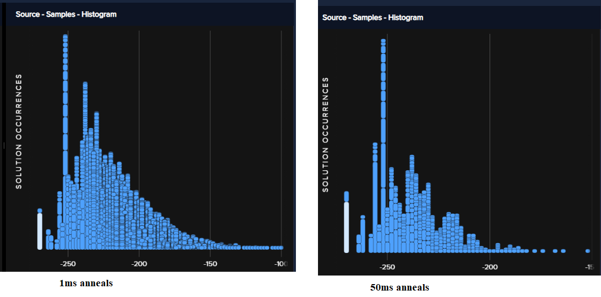

    Energy histograms for 10,000 samples with an anneal time of 1 :math:`\mu s`
    (left) versus 1,000 samples with an anneal time of 50 :math:`\mu s` (right).

For this particular example, it makes sense to increase the anneal time at the
expense of fewer anneal cycles (number of reads). That might not be true of
other problems.

.. _cb_qpu_gauge_transformations:

Spin-Reversal (Gauge) Transforms
================================

Coupling :math:`J_{i,j}` adds a small bias to qubits :math:`i` and :math:`j` due
to leakage. This can become significant for chained qubits: see
:ref:`integrated control errors (ICE) 1 <sysdocs:qpu_ice_background_susceptibility>`.
Additionally, qubits are biased to some small degree in one direction or another
due to QPU imperfections.

Applying a spin-reversal transform can improve results by reducing the impact of
such unintended biases. A spin-reversal transform does not alter the Ising
problem; the transform simply amounts to reinterpreting spin up as spin down,
and visa-versa, for a particular spin. The technique works as follows: Given an
:math:`n`-variable Ising problem, we can select a random :math:`g\in\{\pm1\}^n`
and transform the problem via :math:`h_i\mapsto h_ig_i` and
:math:`J_{ij}\mapsto J_{ij}g_ig_j`. A spin-reversal transform does not alter the
mathematical nature of the Ising problem. Solutions :math:`s` of the original
problem and :math:`s^\prime` of the transformed problem are related by
:math:`s^\prime_i=s_ig_i` and have identical energies. However, the sample
statistics can be affected by the spin-reversal transform because the QPU is a
physical object with asymmetries.

Spin-reversal transforms work correctly with postprocessing and chains. Majority
voting happens on the original problem state, not on the transformed state.

*   Changing too few spins leaves most errors unchanged, and therefore has
    little effect.
*   Changing too many spins means that most couplers connect spins that are both
    transformed, thus :math:`J_{i,j}` does not change sign. As a result, some
    systematic errors associated with the couplers are unaffected.

Ocean software's
:class:`~dwave.preprocessing.composites.SpinReversalTransformComposite`
composite enables you to specify some number,
:code:`num_spin_reversal_transforms`, of spin-reversal transforms for a problem.
Note that increasing this number increases the total run time of the problem.

Example
-------

This example solves Ocean software's
:std:doc:`Boolean AND Gate example <oceandocs:examples/and>` using
illustratively long chains for two of the variables (for reference, you can
embed this AND gate onto three qubits on an |dwave_5kq| QPU). The first
submission does not use spin-reversal transforms while the second does. An AND
gate has four feasible states: :math:`x1, x2, out` should take values
:math:`000, 010, 100, 111`. The example prints the percentage of samples found
for each of the feasible states of all lowest-energy samples with unbroken
chains (typically this example also produces a small number of solutions with
broken chains). Ideally, for a perfectly balanced QPU, feasible states would be
found in equal numbers: :code:`[25 25 25 25] percent`.

.. note::
    The qubits selected below for chains are available on the particular
    |dwave_5kq| QPU used for the example. Select a suitable embedding for the
    QPU you run examples on.

>>> import time
>>> from dwave.system import DWaveSampler, FixedEmbeddingComposite
>>> from dwave.preprocessing import SpinReversalTransformComposite
...
>>> qpu = DWaveSampler()
>>> Q = {('x1', 'x2'): 1, ('x1', 'z'): -2, ('x2', 'z'): -2, ('z', 'z'): 3}
>>> embedding = {'x1': [2146, 2131, 2145, 2147, 3161, 3176, 3191, 3206, 3221,
...              3236,  3281, 3296, 3311, 3326], 'x2': [3251, 2071, 2086, 2101,
...              2116, 2161, 2176, 2191, 2206, 2221, 2236, 3250, 3252], 'z': [3266]}
...
>>> start_t = time.time_ns(); \
... sampleset = FixedEmbeddingComposite(qpu, embedding).sample_qubo(Q, num_reads=5000);\
... print(sampleset); \
... time_ms = (time.time_ns() - start_t)/1000000        # doctest: +SKIP
   x1 x2  z energy num_oc. chain_b.
0   1  1  1    0.0    1226      0.0
1   0  0  0    0.0     713      0.0
2   0  1  0    0.0     957      0.0
3   1  0  0    0.0    2076      0.0
6   1  0  0    0.0       1 0.333333
7   1  0  0    0.0       5 0.333333
8   0  1  0    0.0       1 0.333333
9   1  0  0    0.0       1 0.333333
10  1  0  0    0.0       1 0.333333
11  1  0  0    0.0       1 0.333333
4   0  1  1    1.0       2      0.0
5   1  0  1    1.0      16      0.0
['BINARY', 12 rows, 5000 samples, 3 variables]
...
>>> print(time_ms)  # doctest: +SKIP
1146.5026
...
>>> start_t = time.time_ns(); \
... sampleset_srt = FixedEmbeddingComposite(SpinReversalTransformComposite(qpu), embedding).sample_qubo(
...     Q, num_reads=500,  num_spin_reversal_transforms=10); \
... print(sampleset_srt.aggregate()); \
... time_ms = (time.time_ns() - start_t)/1000000        # doctest: +SKIP
  x1 x2  z energy num_oc. chain_.
0  1  1  1    0.0    1519     0.0
1  0  1  0    0.0    1557     0.0
2  0  0  0    0.0     809     0.0
3  1  0  0    0.0    1090     0.0
4  1  1  0    1.0       6     0.0
5  1  0  1    1.0      12     0.0
6  0  1  1    1.0       7     0.0
['BINARY', 7 rows, 5000 samples, 3 variables]
...
>>> print(time_ms)  # doctest: +SKIP
4231.5592

Note that the submission using spin reversals produced more balanced solutions
(the four feasible configurations for an AND gate are closer to being 25% of
the lowest-energy samples with unbroken chains). Note too that the runtime
increased from about one second to about four seconds.

**Further Information**

*   |doc_processor|_ describes ICE in the |dwave_short| system.
*   [Ray2016]_ about temperature estimation in quantum annealers also looks at
    effects of spin-reversal transforms.

.. _cb_qpu_postprocessing:

Postprocessing
==============

Postprocessing optimization and sampling algorithms provide local improvements
with minimal overhead to solutions obtained from the quantum processing unit
(QPU).

Ocean software provides postprocessing tools.

Example: Broken-Chain Fixing
----------------------------

By default, Ocean software's embedding composites such as the
:class:`~dwave.system.composites.EmbeddingComposite` class fix broken chains.

This three-variable example ferromagnetically couples variable ``a``,
represented by a two-qubit chain, to two variables, ``b`` and ``c``, that have
opposing biases and are represented by one qubit each. Setting a chain strength
that is smaller than the ferromagnetic coupling makes it likely for the chain to
break.

:numref:`Figure %s <qpuPostprocessingChainBreaks>` shows the problem graph and
its embedding in an |dwave_5kq| QPU.

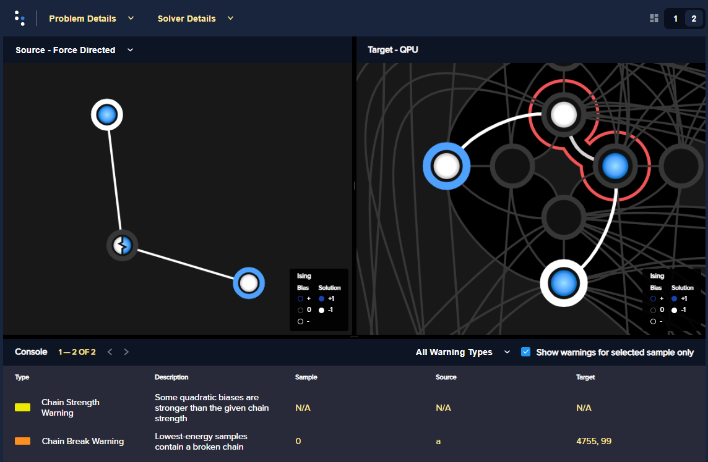

    The problem graph (left) and a particular embedding on a QPU (right), with a
    broken chain, as displayed by the
    :std:doc:`problem inspector <oceandocs:docs_inspector/sdk_index>`.

The first submission uses the Ocean software's default postprocessing of chains
to set a value for variable ``a``; the second submission discards samples with
broken chains.

.. note::
    The qubits selected below are available on the particular |dwave_5kq| QPU
    used for the example. Select a suitable embedding for the QPU you run
    examples on.

>>> from dwave.system import DWaveSampler, FixedEmbeddingComposite
>>> from dwave.embedding import chain_breaks
...
>>> qpu = DWaveSampler(solver={'topology__type': 'pegasus'})
>>> embedding={'a': [4755, 99], 'b': [69], 'c': [4785]}
...
>>> sampleset = FixedEmbeddingComposite(qpu, embedding=embedding).sample_ising(
...                                     {'b': +1, 'c': -1}, {'ab': -1, 'ac': -1},
...                                     chain_strength=0.8,
...                                     num_reads=1000)       # doctest: +SKIP
>>> print(sampleset)                                          # doctest: +SKIP
   a  b  c energy num_oc. chain_b.
0 +1 -1 +1   -2.0     672 0.333333
1 -1 -1 +1   -2.0      49      0.0
2 +1 +1 +1   -2.0     118      0.0
3 -1 -1 -1   -2.0      74      0.0
4 +1 -1 +1   -2.0      87      0.0
['SPIN', 5 rows, 1000 samples, 3 variables]
...
>>> sampleset = FixedEmbeddingComposite(qpu, embedding=embedding).sample_ising(
...                                     {'b': +1, 'c': -1}, {'ab': -1, 'ac': -1},
...                                     chain_strength=0.8,
...                                     num_reads=1000,
...                                     chain_break_method=chain_breaks.discard) # doctest: +SKIP
>>> print(sampleset)                                             # doctest: +SKIP
   a  b  c energy num_oc. chain_.
0 -1 -1 +1   -2.0      60     0.0
1 +1 +1 +1   -2.0      79     0.0
2 -1 -1 -1   -2.0     142     0.0
3 +1 -1 +1   -2.0      77     0.0
['SPIN', 4 rows, 358 samples, 3 variables]

Example: Local Search
---------------------

:std:doc:`dwave-greedy <oceandocs:docs_greedy/sdk_index>` provides an
implementation of a steepest-descent solver,
:class:`~greedy.sampler.SteepestDescentSolver`, for binary quadratic models.

This example runs this classical algorithm initialized from QPU samples to find
minima in the samples’ neighborhoods.

>>> from dwave.system import DWaveSampler, EmbeddingComposite
>>> from greedy import SteepestDescentSolver
>>> import dimod
...
>>> solver_greedy = SteepestDescentSolver()
>>> bqm = dimod.generators.ran_r(5, 25)
>>> sampleset = EmbeddingComposite(DWaveSampler()).sample(bqm,
...                                                       num_reads=100,
...                                                       answer_mode='raw')  # doctest: +SKIP
>>> sampleset_pp = solver_greedy.sample(bqm, initial_states=sampleset)  # doctest: +SKIP

:numref:`Figure %s <qpuPostprocessingChainBreaks>` compare the results before
and after the postprocessing.

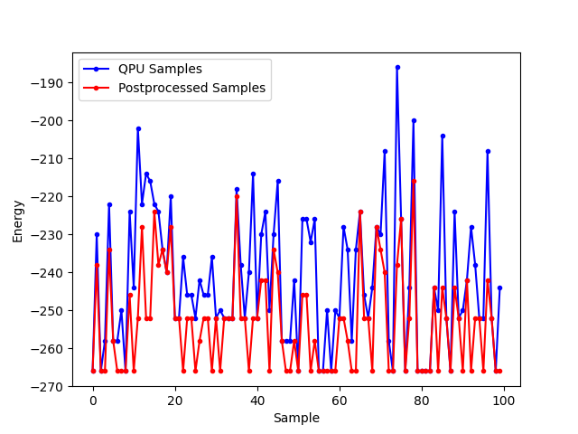

    Samples returned from the QPU (blue) and the samples with postprocessing
    (red).

Further Information
-------------------

*   The
    :std:doc:`Postprocessing with a Greedy Solver <oceandocs:examples/pp_greedy>`
    example in the :std:doc:`Ocean software documentation <oceandocs:index>` is
    a similar example of using ``dwave-greedy``, but on a native problem.

.. _cb_qpu_precision:

Imprecision of Biases
=====================

Ising problems with high-precision parameters (:math:`h_i` and :math:`J_{i,j}`)
present a challenge for quantum computers due to the finite precision available
on :math:`\vc{h}` and :math:`\vc{J}`. A problem may have lowest energy states
that are sensitive to small variations in :math:`h` or :math:`J` while also
requiring a large range of :math:`h` or :math:`J` values or high penalty values
to enforce constraints on chains of qubits.

These are typically quantitative optimization problems rather than problems of a
purely combinatorial nature (such as finding a subgraph with certain
properties), where the number and connectivity of the qubits is more important
than the weights, and problems for which near-optimal solutions are
unacceptable. The solution's quality depends on slight differences, at
low-energy regions of the solution space, of the problem Hamiltonian as
delivered to the QPU from its specification.

Example: Limiting Biases with Embedding
---------------------------------------

You can improve results by minimizing the range of on-QPU :math:`J` or :math:`h`
values through embeddings.

For example, if a problem variable :math:`s_i`, which has the largest parameter
value :math:`h_i`, is represented by qubits :math:`q_i^1, q_i^2`, and
:math:`q_i^3` having the same value in any feasible solution, :math:`h_i` can be
shared across the three qubits; i.e.,
:math:`h_i s_i \rightarrow (h_i/3)(q_i^1+q_i^2+q_i^3)`, reducing :math:`h_i` by
a factor of 3. In a similar way, coupling parameters :math:`J_{i,j}` may also be
shared.

In any embedding there may be multiple edges between chains of qubits
representing problem variables. You can enhance precision (at the cost of using
extra qubits) by sharing the edge weight across these edges.

>>> from dwave.system import DWaveSampler, EmbeddingComposite, FixedEmbeddingComposite
>>> import networkx as nx
>>> import dimod
>>> import random
>>> import dwave.inspector
...
>>> # Create a 5-variable problem with one outsized bias
>>> G = nx.generators.small.bull_graph()
>>> for edge in G.edges:
...     G.edges[edge]['quadratic'] = random.choice([1,-1])
>>> for node in range(max(G.nodes)):
...    G.nodes[node]['linear'] = random.choice([0.1,-0.1])
>>> G.nodes[max(G.nodes)]['linear'] = 10
>>> bqm = dimod.from_networkx_graph(G,
...                                 vartype='SPIN',
...                                 node_attribute_name ='linear',
...                                 edge_attribute_name='quadratic')
>>> # Submit the problem to a QPU solver
>>> qpu = DWaveSampler(solver={'topology__type': 'pegasus'})
>>> sampleset = EmbeddingComposite(qpu).sample(bqm, num_reads=1000, return_embedding=True)

:numref:`Figure %s <qpuImprecisionBiasDivided>` shows the embedded problem with
the large-biased variable represented by qubit 3999.

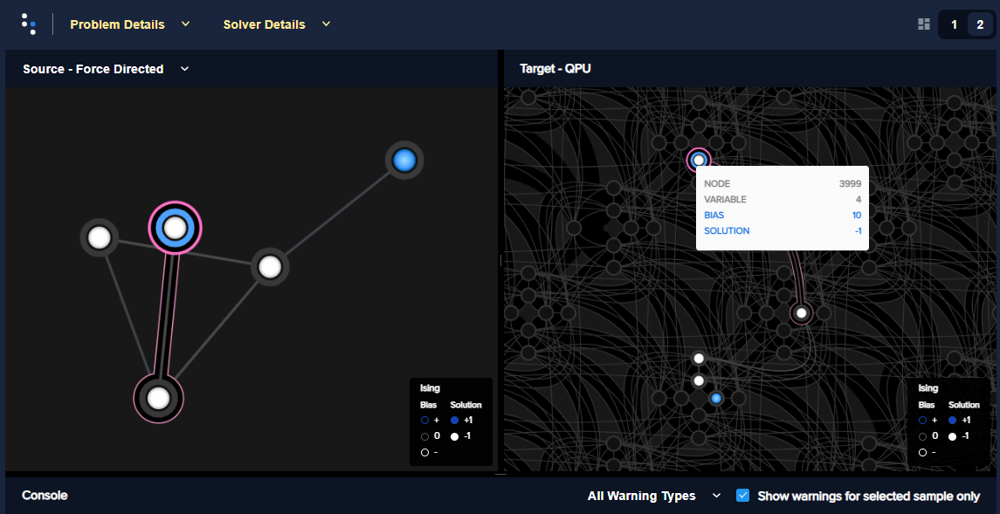

    An embedded problem with one large-biased variable.

>>> embedding = dict(sampleset.info["embedding_context"]["embedding"])
>>> embedding[4]                                        # doctest: +SKIP
(3999,)
>>> embedding[4] = [3999, 1715, 1730, 1745]
>>> sampleset = FixedEmbeddingComposite(qpu, embedding).sample(bqm, num_reads=1000)    # doctest: +SKIP

:numref:`Figure %s <qpuImprecisionBiasDivided>` shows the embedded problem with
the large-biased variable represented by four chained qubits.

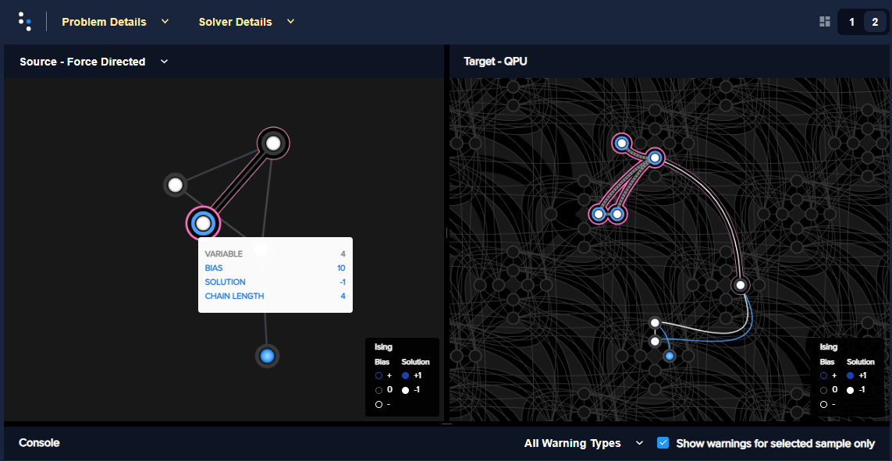

    A large-biased variable represented by four chained qubits.

Example: Limiting Biases by Simplifying the Problem
---------------------------------------------------

In problems with interaction :math:`h_i s_i`, where :math:`h_i>0` is much larger
than all other problem parameters, it is likely that in low-energy states,
:math:`s_i=-1` (:math:`2h` lower in energy than :math:`s_i=+1`). Generally, you
may be able to identify, in polynomial time, a subset of variables that always
take the same value in the ground state. You can then eliminate such variables
from the problem.

Consider preprocessing problems to determine whether certain variable values can
be inferred. There is little overhead in attempting to simplify every problem
before sending it to the QPU.

The code below preprocesses the problem of the previous section, which has a
single outsized value for variable ``4``.

>>> from dwave.system import DWaveSampler, EmbeddingComposite
>>> import networkx as nx
>>> import dimod
>>> import random
>>> from dwave.preprocessing import FixVariablesComposite
...
>>> # Create a 5-variable problem with one outsized bias
>>> G = nx.generators.small.bull_graph()
>>> for edge in G.edges:
...     G.edges[edge]['quadratic'] = random.choice([1,-1])
>>> for node in range(max(G.nodes)):
...    G.nodes[node]['linear'] = random.choice([0.1,-0.1])
>>> G.nodes[max(G.nodes)]['linear'] = 10
>>> bqm = dimod.from_networkx_graph(G,
...                                 vartype='SPIN',
...                                 node_attribute_name ='linear',
...                                 edge_attribute_name='quadratic')
>>> # Preprocess and submit to a QPU solver
>>> sampler_pp = FixVariablesComposite(EmbeddingComposite(DWaveSampler()), algorithm="roof_duality")
>>> sampleset = sampler_pp.sample(bqm, num_reads=1000, return_embedding=True)

The problem submitted to the QPU has had the value of variable 4 fixed by the
:class:`~dwave.preprocessing.composites.FixVariablesComposite` composite using
the roof duality algorithm.

Further Information
-------------------

*   [Kin2014]_ discusses preprocessing more robust problem Hamiltonians on the
    |dwave_short| system.
*   [Pud2014]_ and [Pud2015]_ discuss quantum error correction.
*   |doc_processor|_ describes integrated control errors (ICE), measurement, and
    effects; for example, quantization of digital to analog converters.

.. _cb_qpu_problem_scale:

Problem Scale
=============

In general, use the full range of :math:`h` and :math:`J` values available for
the QPU when submitting a problem.

Ocean software's default enabling of the :ref:`sysdocs:param_autoscale` solver
parameter automatically scales problems to make maximum use of the available
ranges.

Example
-------

This example uses a single outsized bias to "squash" the scale of biases
available for the remaining variables. :numref:`Figure %s <qpuScaleP12k44>`
shows the (native, over twelve :math:`K_{4,4}` structures of the Pegasus
topology) BQM embedded on an |dwave_5kq| QPU: all variables have linear
coefficients of 0 or 1 except for one variable with a linear coefficient of
-100. (In practice your problem may have a minority of variables that have
significantly different values from the majority.)

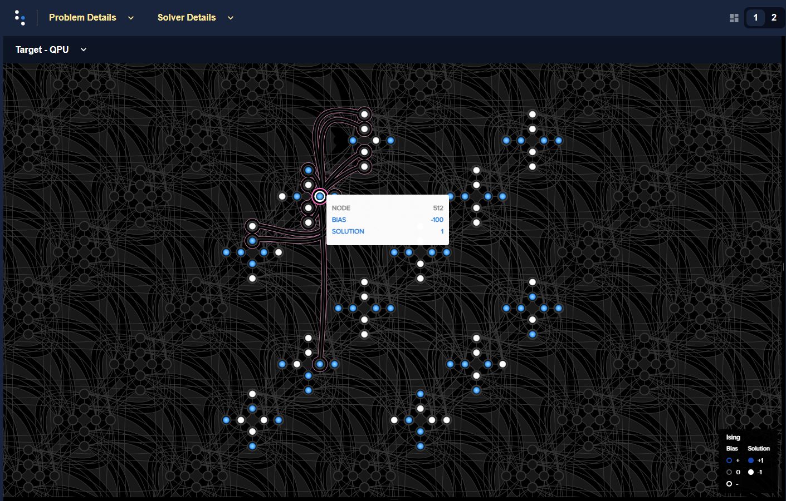

    A BQM with a single large-biased qubit that reduces the range of qubit
    biases available for the remaining linear biases.

>>> import dimod
>>> import networkx as nx
>>> from dwave.system import DWaveSampler
>>> import dwave_networkx as dnx
>>> from dwave.preprocessing import FixVariablesComposite
...
>>> # Create a native problem with one outsized bias
>>> coords = dnx.pegasus_coordinates(16)
>>> qpu = DWaveSampler(solver={'topology__type': 'pegasus'})
>>> p16_working = dnx.pegasus_graph(16, node_list=qpu.nodelist, edge_list=qpu.edgelist)
>>> p12k44_nodes = [coords.nice_to_linear((t, y, x, u, k)) for (t, y, x, u, k) in list(coords.iter_linear_to_nice(p16_working.nodes)) if x in [2, 3] and y in [2, 3]]
>>> p12k44 = p16_working.subgraph(p12k44_nodes)
>>> bqm = dimod.generators.randint(p12k44, "SPIN")
>>> bqm.set_linear(list(bqm.linear.keys())[0], -100)        # doctest: +SKIP
...
>>> # Submit with and without the outsized bias
>>> sampleset = qpu.sample(bqm, num_reads=1000)
>>> sampler_fixed = FixVariablesComposite(qpu)
>>> sampleset_fixed = sampler_fixed.sample(bqm, fixed_variables={bqm.variables[0]: 1}, num_reads=1000)  # doctest: +SKIP

The two figures below show the energies of returned solutions:

*   :numref:`Figure %s <qpuScaleP12K44BeforeFix>` is the BQM with the outsized
    bias.
*   :numref:`Figure %s <qpuScaleP12k44AfterFix>` is the (updated) BQM without
    the outsized bias.

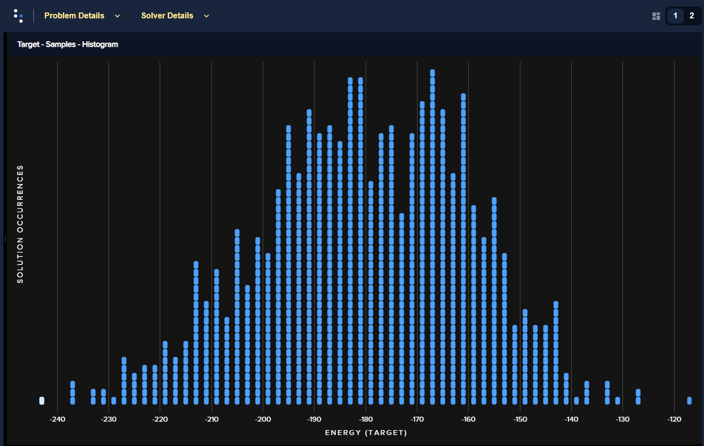

    Energies of returned solutions for the original BQM with the outsized bias.

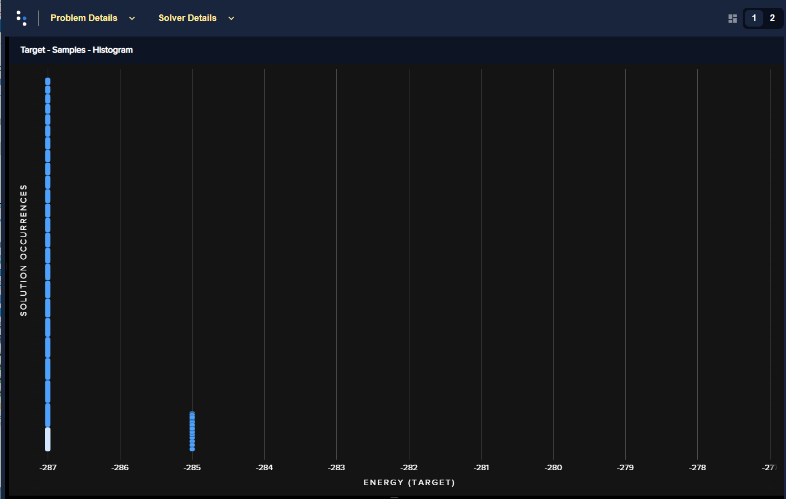

    Energies of returned solutions for the BQM with the variable that has an
    outsized bias fixed.

When the original BQM is embedded on the QPU, the problem range is scaled by 25:

>>> print(min(bqm.linear.values())//min(qpu.properties["h_range"])) # doctest: +SKIP
25.0

The qubit biases of all but one variable and the coupler strengths are either 0
or 0.04; that is, over 99% of the qubit biases are in just 0.5% of the available
range of :math:`h` values (:code:`[-4.0, 4.0]` for the QPU on which this example
was run).

In a fixed BQM, most variables keep the original coefficient values except for
variables connected to the fixed variable. For this execution of the example,
two connected variables' coefficients are changed to a value of 2 to account for
the fixed variable. 

>>> bqm.fix_variable(bqm.variables[0], 1)           # doctest: +SKIP
>>> set(bqm.quadratic.values()) | set(bqm.linear.values())      # doctest: +SKIP
{0.0, 1.0, 2.0}
>>> print(bqm.linear.max()/max(qpu.properties["h_range"])) # doctest: +SKIP
0.5

.. _cb_qpu_anneal_schedule:

Annealing Schedule
==================

Some types of problems benefit from the introduction of a *pause* or a *quench*
at some point in the anneal schedule. A pause dwells for some time at a
particular anneal fraction; a quench abruptly terminates the anneal within a
few hundred nanoseconds of the point specified.

This degree of control over the global annealing schedule also enables closer
study the quantum annealing algorithm.

Pause and Quench
----------------

A pause can be a useful diagnostic tool for instances with a small perturbative
anticrossing. While pauses early or late in the anneal have no effect, a pause
near the expected perturbative anticrossing produces a large increase in the
ground-state success rate.

If a quench is fast compared to problem dynamics, then the distribution of
states returned by the quench can differ significantly from that returned by the
standard annealing schedule. The probability of obtaining ground state samples
depends on when in the anneal the quench occurs, with later quenches more likely
to obtain samples from the ground state.

Supply the scheduling points using the :ref:`sysdocs:param_anneal_sched` solver
parameter.

Reverse Anneal
--------------

Reverse annealing enables the use of quantum annealing as a component in local
search algorithms to refine classical states. Examples of using this feature
include Quantum Boltzmann sampling, tunneling rate measurements, and relaxation
rate measurements.

Examples
--------

:numref:`Figure %s <qpuAnnealSchedule16qubit>` shows embedded in an |dwave_5kq|
QPU a 16-qubit system, which was studied in a
`nature article <https://www.nature.com/articles/ncomms2920>`_. It has an energy
gap of 4 between the classical ground state and excited states.

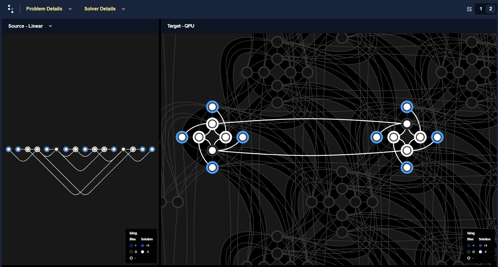

    A 16-qubit system with an energy gap of 4 between the classical ground state
    and excited states embedded in an |dwave_5kq| QPU.

The following code shows how varying the anneal schedule can increase the
probability of finding ground states. (Results can vary significantly between
executions.) First, the problem is embedded onto a QPU such that each problem
qubit is represented by a single qubit\ [#]_ on the QPU.

>>> import numpy as np
>>> import dwave_networkx as dnx
>>> from dwave.system import DWaveSampler, FixedEmbeddingComposite
>>> from minorminer import find_embedding
...
>>> # Configure the problem structure
>>> h = {0: 1.0, 1: -1.0, 2: -1.0, 3: 1.0, 4: 1.0, 5: -1.0, 6: 0.0, 7: 1.0,
...      8: 1.0, 9: -1.0, 10: -1.0, 11: 1.0, 12: 1.0, 13: 0.0, 14: -1.0, 15: 1.0}
>>> J = {(9, 13): -1, (2, 6): -1, (8, 13): -1, (9, 14): -1, (9, 15): -1,
...      (10, 13): -1, (5, 13): -1, (10, 12): -1, (1, 5): -1, (10, 14): -1,
...      (0, 5): -1, (1, 6): -1, (3, 6): -1, (1, 7): -1, (11, 14): -1,
...      (2, 5): -1, (2, 4): -1, (6, 14): -1}
...
>>> # Find an embedding in the Pegasus topology
>>> qpu_pegasus = DWaveSampler(solver={'topology__type': 'pegasus'})
>>> embedding = find_embedding(J.keys(), qpu_pegasus.edgelist)
>>> max(len(val) for val in embedding.values()) == 1        # doctest: +SKIP
True
>>> # Set up the sampler
>>> reads = 1000
>>> sampler = FixedEmbeddingComposite(qpu_pegasus, embedding)

Print the percentage of ground states for a 100 :math:`\mu s` anneal:

>>> sampleset = sampler.sample_ising(h, J, num_reads=reads, answer_mode='raw',
...                                  annealing_time=100)
>>> counts = np.unique(sampleset.record.energy.reshape(reads,1), axis=0,
...                    return_counts=True)[1]
>>> print("{}% of samples were best energy {}.".format(100*counts[0]/sum(counts),
...       sampleset.first.energy))                          # doctest: +SKIP
6.8% of samples were best energy -20.0.

Print the percentage of ground states for an anneal with a 100 :math:`\mu s`
pause:

>>> anneal_schedule=[[0.0, 0.0], [40.0, 0.4], [140.0, 0.4], [142, 1.0]]
>>> sampleset = sampler.sample_ising(h, J, num_reads=reads, answer_mode='raw',
...                                  anneal_schedule=anneal_schedule)
>>> counts = np.unique(sampleset.record.energy.reshape(reads,1), axis=0,
...                    return_counts=True)[1]
>>> print("{}% of samples were best energy {}.".format(100*counts[0]/sum(counts),
...       sampleset.first.energy))                        # doctest: +SKIP
28.7% of samples were best energy -20.0.

Print the percentage of ground states for a reverse anneal (of almost 100
:math:`\mu s`):

>>> reverse_schedule = [[0.0, 1.0], [5, 0.55], [99, 0.55], [100, 1.0]]
>>> initial = dict(zip(sampleset.variables, sampleset.record[int(reads/2)].sample))
>>> reverse_anneal_params = dict(anneal_schedule=reverse_schedule,
...                              initial_state=initial,
...                              reinitialize_state=True)
>>> sampleset = sampler.sample_ising(h, J, num_reads=reads, answer_mode='raw',
...                                  **reverse_anneal_params)    # doctest: +SKIP
>>> counts = np.unique(sampleset.record.energy.reshape(reads,1), axis=0,
...                    return_counts=True)[1]     # doctest: +SKIP
>>> print("{}% of samples were best energy {}.".format(100*counts[0]/sum(counts),
...       sampleset.first.energy))                         # doctest: +SKIP
99.7%% of samples were best energy -20.0.

.. [#]
    On most executions, the
    :std:doc:`minorminer <oceandocs:docs_minorminer/source/sdk_index>` package
    finds an embedding with all chains of length 1. However, a typical embedding
    looks like that of :numref:`Figure %s <qpuAnnealSchedule16qubitTypical>`.

    .. figure:: ../_images/qpu_anneal_schedule_16qubit_typical.png
        :name: qpuAnnealSchedule16qubitTypical
        :alt: image
        :align: center
        :height: 300 pt
        :width: 600 pt

        A typical embedding for the 16-qubit system on an |dwave_5kq| QPU.

    The following code finds a more visually intuitive embedding such as shown
    in :numref:`Figure %s <qpuAnnealSchedule16qubit>` above.

    >>> import itertools
    ...
    >>> # Find an embedding with a single QPU qubit representing each problem qubit
    >>> qpu_pegasus = DWaveSampler(solver={'topology__type': 'pegasus'})
    >>> coords = dnx.pegasus_coordinates(16)
    >>> try:            # doctest: +SKIP
    ...     for x, y, t in itertools.product(range(15), range(16), range(3)):
    ...         nodes = {s: [coords.nice_to_linear((t, y, x + s//8, 1 if s%8//4 else 0 , s%4))]
    ...                  for s in h.keys()}
    ...         try:
    ...             embedding = find_embedding(J.keys(), qpu_pegasus.edgelist, restrict_chains=nodes)
    ...         except Exception:
    ...             pass
    ...         else:
    ...             break
    >>> # Set up the sampler
    >>> reads = 1000
    >>> sampler = FixedEmbeddingComposite(qpu_pegasus, embedding) # doctest: +SKIP

Further Information
-------------------

*   Jupyter Notebooks
    `Anneal Schedule <https://github.com/dwave-examples/anneal-schedule-notebook>`_
    and
    `Reverse Anneal <https://github.com/dwave-examples/reverse-annealing-notebook>`_
    demonstrate these features.
*   [Dic2013]_ discusses the anticrossing example.
*   [Dwave5]_ is a white paper on reverse annealing.
*   [Izq2022]_ shows the efficacy of mid-anneal pauses.
*   The |doc_processor|_ guide describes varying the anneal schedule.

.. _cb_qpu_anneal_offset:

Anneal Offsets
==============

Anneal offsets may improve results for problems in which the qubits have
irregular dynamics for some easily determined reason; for example, if a qubit's
final value does not affect the energy of the classical state, you can advance
it (with a positive offset) to reduce quantum bias in the system.

Anneal offsets can also be useful in embedded problems with varying chain
length: longer chains may freeze out earlier than shorter ones, which means that
at an intermediate point in the anneal, some variables act as fixed constants
while others remain undecided. If, however, you advance the anneal of the qubits
in the shorter chains, they freeze out earlier than they otherwise would. The
correct offset will synchronize the annealing trajectory of the shorter chains
with that of the longer ones.

If you decide that offsetting anneal paths might improve results for a problem,
your next task is to determine the optimal value for the qubits you want to
offset. As a general rule, if a qubit is expected to be subject to a strong
effective field relative to other qubits, delay its anneal with a negative
offset. The ideal offset magnitudes are likely to be the subject of trial and
error, but expect that the appropriate offsets for two different qubits in the
same problem to be within 0.2 normalized offset units of each other.

Supply the array of offsets for the qubits in the system using the
:ref:`sysdocs:param_ao` solver parameter with a length equal to the
:ref:`sysdocs:property_num_qubits` property.

Example: 3-Qubit System
-----------------------

This example is a 3-qubit looks at a system that has a ground state,
:math:`1, 1, 1`, separated from its two closest excited states,
:math:`-1, -1, -1` and :math:`-1, -1, 1`, by a small energy gap compared to its
remaining excited states. These two first excited states have the same energy
and differ by a single flip of qubit 2; consequently, the superposition of these
two states is dominant early in the anneal.
:numref:`Figure %s <qpuAnnealOffsets3qubit>` shows the problem and a possible
embedding in one particular |dwave_5kq| QPU.

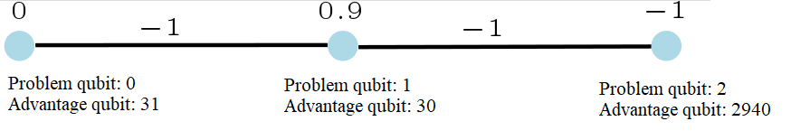

    A three-qubit system with a small energy gap between the ground state and
    first two excited states.

:std:doc:`dimod <oceandocs:docs_dimod/sdk_index>`\ 's
:class:`~dimod.reference.samplers.ExactSolver` shows the energies of the ground
state, first two excited states, and remaining states:

>>> from dimod import ExactSolver
...
>>> h = {0: 0, 1: 0.9, 2: -1}
>>> J = {(0, 1): -1, (1, 2): -1}
>>> print(ExactSolver().sample_ising(h, J))                   # doctest: +SKIP
   0  1  2 energy num_oc.
5 +1 +1 +1   -2.1       1
0 -1 -1 -1   -1.9       1
7 -1 -1 +1   -1.9       1
4 -1 +1 +1   -0.1       1
1 +1 -1 -1    0.1       1
6 +1 -1 +1    0.1       1
2 +1 +1 -1    1.9       1
3 -1 +1 -1    3.9       1
['SPIN', 8 rows, 8 samples, 3 variables]

The |dwave_short| system used for this example is an |dwave_5kq| QPU that has
couplers between active qubits 30, 31, and 2940. Select a suitable embedding for
the QPU you run examples on.

>>> from dwave.system import FixedEmbeddingComposite, DWaveSampler
...
>>> qpu = DWaveSampler()
>>> embedding = {0: [31], 1: [30], 2: [2940]}
>>> sampler = FixedEmbeddingComposite(qpu, embedding)           # doctest: +SKIP
>>> print(qpu.properties['anneal_offset_ranges'][2940])         # doctest: +SKIP
[-0.7012257815714587, 0.6717794151250857]

For the default anneal offset of qubit 2, this particular run of 1000 samples,
successfully returned the problem's ground state about one third of the time,
and likewise each of the two first excited states a third of the time:

>>> sampleset = sampler.sample_ising(h, J, num_reads=1000)      # doctest: +SKIP
>>> print(sampleset)                                            # doctest: +SKIP
   0  1  2 energy num_oc. chain_.
0 +1 +1 +1   -2.1     386     0.0
1 -1 -1 +1   -1.9     276     0.0
2 -1 -1 -1   -1.9     338     0.0
['SPIN', 3 rows, 1000 samples, 3 variables]

Applying a positive offset to qubit 2 causes it to freeze a bit earlier in the
anneal than qubits 0 and 1. Consequently, the superposition of the two lowest
excited states, :math:`-1, -1, -1` and :math:`-1, -1, 1`, no longer dominates,
and the ground state is found much more frequently.

>>> offset = [0]*qpu.properties['num_qubits']
>>> offset[2940]=0.2                                        # doctest: +SKIP
>>> sampleset = sampler.sample_ising(h, J, num_reads=1000, anneal_offsets=offset)  # doctest: +SKIP
>>> print(sampleset)                                       # doctest: +SKIP
   0  1  2 energy num_oc. chain_.
0 +1 +1 +1   -2.1     979     0.0
1 -1 -1 +1   -1.9       7     0.0
2 -1 -1 -1   -1.9      13     0.0
3 -1 +1 +1   -0.1       1     0.0
['SPIN', 4 rows, 1000 samples, 3 variables]

Example: 16-Qubit System
------------------------

The example problem of the :ref:`cb_qpu_anneal_schedule` section improved
solutions for a 16-qubit system, shown in
:numref:`Figure %s <qpuAnnealSchedule16qubit>` embedded in an |dwave_5kq| QPU,
which was studied in a
`nature article <https://www.nature.com/articles/ncomms2920>`_, and has an
energy gap of 4 between the classical ground state and excited states. The eight
"outer" qubits, which are coupled to only one other qubit, enable single flips
that produce dominant superpositions of excited states in the anneal (these are
small-gap anticrossings), reducing the likelihood of finding the ground state.

First, the problem is embedded onto a QPU such that each problem qubit is
represented by a single qubit on the QPU. As explained in the
:ref:`cb_qpu_anneal_schedule` section, on most executions, the
:std:doc:`minorminer <oceandocs:docs_minorminer/source/sdk_index>` package finds
an  embedding with all chains of length 1. However, a typical embedding looks
like that of :numref:`Figure %s <qpuAnnealSchedule16qubitTypical>`. The
following code finds a more visually intuitive embedding such as shown in
:numref:`Figure %s <qpuAnnealSchedule16qubit>` above.

>>> import itertools
>>> import numpy as np
>>> import dwave_networkx as dnx
>>> from dwave.system import DWaveSampler, FixedEmbeddingComposite
>>> from minorminer import find_embedding
...
>>> # Configure the problem structure
>>> h = {0: 1.0, 1: -1.0, 2: -1.0, 3: 1.0, 4: 1.0, 5: -1.0, 6: 0.0, 7: 1.0,
...      8: 1.0, 9: -1.0, 10: -1.0, 11: 1.0, 12: 1.0, 13: 0.0, 14: -1.0, 15: 1.0}
>>> J = {(9, 13): -1, (2, 6): -1, (8, 13): -1, (9, 14): -1, (9, 15): -1,
...      (10, 13): -1, (5, 13): -1, (10, 12): -1, (1, 5): -1, (10, 14): -1,
...      (0, 5): -1, (1, 6): -1, (3, 6): -1, (1, 7): -1, (11, 14): -1,
...      (2, 5): -1, (2, 4): -1, (6, 14): -1}
...
>>> # Find an embedding with a single QPU qubit representing each problem qubit
>>> qpu_pegasus = DWaveSampler(solver={'topology__type': 'pegasus'})
>>> coords = dnx.pegasus_coordinates(16)
>>> try:        # doctest: +SKIP
...     for x, y, t in itertools.product(range(15), range(16), range(3)):
...         nodes = {s: [coords.nice_to_linear((t, y, x + s//8, 1 if s%8//4 else 0 , s%4))]
...                  for s in h.keys()}
...         try:
...             embedding = find_embedding(J.keys(), qpu_pegasus.edgelist, restrict_chains=nodes)
...         except Exception:
...             pass
...         else:
...             break
>>> # Set up the sampler
>>> reads = 1000
>>> sampler = FixedEmbeddingComposite(qpu_pegasus, embedding)   # doctest: +SKIP

:numref:`Figure %s <qpuAnnealOffsets16qubit>` shows the 16-qubit system embedded
in an |dwave_5kq| QPU.

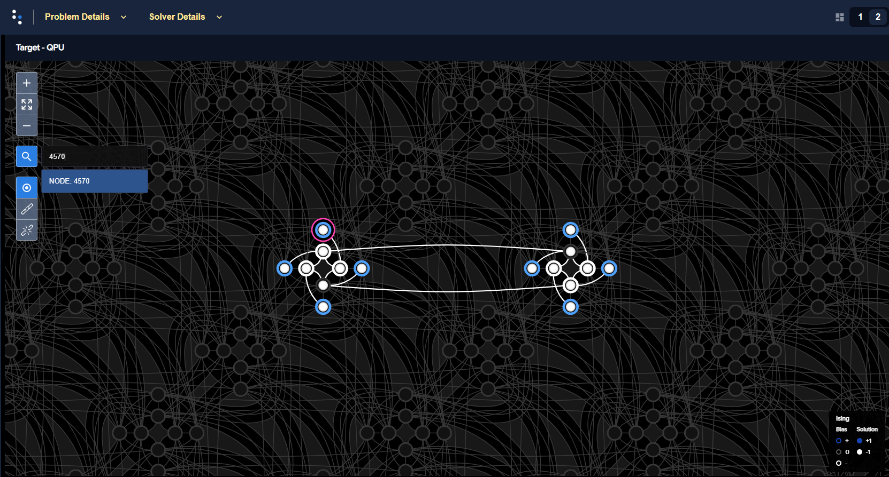

    A 16-qubit system with an energy gap of 4 between the classical ground state
    and excited states embedded in an |dwave_5kq| QPU. One of the eight "outer"
    qubits, problem qubit 4, which is embedded here to QPU qubit 4570, is
    highlighted.

The following code samples 1000 times, with an anneal time of 100 :math:`\mu s`
and no annealing offsets, and prints the percentage of ground states found.

>>> offset = [0]*qpu_pegasus.properties['num_qubits']
>>> sampleset = sampler.sample_ising(h, J, num_reads=reads, answer_mode='raw',
...                                  annealing_time=100,
...                                  anneal_offsets=offset)
>>> counts = np.unique(sampleset.record.energy.reshape(reads,1), axis=0,
...                    return_counts=True)[1]
>>> print("{}% of samples were best energy {}.".format(100*counts[0]/sum(counts),
...       sampleset.first.energy))                          # doctest: +SKIP
8.2% of samples were best energy -20.0.

The minimum range for a positive anneal offset for any of the eight "outer"
qubits of this example's particular embedding can be found as below:

>>> ao_range = qpu_pegasus.properties["anneal_offset_ranges"]   # doctest: +SKIP
>>> ao_step = qpu_pegasus.properties["anneal_offset_step"]      # doctest: +SKIP
>>> outer8 = [4570, 1913, 4615, 1868, 4571, 2093, 4616, 2048]
>>> print(min([ao_range[outer][1] / abs(ao_step) for outer in outer8]))  # doctest: +SKIP
3533.0651831083146

The following code samples 1000 times, with an anneal time of 100 :math:`\mu s`
and annealing offsets set for the eight "outer" qubits, and prints the
percentage of ground states found.

>>> for outer in outer8:
...     offset[outer] = 300*abs(ao_step)                        # doctest: +SKIP
>>> sampleset = sampler.sample_ising(h, J, num_reads=reads, answer_mode='raw',
...                                  annealing_time=100,
...                                  anneal_offsets=offset)
>>> counts = np.unique(sampleset.record.energy.reshape(reads,1), axis=0,
...                    return_counts=True)[1]
>>> print("{}% of samples were best energy {}.".format(100*counts[0]/sum(counts),
...       sampleset.first.energy))                            # doctest: +SKIP
99.8% of samples were best energy -20.0.

Further Information
-------------------

*   |doc_processor|_ describes anneal offsets.
*   [Dwave3]_ describes boosting factoring using anneal oofsets.
*   [Kin2016]_ discusses the use of anneal offsets.
*   [Lan2017]_ shows the use of anneal offsets on several problems.
*   [Tin2018]_ systematically applies anneal offsets to SAT problems.

.. _cb_qpu_flux_biases:

Emulate Linear Biases with Flux-Bias Offsets
============================================

It is sometimes useful to represent linear coefficients on a problem's
variables without setting biases on the corresponding qubits; for example, when
running the :ref:`fast-anneal protocol <qpu_annealprotocol_fast>`. This protocol
does not allow non-zero values for :ref:`param_h` or diagonal elements of
:ref:`param_q`, so to represent part of a problem modeled, for example, as
:math:`a_{1,2}x_1x_2 + a_2x_2` one needs to bias the qubit or qubits
representing :math:`x_2` without applying a bias :math:`h_2=a_2.`

You can use :ref:`param_flux_biases` for this purpose.

Method 1: Coupling to an Ancilliary Qubit with Large Flux Bias
--------------------------------------------------------------

Locate an unused neighboring qubit that can be coupled to the problem qubit,
apply to this ancillary qubit a flux-bias offset of magnitude greater than
:math:`JM_{\rm AFM} I_p / \Phi_0` (see equation
:math:numref:`qpu_equation_quantum_hamiltonian` in the |doc_processor|_ guide),
and set the coupling strength between the problem and ancillary qubits equal to
the needed linear bias.

:numref:`Figure %s <fluxBiasOffsetsHVsJ>` shows the probability of state
:math:`-1` for a qubit, :math:`q_1`, annealed 1000 times for each value, in
range :math:`[-1.0, 1.0]`, of these two methods of biasing its outcome:

*   Qubit :math:`q_1` is biased by :math:`h_1` (the standard way of biasing a
    qubit to represent the linear coefficient of a problem variable).
*   Qubit :math:`q_1` is coupled to ancillary qubit :math:`q_2` by
    :math:`J_{1,2}`. A flux-bias offset of large magnitude is applied to
    ancillary qubit :math:`q_2`.

As is seen, directly biasing the problem qubit, :math:`q_1`, with  linear bias
:math:`h_1` is equivalent to coupling it to flux-biased ancillary qubit
:math:`q_2` with a coupling strength of :math:`J_{1,2}`, as long as the
magnitude of the flux-bias offset is high enough.

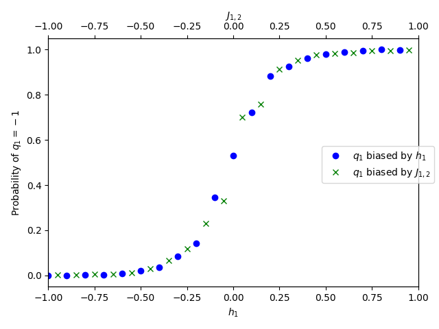

    Probability of state :math:`-1` for a qubit biased with :math:`h_1` or
    coupled with :math:`J_{1,2}` to a second qubit on which a high flux-bias
    offset is applied.

The following code snippet provides a single-point demonstration. Scan across
``h_1`` and ``J_12`` to reproduce the plots of
:numref:`Figure %s <fluxBiasOffsetsHVsJ>` above.

>>> import numpy as np
>>> from dwave.system import DWaveSampler
...
>>> qpu = DWaveSampler()
>>> q1, q2 = qpu.edgelist[0]
...
>>> h_1 = 0.25
>>> J_12 = 0.25
...
>>> fb = [0]*qpu.properties['num_qubits']
>>> sampleset1 = qpu.sample_ising({q1: h_1, q2: 0}, {(q1, q2): 0}, num_reads=1000, auto_scale=False,
...                              answer_mode="raw", flux_biases=fb)
>>> fb[q2] = 0.001
>>> sampleset2 = qpu.sample_ising({q1: 0, q2: 0}, {(q1, q2): J_12}, num_reads=1000,
...                              auto_scale=False, answer_mode="raw", flux_biases=fb)
>>> sample1 = sampleset1.record.sample
>>> sample2 = sampleset2.record.sample
>>> print(np.count_nonzero(sample1[:,0]==-1)/sample1.shape[0])      # doctest: +SKIP
0.855
>>> print(np.count_nonzero(sample2[:,0]==-1)/sample2.shape[0])      # doctest: +SKIP
0.858

Method 2: Setting a Flux Bias on the Problem Qubit
--------------------------------------------------

Alternatively, set directly on the problem qubit a flux-bias offset that is
closest to an equivalent of the needed linear bias. Although the dynamics of
:math:`h` and flux bias (constant in time) differ, equivalence at a specific
point in the anneal is valid under some assumptions. Ocean software provides
:std:doc:`conversion functions <oceandocs:docs_system/reference/utilities>`
between :math:`h` and flux biases.

:numref:`Figure %s <fluxBiasOffsetsHVsFB>` shows the probability of state
:math:`-1` for a qubit, :math:`q_1`, annealed 1000 times for each value, in
range :math:`[-1.0, 1.0]`, of these two methods of biasing its outcome:

*   Qubit :math:`q_1` is biased by :math:`h_1` (the standard way of biasing a
    qubit to represent the linear coefficient of a problem variable, identical
    to the previous subsection above).
*   Qubit :math:`q_1` is biased by a flux-bias offset calculated with the
    :func:`~dwave.system.temperatures.h_to_fluxbias` function on the same range
    of :math:`h`.

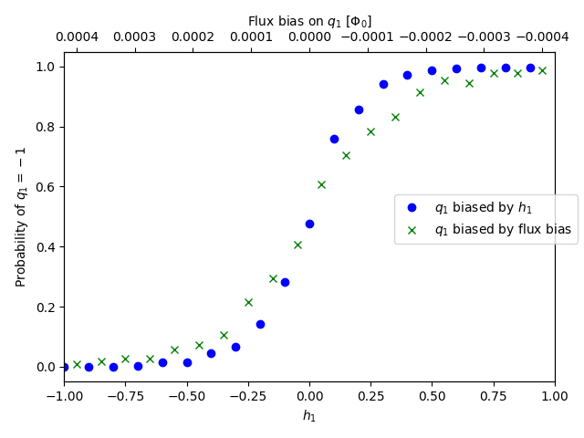

    Probability of state :math:`-1` for a qubit biased with :math:`h_1` or by an
    equivalent flux-bias offset.

The following code snippet provides a single-point demonstration. Scan across
``h_1`` to reproduce the plots of :numref:`Figure %s <fluxBiasOffsetsHVsFB>`
above.

>>> import numpy as np
>>> from dwave.system import DWaveSampler
>>> from dwave.system.temperatures import h_to_fluxbias
...
>>> qpu = DWaveSampler()
>>> q = qpu.nodelist[0]
...
>>> h_1 = 0.25
...
>>> fb = [0]*qpu.properties['num_qubits']
>>> sampleset1 = qpu.sample_ising({q: h_1}, {}, num_reads=1000, auto_scale=False, 
...                              answer_mode="raw", flux_biases=fb)
>>> fb[q] = h_to_fluxbias(h_1, B=1.391, MAFM=1.647)
>>> sampleset2 = qpu.sample_ising({q: 0}, {}, num_reads=1000, 
...                              auto_scale=False, answer_mode="raw", flux_biases=fb)
>>> sample1 = sampleset1.record.sample
>>> sample2 = sampleset2.record.sample
>>> print(np.count_nonzero(sample1[:,0]==-1)/sample1.shape[0])      # doctest: +SKIP
0.888
>>> print(np.count_nonzero(sample2[:,0]==-1)/sample2.shape[0])      # doctest: +SKIP
0.841

For QPU-specific parameters such as the quantum crossing point and the maximum
mutual inductance between qubits, :math:`M_{AFM}`, see the
:ref:`doc_qpu_characteristics` page.

.. _cb_qpu_anneal_gap:

Energy Gap
==========

There are strategies for increasing the gap between ground and excited states
during the anneal. For example, different choices of constraints when
reformulating a CSP as a QUBO affect the gap.

Consider also the differences between maximizing the gap versus creating a
uniform gap.

Example
-------

This example formulates a 3-bit parity check\ [#]_ as an Ising model in two
ways, the first with an energy gap of 1 and the second with an energy gap of 2.

.. [#]
    Feasible states are those states where the number of spin-up values for
    three Ising variables, :math:`s_1, s_2, s_3`, is even.

Penalty model 1 is formulated as,

.. math::

    0.5(s_1 + s_2 + s3) -a + 0.5(s_1s_2 + s_1s_3 + s_2s_3) - as_1 - as_2 - as_3

with one auxiliary variable, :math:`a`, and an energy gap of 1. The following
code samples it on an |dwave_5kq| QPU:

>>> from dwave.system import DWaveSampler, EmbeddingComposite
>>> sampler = EmbeddingComposite(DWaveSampler(solver={'topology__type': 'pegasus'}))
>>> h = {'s1': 0.5, 's2': 0.5, 's3': 0.5, 'a': -1}
>>> J = {('s1', 's2'): 0.5, ('s1', 's3'): 0.5, ('s2', 's3'): 0.5,
...      ('s1', 'a'): -1, ('s2', 'a'): -1, ('s3', 'a'): -1}
>>> sampleset = sampler.sample_ising(h, J, num_reads=1000)
>>> print(sampleset)                               # doctest: +SKIP
    a s1 s2 s3 energy num_oc. chain_.
0  +1 -1 +1 +1   -2.0     209     0.0
1  +1 +1 +1 -1   -2.0     244     0.0
2  -1 -1 -1 -1   -2.0     265     0.0
3  +1 +1 -1 +1   -2.0     271     0.0
4  -1 +1 -1 -1   -1.0       1     0.0
5  -1 -1 -1 +1   -1.0       1     0.0
6  -1 -1 +1 -1   -1.0       1     0.0
7  +1 +1 +1 +1   -1.0       1     0.0
8  +1 -1 +1 -1   -1.0       2     0.0
9  +1 -1 -1 +1   -1.0       2     0.0
10 +1 +1 -1 -1   -1.0       3     0.0
['SPIN', 11 rows, 1000 samples, 4 variables]

Penalty model 2 is formulated as,

.. math::

    -a_1  +a_2 - a_3 + s_1a_1 + s_1a_2 + s_1a_3  - s_2a_1 + s_2a_2 + s_2a_3
    + s_3a_1 + s_3a_2 - s_3a_3

with three auxiliary variables, :math:`a_1, a_2, a_3`, and an energy gap of 2.
The following code samples it on the same |dwave_5kq| QPU as the previous code:

>>> h = {'a1': -1, 'a2': 1, 'a3': -1}
>>> J = {('s1', 'a1'): 1, ('s1', 'a2'): 1, ('s1', 'a3'): 1,
...      ('s2', 'a1'): -1, ('s2', 'a2'): 1, ('s2', 'a3'): 1,
...      ('s3', 'a1'): 1, ('s3', 'a2'): 1, ('s3', 'a3'): -1}
>>> sampleset = sampler.sample_ising(h, J, num_reads=1000)
>>> print(sampleset)                                          # doctest: +SKIP
  a1 a2 a3 s1 s2 s3 energy num_oc. chain_.
0 -1 -1 +1 +1 -1 +1   -6.0     302     0.0
1 +1 -1 -1 +1 +1 -1   -6.0     181     0.0
2 +1 +1 +1 -1 -1 -1   -6.0     278     0.0
3 +1 -1 +1 -1 +1 +1   -6.0     236     0.0
4 +1 +1 +1 -1 +1 -1   -4.0       1     0.0
5 -1 +1 +1 -1 -1 +1   -4.0       1     0.0
6 +1 +1 +1 -1 +1 +1   -2.0       1     0.0
['SPIN', 7 rows, 1000 samples, 6 variables]

For this simple example, both formulations produce a high percentage of ground
states (states where the number of spin-up values for variables
:math:`s_1, s_2, s_3` is even). Had this been part of a more complex problem,
you might have needed to weigh the benefit of a larger energy gap against other
considerations, such as a larger number of ancillary variables.

Further Information
-------------------

*   [Bia2014]_ discusses constructing a penalty function for a given constraint
    with the largest possible gap, subject to bounds on the supported
    :math:`h`\ s and :math:`J`\ s.
*   [Pud2014]_ and [Pud2015]_ discuss error suppression techniques using
    auxiliary qubits and the energy gap.

.. _cb_qpu_neighbors:

Neighbor Interactions
=====================

The dynamic range of :math:`h` and :math:`J` values may be limited by ICE.
Instead of finding low-energy states to an optimization problem defined by
:math:`h` and :math:`J`, the QPU solves a slightly altered problem that can be
modeled as

.. math::

    E^{\delta}_{ising} ({\bf s})  =
    \sum_{i=1}^N (h_i  + \delta  h_i  ) s_i
    +  \sum_{i=1}^N \sum_{j=i+1}^{N}   (J_{i,j}  + \delta J_{i,j} )  s_i s_j,

where the ICE errors :math:`\delta h_i` and :math:`\delta J_{i,j}` depend
on :math:`h_i` and on the values of all incident couplers :math:`J_{i,j}` and
neighbors :math:`h_j`, as well as *their* incident couplers :math:`J_{j,k}` and
next neighbors :math:`h_k`. For example, if a given problem is specified by
:math:`(h_1  = 1 ,  h_2 = 1,  J_{1,2} = -1)`, the QPU might actually solve the
problem :math:`(h_1 = 1.01, h_2 = 0.99, J_{1,2} = -1.01)`.

Changing a single parameter in the problem might change all three error terms,
altering the problem in different ways.

**Further Information**

[Har2010]_ discusses how applied :math:`h` bias leaks from spin :math:`i` to its
neighboring spins.

