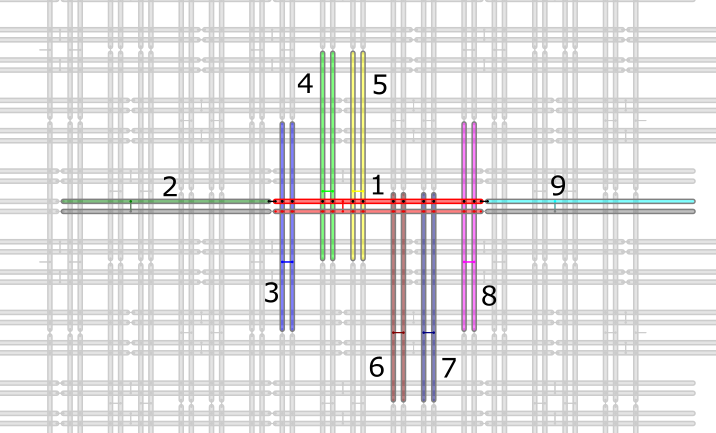

.. _qpu_topologies:

==========
Topologies
==========

The layout of the |dwave_short| quantum processing unit (QPU) is critical to
formulating an objective function in a format that a |dwave_short| annealing
quantum computer can solve, as described in the :ref:`getting_started_concepts`
section. Although Ocean software automates the mapping from the linear and
quadratic coefficients of a quadratic model to qubit bias and coupling values
set on the QPU, you should understand it if you are using QPU solvers directly
because it has implications for the problem-graph size and solution quality.

.. note:: If you are sending your problem to a
    quantum-classical hybrid solver in the
    `Leap service <https://cloud.dwavesys.com/leap/>`_, the solver handles all
    interactions with the QPU.

The |dwave_short| QPU is a lattice of interconnected qubits.
While some qubits connect to others via couplers, the |dwave_short| QPU is not
fully connected. Instead, the qubits of |dwave_short| annealing quantum
computers interconnect in one of the following topologies:

*   :ref:`Pegasus <topology_intro_pegasus>` topology for |dwave_5kq| QPUs
*   :ref:`Zephyr <topology_intro_zephyr>` topology for next-generation QPUs
    currently under development

.. _topologies_working_graph:

The Working Graph
=================

Some small number of qubits and couplers in a QPU may not meet the
specifications to function as desired. These are therefore removed from the
programmable fabric that users can access. The subset of the QPU's graph
available to users is the *working graph*. The yield\ [#]_ of the working graph
is the percentage of working qubits that are present.

.. [#]
    Manufacturing variations and the need to prepare the QPU to operate at
    cryogenic temperatures in a low–magnetic field environment limits the yield.
    These variations are minimized through an extensive calibration process that
    attempts to bring all of these analog devices into a consistent parametric
    regime.

    For example, each |dwave_5kq| QPU is fabricated with 5,640 qubits and 40,484
    couplers in a Pegasus topology. Of this total, the number and specific set
    of qubits and couplers that can be made available in the working graph
    changes with each system cooldown and calibration cycle. Calibrated
    commercial systems typically have more than 97% of fabricated qubits
    available in their working graphs.

.. _topology_intro_chimera:

Topology Concepts and the Chimera Topology
==========================================

This section introduces concepts in topology by describing elements of the
Chimera\ |tm| topology used on |dwave_short|'s previous generation of quantum
computer, the |dwave_2kq_tm| system. The Chimera topology's relative simplicity
is helpful for understanding the more complex topologies of newer QPUs: in
addition to shared concepts, the newer topologies are often described in terms
derived from the Chimera topology.

Qubit Orientation 
-----------------

Qubits on |dwave_short| QPUs are "oriented" vertically 
or horizontally as shown in :numref:`Figure %s <ChimeraQubits3x3>`
for the Chimera topology.

.. figure:: ../_images/Chimera_qubits_3x3.*
    :align: center
    :name: ChimeraQubits3x3
    :alt: Qubits in the Chimera topology.
    :height: 200 pt
    :width: 200 pt

    Qubits represented as horizontal and vertical loops. This graphic shows
    three rows of 12 vertical qubits and three columns of 12 horizontal qubits
    for a total of 72 qubits, 36 vertical and 36 horizontal.

Qubits on newer QPUs, such as those with the Zephyr topology, are also oriented
vertically and horizontally. 

Coupler Types
------------- 

It is conceptually useful to categorize couplers as follows:

.. _topologies_couplers_internal:

-   **Internal couplers**.

    Internal couplers connect pairs of orthogonal (with opposite orientation)
    qubits as shown in :numref:`Figure %s <ChimeraQubits2x2Internals>`.

    .. figure:: ../_images/Chimera_qubits_2x2_internals.*
        :align: center
        :name: ChimeraQubits2x2Internals
        :height: 200 pt
        :width: 200 pt
        :alt: Internal couplings in the Chimera topology.

        Green circles at the intersections of qubits signify internal couplers;
        for example, the upper leftmost vertical qubit, highlighted in green,
        internally couples to four horizontal qubits, shown bolded.

.. _topologies_couplers_external:

-   **External couplers**.

    External couplers connect colinear pairs of qubits---pairs of parallel
    qubits in the same row or column---as shown in
    :numref:`Figure %s <ChimeraQubits1x3InternalsExternals>`.

    .. figure:: ../_images/Chimera_qubits_1x3_internals_externals.*
        :align: center
        :name: ChimeraQubits1x3InternalsExternals
        :height: 170 pt
        :width: 425 pt
        :scale: 70%
        :alt: Internal and external couplings in the Chimera topology.

        External couplers, shown as connected blue circles, couple vertical
        qubits to adjacent vertical qubits and horizontal qubits to adjacent
        horizontal qubits; for example, the green horizontal qubit in the center
        couples to the two blue horizontal qubits in adjacent unit cells. (It is
        also coupled to the bolded qubits in its own unit cell by internal
        couplers.)

-   **Odd couplers**.

    Odd couplers connect similarly aligned pairs of qubits as shown in
    :numref:`Figure %s <PegasusOddCoupled>` of the :ref:`topology_intro_pegasus`
    section. The Chimera topology does not support such couplers but newer
    topologies do.

Unit Cells 
----------

The Chimera topology has a recurring structure of four horizontal qubits coupled
to four vertical qubits in a :math:`K_{4,4}` bipartite graph, called a
*unit cell*. :numref:`Figure %s <ChimeraQubits3x3Examplecoupledqubit>` shows
three unit cells.

.. figure:: ../_images/Chimera_qubits_3x3_examplecoupledqubit.*
    :align: center
    :name: ChimeraQubits3x3Examplecoupledqubit
    :height: 170 pt
    :width: 425 pt
    :scale: 100%
    :alt: Internal and external couplings in the Chimera topology.

    Three unit cells in the Chimera topology. Each of the three green squares
    contains eight qubits, four horizontal and four vertical. External couplers
    couple horizontal qubits to adjacent horizontal qubits (shown as connected
    blue circles) and vertical qubits to adjacent vertical qubits (not shown).
    Internal couplers, shown in green, couple horizontal to vertical qubits
    inside each unit cell.

A unit cell is typically rendered as either a cross or a column as shown in
:numref:`Figure %s <ChimeraUnitCell>`.

.. figure:: ../_images/ChimeraUnitCell.*
    :align: center
    :name: ChimeraUnitCell
    :height: 180 pt
    :width: 310 pt
    :alt: Unit cell in the Chimera topology.

    Unit cell in the Chimera topology. In each of these renderings there are two
    sets of four qubits. Each qubit connects to all qubits in the other set but
    to none in its own, forming a :math:`K_{4,4}` graph; for example, the green
    qubit labeled 0 connects to bolded qubits 4 to 7.

Structure
---------

The :math:`K_{4,4}` unit cells formed by internal couplers are connected by
external couplers as a lattice: this is the Chimera topology.
:numref:`Figure %s <chimera2x2UnitCells>` shows two unit cells that form part
of a larger Chimera graph.

.. figure:: ../_images/Chimera_2x2_unit_cells.*
    :name: chimera2x2UnitCells
    :height: 230 pt
    :width: 200 pt
    :align: center
    :alt: Chimera graph. Qubits are arranged in unit cells that form bipartite
        connections.

    A cropped view of two unit cells of a Chimera graph. Qubits are arranged in
    4 unit cells (translucent green squares) interconnected by external couplers
    (blue lines).

Notations 
---------

Qubits in the Chimera topology are characterized as having:

*   nominal length 4---each qubit is connected to 4 orthogonal qubits through
    internal couplers
*   degree 6---each qubit is coupled to 6 different qubits

The notation CN refers to a Chimera graph consisting of an :math:`N{\rm x}N`
grid of unit cells.

For example, the |dwave_2kq| QPU supported a C16 Chimera graph: its more than
2000 qubits were logically mapped into a :math:`16 {\rm x} 16` matrix of unit
cells of 8 qubits. The :math:`2 {\rm x} 2` Chimera graph of
:numref:`Figure %s <ChimeraQubits2x2Internals>` is denoted C2.

.. _topology_intro_pegasus:

Pegasus Graph
=============

In |dwave_5kq_tm| QPUs, qubits are “oriented” vertically or horizontally, as in
the Chimera topology, but similarly aligned qubits are also shifted, as
illustrated in :numref:`Figure %s <PegasusQubits>`.

.. figure:: ../_images/Pegasus_qubits.*
    :name: PegasusQubits
    :height: 400 pt
    :width: 400 pt
    :align: center
    :alt: Qubits in the Pegasus topology.

    A cropped view of the Pegasus topology with qubits represented as horizontal
    and vertical loops. This graphic shows approximately three rows of 12
    vertical qubits and three columns of 12 horizontal qubits for a total of 72
    qubits, 36 vertical and 36 horizontal.

For QPUs with the Pegasus\ |tm| topology it is conceptually useful to categorize
couplers as internal, external, and odd.
:numref:`Figure %s <pegasusAllCoupledQubits>` and
:numref:`Figure %s <pegasusAllCoupledQubitsRoadway>` show two views of the
coupling of qubits in this topology.

    Coupled qubits (represented as horizontal and vertical loops): the
    horizontal qubit in the center, shown in red and numbered 1, with its odd
    coupler and paired qubit also in red, is internally coupled to vertical
    qubits, in pairs 3 through 8, each pair and its odd coupler shown in a
    different color, and externally coupled to horizontal qubits 2 and 9, each
    shown in a different color.

.. figure:: ../_images/pegasus_all_coupled_qubits_roadway.*
    :align: center
    :name: pegasusAllCoupledQubitsRoadway
    :height: 240 pt
    :width: 480 pt
    :alt: Roadway graphic of the Pegasus topology

    Coupled qubits "roadway" graphic (qubits represented as dots and couplers as
    lines): the qubit in the upper center, shown in red and numbered 1, is oddly
    coupled to the (red) qubit shown directly below it, internally coupled to
    vertical qubits, in pairs 3 through 8, each pair and its odd coupler shown
    in a different color, and externally coupled to horizontal qubits 2 and 9,
    each shown in a different color.

Couplers
--------

-   **Internal couplers**.

    Internal couplers connect pairs of orthogonal (with opposite orientation)
    qubits as shown in :numref:`Figure %s <PegasusInternalCoupled>`. Each qubit
    is connected via internal coupling to 12 other qubits.

    .. figure:: ../_images/Pegasus_internal_coupled.*
        :align: center
        :name: PegasusInternalCoupled
        :height: 300 pt
        :width: 300 pt
        :alt: Internal couplings in the Pegasus topology.

        Junctions of horizontal and vertical loops signify internal couplers;
        for example, the green vertical qubit is coupled to 12 horizontal
        qubits, shown bolded. The translucent green square represents a unit
        cell structure in the Chimera topology (a :math:`K_{4,4}` bipartite
        graph of internal couplings).

-   **External couplers**.

    External couplers connect vertical qubits to adjacent vertical qubits and
    horizontal qubits to adjacent horizontal qubits as shown in
    :numref:`Figure %s <PegasusInternalExternalCoupled>`.

    .. figure:: ../_images/Pegasus_internal_external_coupled.*
        :align: center
        :name: PegasusInternalExternalCoupled
        :height: 300 pt
        :width: 300 pt
        :alt: Internal and external couplings in the Pegasus topology.

        External couplers connect similarly aligned adjacent qubits; for
        example, the green vertical qubit is coupled to the two adjacent
        vertical qubits, highlighted in blue.

.. _topologies_couplers_odd:

-   **Odd couplers**.

    Odd couplers connect similarly aligned pairs of qubits as shown in
    :numref:`Figure %s <PegasusOddCoupled>`.

    .. figure:: ../_images/Pegasus_odd_coupled.*
        :align: center
        :name: PegasusOddCoupled
        :height: 300 pt
        :width: 300 pt
        :alt: Odd couplings in the Pegasus topology.

        Odd couplers connect similarly aligned pairs of qubits; for example, the
        green vertical qubit is coupled to the red vertical qubit by an odd
        coupler.

The Pegasus topology features qubits of degree 15 and native :math:`K_4` and
:math:`K_{6,6}` subgraphs. Qubits in this topology are considered to have a
nominal length of 12 (each qubit is connected to 12 orthogonal qubits through
internal couplers) and degree of 15 (each qubit is coupled to 15 different
qubits).

As the notation :math:`C_n` refers to a Chimera graph with size parameter N,
:math:`P_n` refers to instances of Pegasus topologies; for example, :math:`P_3`
is a graph with 144 nodes. A unit cell in the Pegasus topology contains
twenty-four qubits, with each qubit coupled to one similarly aligned qubit in
the cell and two similarly aligned qubits in adjacent cells, as shown in
:numref:`Figure %s <P4UnitCells>`. An |dwave_5kq| QPU is a lattice of
:math:`16x16` such unit cells, denoted as a :math:`P_{16}` Pegasus graph.

.. figure:: ../_images/p4_unitcells.*
    :align: center
    :name: P4UnitCells
    :height: 300 pt
    :width: 300 pt
    :alt: Unit cells in the Pegasus topology.

    Unit cells of the Pegasus topology in a :math:`P_4` graph, with qubits
    represented as green dots and couplers as gray lines.

More formally, a unit cell in the Pegasus topology consists of 48 halves of
qubits that are divided between adjacent such unit cells, as shown in
:numref:`Figure %s <P4UnitCellsHalfQubits>`.

.. figure:: ../_images/p4_unitcell_halfqubits.*
    :align: center
    :name: P4UnitCellsHalfQubits
    :height: 200 pt
    :width: 200 pt
    :alt: Unit cell in the Pegasus topology.

    Unit cell in the Pegasus topology shown as 48 halves of qubits from adjacent
    unit cells, with qubits represented as truncated loops (double lines),
    internal couplers as dots, and external and odd couplers as dots connected
    by short lines.

.. _topology_intro_zephyr:

Zephyr Graph
============

|dwave_short| is currently developing its next-generation QPU with the
Zephyr\ |tm| topology: qubits are “oriented” vertically or horizontally, as in
the Chimera and Pegasus topologies, and are shifted and connected with three
coupler types as in the Pegasus topology, but this new graph achieves higher
nominal length (16) and degree (20). A qubit in the Zephyr topology has sixteen
:ref:`internal couplers <topologies_couplers_internal>` connecting it to
orthogonal qubits and two
:ref:`external couplers <topologies_couplers_external>` and two
:ref:`odd couplers <topologies_couplers_odd>` connecting it to similarly
aligned qubits.

The Zephyr topology enables native :math:`K_4` and :math:`K_{8,8}` subgraphs.

:numref:`Figure %s <ZephyrCouplersColored>` shows the 20 couplers of a qubit in
a Zephyr graph.

.. figure:: ../_images/zephyr_couplers_colored.*
    :name: ZephyrCouplersColored
    :height: 600 pt
    :width: 600 pt
    :align: center
    :alt: Couplers in the Zephyr topology.

    A cropped view of the Zephyr topology with one representative qubit (black
    dot) connected to orthogonal qubits by 16 internal couplers (green lines)
    and to similarly aligned qubits by two external couplers (blue lines) and
    two odd couplers (red lines).

As the notations :math:`C_n` and :math:`P_n` refer to Chimera and Pegasus graphs
with size parameter N, :math:`Z_n` refers to instances of Zephyr topologies;
specifically, :math:`Z_n` is a :math:`(2n+1) \times (2n+1)` grid of unit cells.
For example, :math:`Z_3` is a graph with 336 nodes.

As shown in :numref:`Figure %s <ZephyrUnitCellsHalfQubits>`, a unit cell in the
Zephyr topology contains two groups of eight half qubits, with each qubit in the
cell coupled either to four oppositely aligned qubits and one similarly aligned
qubit (four :math:`K_{4,4}` complete graphs with their internal and external
couplings) or to eight oppositely aligned qubits and one similarly aligned qubit
(a :math:`K_{8,8}` complete graph with its internal and odd couplings).

.. figure:: ../_images/zephyr_unitcell_halfqubits.*
    :align: center
    :name: ZephyrUnitCellsHalfQubits
    :height: 500 pt
    :width: 500 pt
    :alt: Unit cell in the Zephyr topology.

    Unit cells in the Zephyr topology: for the center unit cell, one group of
    eight half qubits are shown in orange, another in blue.

:numref:`Figure %s <ZephyrUnitcell>` shows a :math:`Z_1` :math:`3X3` grid of
unit cells in the Zephyr topology.

.. figure:: ../_images/zephyr_unitcell.*
    :name: ZephyrUnitcell
    :height: 600 pt
    :width: 600 pt
    :align: center
    :alt: Unit cell in the Zephyr topology.

    A visualization of the :math:`Z_1` :math:`3X3` grid of unit cells in the
    Zephyr topology: qubits are represented as black dots, solid lines represent
    couplers that belong to one unit cell, while dashed lines represent couplers
    that belong to other unit cells. Internal couplers are green, external
    couplers are blue, and odd coupler are red.

Ocean Software's Graph Tools
============================

Ocean software provides for all supported topologies the following graph tools:

*   :ref:`graph generation <oceandocs:generators_dnx>` creates graphs for the
    supported topologies of various sizes.
*   :ref:`drawing <oceandocs:drawing>` visualizes the graphs you create.
*   :std:doc:`indexing<oceandocs:docs_dnx/reference/utilities>` helps translate
    coordinates of the supported graphs.

Further Information: Technical Reports
======================================

You can learn more about these topologies and their implications in the
following technical reports:

*   Pegasus topology: `14-1026 Next-Generation Topology of D-Wave Quantum Processors <https://www.dwavesys.com/media/jwwj5z3z/14-1026a-c_next-generation-topology-of-dw-quantum-processors.pdf>`_
*   Zephyr topology: `14-1056 Zephyr Topology of D-Wave Quantum Processors <https://www.dwavesys.com/media/2uznec4s/14-1056a-a_zephyr_topology_of_d-wave_quantum_processors.pdf>`_
