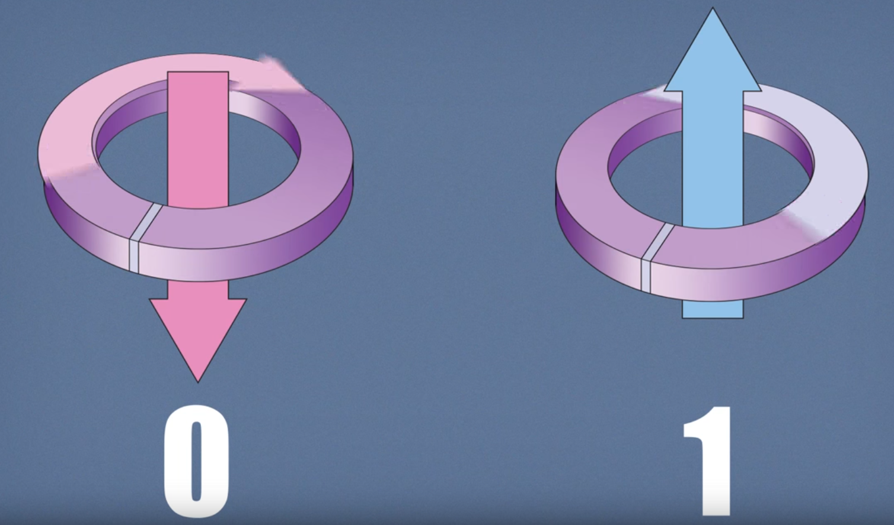
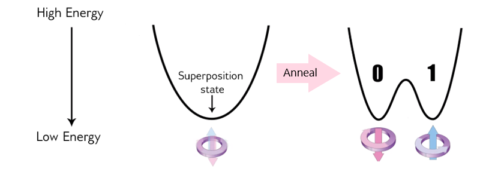
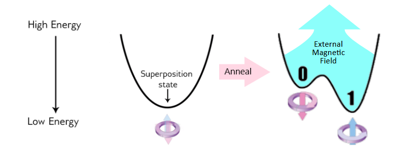
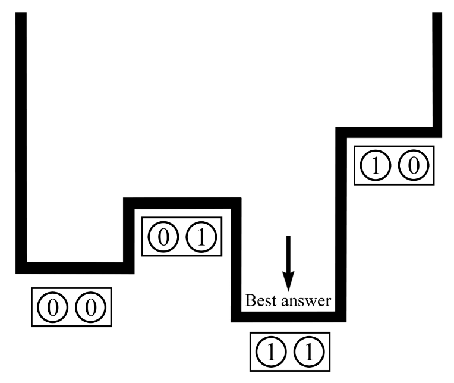
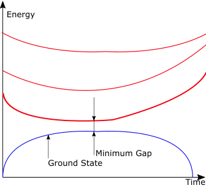

.. _qpu_quantum_annealing_intro:

==========================
What is Quantum Annealing?
==========================

This section explains what quantum annealing is and how it works, and
introduces the underlying quantum physics that governs its behavior. For more
in-depth information on quantum annealing in |dwave_short| quantum computers,
see the :ref:`qpu_annealing` section.

Applicable Problems
===================

Quantum annealing processors naturally return low-energy solutions; some
applications require the real minimum energy (optimization problems) and others
require good low-energy samples (probabilistic sampling problems).

**Optimization problems.** In an optimization problem, you search for the best
of many possible combinations. Optimization problems include scheduling
challenges, such as "Should I ship this package on this truck or the next one?"
or "What is the most efficient route a traveling salesperson should take to
visit different cities?"

Physics can help solve these sorts of problems because you can frame them as
energy minimization problems. A fundamental rule of physics is that everything
tends to seek a minimum energy state. Objects slide down hills; hot things cool
down over time. This behavior is also true in the world of quantum physics.
Quantum annealing simply uses quantum physics to find low-energy states of a
problem and therefore the optimal or near-optimal combination of elements.

**Sampling problems.** Sampling from many low-energy states and characterizing
the shape of the energy landscape is useful for machine learning problems where
you want to build a probabilistic model of reality. The samples give you
information about the model state for a given set of parameters, which can then
be used to improve the model.

Probabilistic models explicitly handle uncertainty by accounting for gaps in
knowledge and errors in data sources. Probability distributions represent the
unobserved quantities in a model (including noise effects) and how they relate
to the data. The distribution of the data is approximated based on a finite set
of samples. The model infers from the observed data, and learning occurs as it
transforms the prior distribution, defined before observing the data, into the
posterior distribution, defined afterward. If the training process is
successful, the learned distribution resembles the distribution that generated
the data, allowing predictions to be made on unobserved data. For example, when
training on the famous MNIST dataset of handwritten digits, such a model can
generate images resembling handwritten digits that are consistent with the
training set.

Sampling from energy-based distributions is a computationally intensive task
that is an excellent match for the way that the |dwave_short| quantum computer
solves problems; that is, by seeking low-energy states.

You can see a variety of example problems in the
:ref:`qpu_index_examples_beginner` and :ref:`qpu_index_examples_advanced`
sections, in |dwave_short|'s
`code examples repository <https://github.com/dwave-examples>`_
on GitHub, and the many user-developed early quantum applications on
|dwave_short| systems shown on the |dwave_short|_ website.

How Quantum Annealing Works in |dwave_short| QPUs
=================================================

The quantum bits---also known as *qubits*---are the lowest energy states of
the superconducting loops that make up the |dwave_short| QPU. These states
have a circulating current and a corresponding magnetic field. As with
classical bits, a qubit can be in state of 0 or 1; see
:numref:`Figure %s <superp>`. But because the qubit is a quantum object, it can
also be in a superposition of the 0 state and the 1 state at the same time. At
the end of the quantum annealing process, each qubit collapses from a
superposition state into either 0 or 1 (a classical state).

        corresponding magnetic field.

    A qubit's state is implemented as a circulating current, shown clockwise for
    0 and counterclockwise for 1, with a corresponding magnetic field.

The physics of this process can be visualized with an energy diagram. At the
start of the annealing process, the qubit is in a superposition state, which
can be represented as a single valley with a single minimum energy. As the
quantum annealing process runs, an energy barrier is raised which separates
the single minimum energy into two valleys (that is, a
`double-well potential <https://en.wikipedia.org/wiki/Double-well_potential>`_).
For example, :numref:`Figure %s <anneal_one_qubit_no_h>` shows the energy
diagram for the annealing process of a single qubit that results in two valleys
of equal energy minima; thus the qubit has a 50/50 chance of being in either
valley at the end of the anneal---that is, in the classical state of either 0
or 1.

        for a single qubit, resulting in a 50/50 probability of ending in a
        classical state of 0 or 1.

    Annealing process's energy diagram shows raising the energy barrier for a
    single qubit, resulting in a 50/50 probability of ending in a classical
    state of 0 or 1.

The probability of the qubit falling into the 0 or 1 state can be controlled by
applying an external magnetic field to bias the qubit to end in one state over
the other; the magnetic field is programmatically controlled via a qubit bias.
For example, :numref:`Figure %s <anneal_one_qubit_with_h>` shows a magnetic
field being applied to a single qubit as the energy barrier is raised; the
magnetic field tilts the valleys in a preferred direction, increasing the
probability of the qubit ending up in the valley with the lower energy
minimum---here, the classical state of 1.

        being applied to a single qubit, resulting in a higher probability
        of ending in a classical state of 1.

    Annealing process's energy diagram shows an external magnetic field being
    applied to a single qubit, resulting in a higher probability of ending in
    a classical state of 1.

However, the real power of quantum annealing is realized when you link qubits
together so they can influence each other, accomplished via a device called a
*coupler*. A coupler can correlate two qubits such that they tend to end up in
the same classical state---both 0 or both 1---or in opposite states. The
correlation between coupled qubits is controlled programmatically. Together,
programmable qubit biases and coupler correlations are the means by which a
problem is defined in the |dwave_short| quantum computer.

Furthermore, couplers use another phenomenon of quantum physics called
entanglement. When two qubits are entangled, they can be thought of as a single
object with four possible states. :numref:`Figure %s <4states>` illustrates
this idea, showing a potential with four states, each corresponding to a
different combination of the two qubits: (0,0), (0,1), (1,1), and (1,0). The
relative energy of each state depends on the biases of qubits and the couplers
between them. During the anneal, the qubit states are potentially entangled in
this landscape before finally settling into (1,1) at the end of the anneal.

    Energy diagram showing the best answer.

As stated, each qubit has a bias and qubits interact via the couplers. When
formulating a problem, you choose values for the qubit biases and couplers. The
qubit biases and couplers define an energy landscape, and the |dwave_short|
quantum computer finds the minimum energy of that landscape: this is quantum
annealing.

Systems get increasingly complex as qubits are added: two qubits have four
possible states over which to define an energy landscape; three qubits have
eight. Each additional qubit doubles the number of states over which you can
define the energy landscape: the number of states goes up exponentially with
the number of qubits.

In summary, the system starts with a set of qubits, each in a superposition
state of 0 and 1. They are not yet coupled. When they undergo quantum
annealing, the couplers and qubit biases are introduced and the qubits become
entangled. At this point, the system is in an entangled state of many possible
answers. By the end of the anneal, each qubit is in a classical state that
represents the minimum energy state of the problem, or one very close to it.
All of this happens in |dwave_short| quantum computers in a matter of
microseconds.

Underlying Quantum Physics
==========================

This section discusses some concepts essential to understanding
the quantum physics that governs the |dwave_short| quantum annealing process.

.. _qpu_quantum_annealing_intro_hamiltonian:

The Hamiltonian and the Eigenspectrum
-------------------------------------

A classical Hamiltonian is a mathematical description of some physical system
in terms of its energies. You can input any particular state of the system,
and the Hamiltonian returns the energy for that state. For most non-convex
Hamiltonians, finding the minimum energy state is an NP-hard problem that
classical computers cannot solve efficiently.

As an example of a classical system, consider an extremely simple system of a
table and an apple. This system has two possible states: the apple on the table,
and the apple on the floor. The Hamiltonian tells you the energies, from which
you can discern that the state with the apple on the table has a higher energy
than that when the apple is on the floor.

For a quantum system, a Hamiltonian is a function that maps certain states,
called *eigenstates*, to energies. Only when the system is in an eigenstate of
the Hamiltonian is its energy well defined and called the *eigenenergy*. When
the system is in any other state, its energy is uncertain. The collection of
eigenstates with defined eigenenergies make up the *eigenspectrum*.

For the |dwave_short| quantum computer, the Hamiltonian may be represented as

.. math::

    {\cal H}_{ising} = \underbrace{- \frac{A({s})}{2}
    \left(\sum_i {\hat\sigma_{x}^{(i)}}\right)}_\text{Initial Hamiltonian} +
    \underbrace{\frac{B({s})}{2} \left(\sum_{i} h_i {\hat\sigma_{z}^{(i)}} +
    \sum_{i>j} J_{i,j} {\hat\sigma_{z}^{(i)}}
    {\hat\sigma_{z}^{(j)}}\right)}_\text{Final Hamiltonian}

where :math:`{\hat\sigma_{x,z}^{(i)}}` are Pauli matrices operating on a qubit
:math:`q_i`, and :math:`h_i` and :math:`J_{i,j}` are the qubit biases and
coupling strengths.\ [#]_

.. [#]
    Nonzero values of :math:`h_i` and :math:`J_{i,j}` are limited to those
    available in the working graph; see the :ref:`qpu_topologies`
    chapter.

The Hamiltonian is the sum of two terms, the *initial Hamiltonian* and the
*final Hamiltonian*:

*   Initial Hamiltonian (first term)---The lowest-energy state of the initial
    Hamiltonian is when all qubits are in a superposition state of 0 and 1.
    This term is also called the *tunneling Hamiltonian*.
*   Final Hamiltonian (second term)---The lowest-energy state of the final
    Hamiltonian is the answer to the problem that you are trying to solve. The
    final state is a classical state, and includes the qubit biases and the
    couplings between qubits. This term is also called the
    *problem Hamiltonian*.

In quantum annealing, the system begins in the lowest-energy eigenstate of the
initial Hamiltonian. As it anneals, it introduces the problem Hamiltonian, which
contains the qubit biases and couplers, and it reduces the influence of the
initial Hamiltonian. At the end of the anneal, it is in an eigenstate of the
problem Hamiltonian. Ideally, it has stayed in the minimum energy state
throughout the quantum annealing process so that---by the end---it is in the
minimum energy state of the problem Hamiltonian and therefore has an answer to
the problem you want to solve. By the end of the anneal, each qubit is a
classical object.

Annealing in Low-Energy States
------------------------------

A plot of the eigenenergies versus time is a useful way to visualize the quantum
annealing process. The lowest energy state during the anneal---the
*ground state*---is typically shown at the bottom, and any higher excited states
are above it; see :numref:`Figure %s <eigenspectrum>`.

        excited states are above.

    Eigenspectrum, where the ground state is at the bottom and the higher
    excited states are above.

As an anneal begins, the system starts in the lowest energy state, which is well
separated from any other energy level. As the problem Hamiltonian is introduced,
other energy levels may get closer to the ground state. The closer they get, the
higher the probability that the system will jump from the lowest energy state
into one of the excited states. There is a point during the anneal where the
first excited state---that with the lowest energy apart from the ground
state---approaches the ground state closely and then diverges away again. The
minimum distance between the ground state and the first excited state throughout
any point in the anneal is called the :term:`minimum gap`.

Certain factors may cause the system to jump from the ground state into a higher
energy state. One is thermal fluctuations that exist in any physical system.
Another is running the annealing process too quickly. An annealing process that
experiences no interference from outside energy sources and evolves the
Hamiltonian slowly enough is called an *adiabatic* process, and this is where
the name *adiabatic quantum computing* comes from. Because no real-world
computation can run in perfect isolation, quantum annealing may be thought of as
the real-world counterpart to adiabatic quantum computing, a theoretical ideal.
In reality, for some problems, the probability of staying in the ground state
can sometimes be small; however, the low-energy states that are returned are
still very useful.

For every different problem that you specify, there is a different Hamiltonian
and a different corresponding eigenspectrum. The most difficult problems, in
terms of quantum annealing, are generally those with the smallest minimum gaps.

Evolution of Energy States
--------------------------

:numref:`Figure %s <annealing-functions-gsg>` shows the dependence of the
:math:`A` and :math:`B` parameters in the
:ref:`Hamiltonian <qpu_quantum_annealing_intro_hamiltonian>` on
s, the normalized anneal fraction, an abstract parameter ranging from 0 to 1.
The :math:`A(s)` curve is the tunneling energy and the :math:`B(s)` curve is the
problem Hamiltonian energy at :math:`s`. Both are expressed as energies in units
of Joules as is standard for a Hamiltonian.  A linear anneal sets
:math:`s = t / t_f`, where :math:`t` is time and :math:`t_f` is the total time
of the anneal. At :math:`t=0`, :math:`A(0) \gg B(0)`, which leads to the quantum
ground state of the system where each spin is in a delocalized combination of
its classical states. As the system is annealed, :math:`A` decreases and
:math:`B` increases until :math:`t_f`, when the final state of the qubits
represents a low-energy solution.

At the end of the anneal, the Hamiltonian contains the only :math:`B(s)` term.
It is a classical Hamiltonian where every possible classical bitstring (that is,
list of qubit states that are either 0 or 1) corresponds to an eigenstate and
the eigenenergy is the classical energy objective function you have input into
the system.

.. figure:: ../_images/annealing-functions.png
    :name: annealing-functions-gsg
    :height: 400 pt
    :width: 400 pt
    :alt: Graph showing how A(s) and B(s) energies change over time during a
        typical anneal schedule while physical temperature remains constant.

    Annealing functions :math:`A(s)`, :math:`B(s)`. Annealing begins at
    :math:`s=0` with :math:`A(s) \gg B(s)` and ends at :math:`s=1` with
    :math:`A(s) \ll B(s)`. Data shown are representative of |dwave_short|
    2X systems.

Annealing Controls
==================

|dwave_short| continues to pursue a deeper understanding of the fine details of
quantum annealing and devise better controls for it. The quantum computer
includes features that give users programmable control over the annealing
schedule, which enable a variety of searches through the energy landscape. These
controls can improve both optimization and sampling performance for certain
types of problems, and can help investigate what is happening partway through
the annealing process.

For more information about the available annealing controls, see the
:ref:`qpu_annealing` section.
