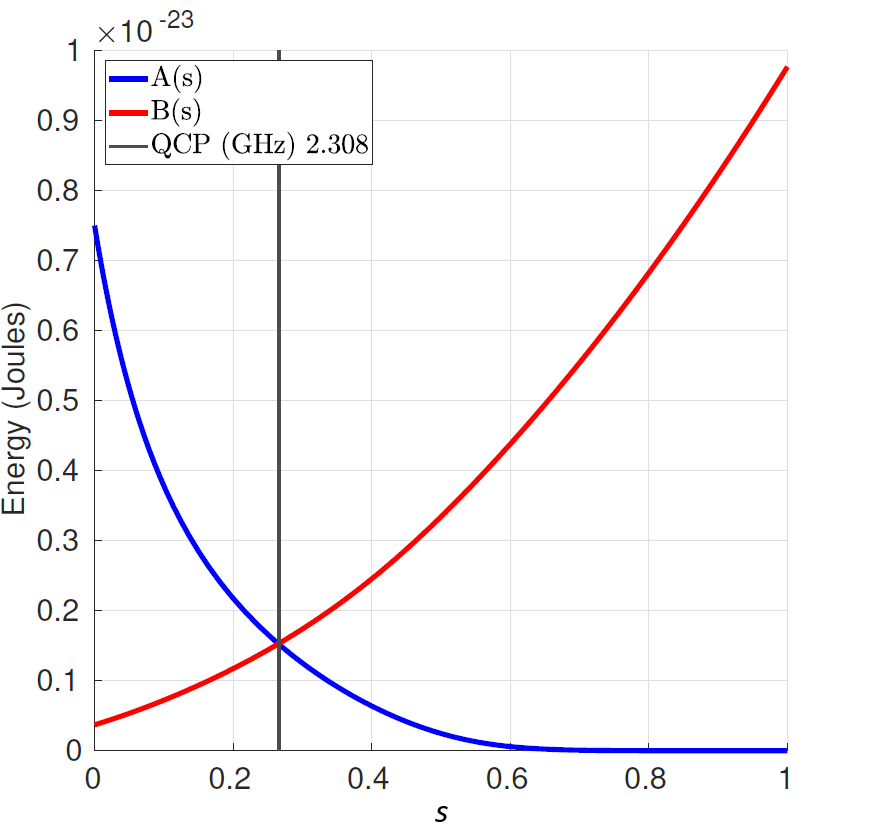
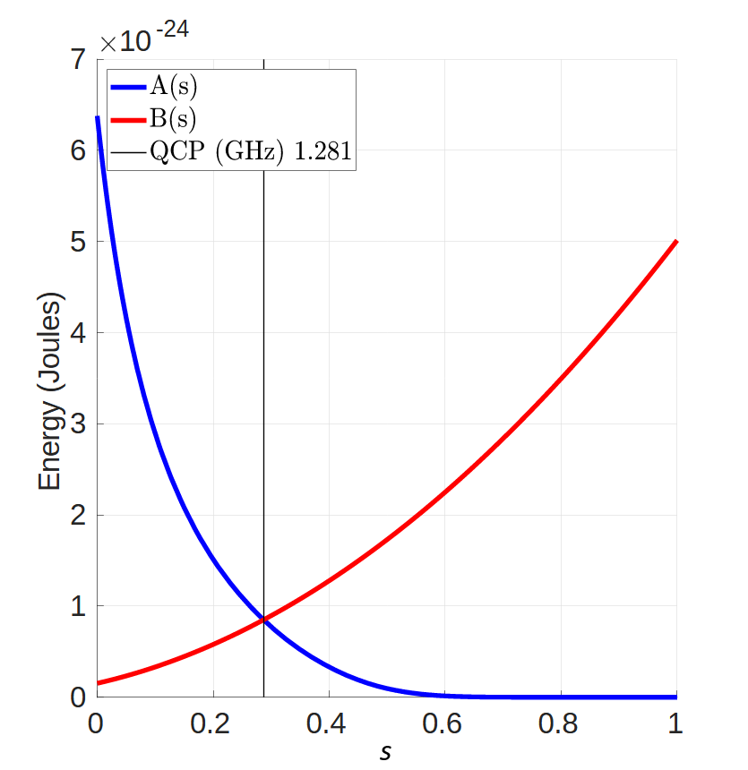
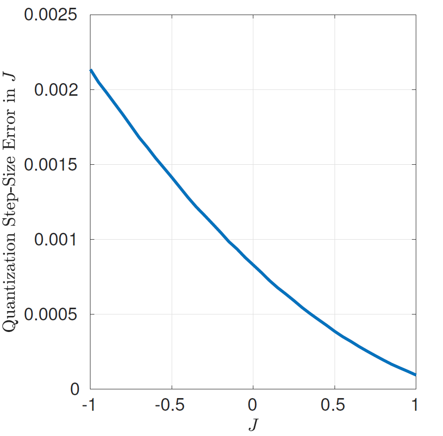
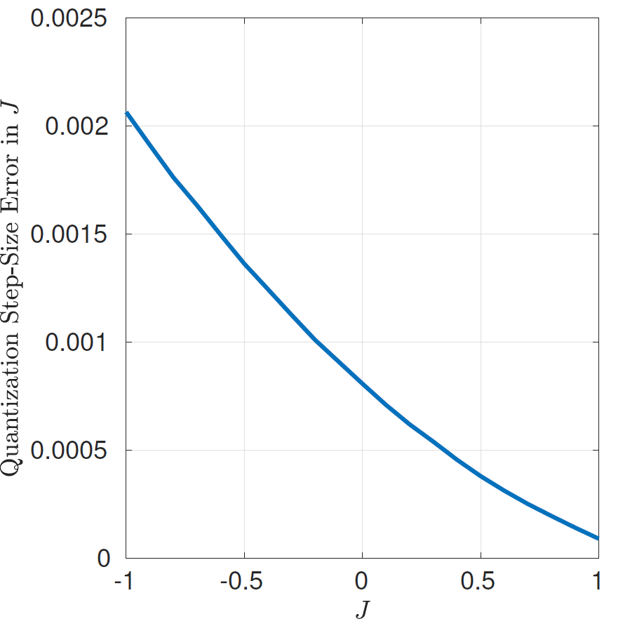
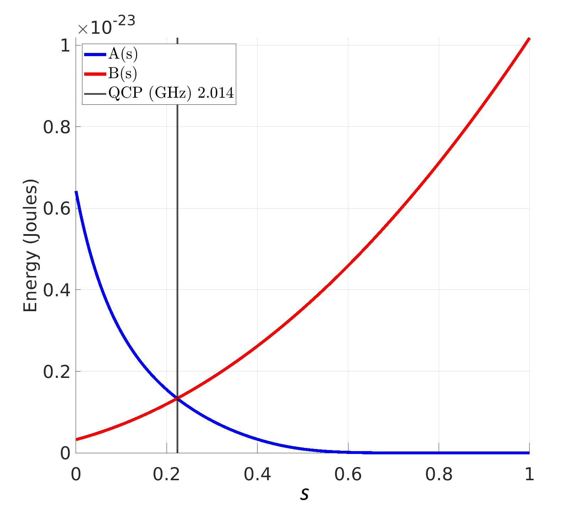

.. _qpu_solver_properties_specific:

=======================================
Per-QPU Solver Properties and Schedules
=======================================

The following sections provide information for advanced users who want to better
understand and leverage the physical implementation of |dwave_short|'s various
quantum processing units (QPUs) available in the Leap service\ [#]_.
This information includes:

*   Summary of a QPU's physical properties---The values provided are
    the physical properties of a calibrated QPU; they are not QPU
    specifications.

    .. note::
        In addition to the physical properties listed herein, each QPU has
        a number of other properties defined in software that are accessible via
        the Solver API. For a global list of the solver properties for a QPU,
        see the :ref:`qpu_solver_properties_all` page and for a list of the
        permitted user parameters for each type of solver, see the
        :ref:`qpu_solver_parameters` page. To retrieve the solver properties for
        a particular QPU, see the examples on those pages.

*   Spreadsheet for a QPU's annealing-schedule functions and normalized
    annealing-waveform values---These values are required for computing
    the energy of a problem at a specific point in a QPU's annealing process;
    as such, the spreadsheet provides the values to use for the :math:`A(s)`
    and :math:`B(s)` terms in the Hamiltonian of equation
    :eq:`2 <qpu_equation_quantum_hamiltonian>` for each value of the normalized
    anneal fraction :math:`s`, between 0 and 1 in increments of 0.001. Units for
    these terms are GHz, where the conversion from energy in Joules to Hz is
    through a division by
    `Planck's constant <https://en.wikipedia.org/wiki/Planck_constant>`_
    as follows:

    .. math::
        A(s)_{\text{[GHz]}} &= \frac{A(s)_{\text{[Joules]}}}
        {6.62607004 \times 10^{-34} \times 10^9}

        &= 1.5092 \times 10^{24} A(s)_{\text{[Joules]}}

.. [#]
        Depending on your customer contract, customer plan, and
        :ref:`seat type <admin_def_seat_type>` in a project, you may not have
        access to all QPUs in the Leap service.

Advantage2_system1.7
====================

All data presented in this section are specific to the **Advantage2_system1.7**
solver. The |adv2_tm| system QPU is based on a physical lattice of qubits and
couplers known as the *Zephyr*\ |tm| topology. For information, see the
:ref:`topology_intro_zephyr` section.

Physical Properties
-------------------

This table lists the physical properties of the calibrated QPU.

.. tabularcolumns:: |l|L|

.. list-table:: QPU Physical Properties\ [#]_
    :header-rows: 1
    :widths: 3 2

    *   - Property
        - Value

    *   - Model
        - :math:`\text{Advantage2}`

    *   - Graph size
        - :math:`\text{Z12}`

    *   - Number of :ref:`qubits <property_qpu_qubits>`
        - :math:`4592`

    *   - Number of :ref:`couplers <property_qpu_couplers>`
        - :math:`41779`

    *   - Qubit temperature
        - :math:`20 \pm 1.0\ \text{mK}`

    *   - :math:`\rm M_{\rm AFM}`: Maximum mutual inductance for qubit pairs
        - :math:`2.113\ \text{pH}`

    *   - Quantum critical point for 1D chains
        - :math:`2.308\ \text{GHz}`

    *   - :math:`L_q`: Qubit inductance
        - :math:`120\ \text{pH}`

    *   - :math:`C_q`: Qubit capacitance
        - :math:`147\ \text{fF}`

    *   - :math:`I_c`: Qubit critical current
        - :math:`4.75\ \text{µA}`

    *   - :ref:`Average single-qubit temperature <qpu_errors_temperature>`
        - :math:`0.112`

    *   - :ref:`Ferromagnetic-problem freezeout <qpu_qa_freezeout>`
        - :math:`0.008`

    *   - :ref:`Single-qubit freezeout <qpu_qa_freezeout>`
        - :math:`0.684`

    *   - :math:`\Phi_{\rm CCJJ}^i`: Initial (at :math:`s=0`) external flux on
          compound Josephson junctions
        - :math:`-0.694\ \Phi_0`

    *   - :math:`\Phi_{\rm CCJJ}^f`: Final (at :math:`s=1`) external flux on
          compound Josephson junctions
        - :math:`-0.760\ \Phi_0`

    *   - Readout time range
        - :math:`17.0\ \text{to}\ 101.0\ \text{µs}`

    *   - Programming time
        - :math:`\sim 33600\ \text{µs}`

    *   - QPU-delay-time per sample
        - :math:`60.6\ \text{µs}`

    *   - Readout error rate
        - :math:`\leq 0.001`

.. [#]

Some notes for the QPU properties are as follows:

.. include:: ../shared/qpu_specific_specs.rst
    :start-after: start_qpu_adv_and_adv2_prop_notes
    :end-before: end_qpu_adv_and_adv2_prop_notes

Annealing Schedule
------------------

Download the annealing schedule for the QPU here:
:download:`Advantage2_system1.7 Excel spreadsheet <../downloadables/09-1312A-G_Advantage2_system1_7_annealing_schedule.xlsx>`.

The standard annealing schedule for the QPU is shown in
:numref:`Figure %s <annealing-schedule-adv2-1.1>`.

    Standard annealing schedule for the QPU, showing energy changes
    as a function of scaled time.

Advantage2_system4.1
====================

All data presented in this section are specific to the **Advantage2_system4.1**
solver. The |adv2_tm| system QPU is based on a physical lattice of qubits and
couplers known as the *Zephyr*\ |tm| topology. For information, see the
:ref:`topology_intro_zephyr` section.

Physical Properties
-------------------

This table lists the physical properties of the calibrated QPU.

.. tabularcolumns:: |l|L|

.. list-table:: QPU Physical Properties\ [#]_
    :header-rows: 1
    :widths: 3 2

    *   - Property
        - Value

    *   - Model
        - :math:`\text{Advantage2}`

    *   - Graph size
        - :math:`\text{Z6}`

    *   - Number of :ref:`qubits <property_qpu_qubits>`
        - :math:`1204`

    *   - Number of :ref:`couplers <property_qpu_couplers>`
        - :math:`10571`

    *   - Qubit temperature
        - :math:`18 \pm 1.0\ \text{mK}`

    *   - :math:`\rm M_{\rm AFM}`: Maximum mutual inductance for qubit pairs
        - :math:`2.057\ \text{pH}`

    *   - Quantum critical point for 1D chains
        - :math:`2.154\ \text{GHz}`

    *   - :math:`L_q`: Qubit inductance
        - :math:`119\ \text{pH}`

    *   - :math:`C_q`: Qubit capacitance
        - :math:`170\ \text{fF}`

    *   - :math:`I_c`: Qubit critical current
        - :math:`4.96\ \text{µA}`

    *   - :ref:`Average single-qubit temperature <qpu_errors_temperature>`
        - :math:`0.119`

    *   - :ref:`Ferromagnetic-problem freezeout <qpu_qa_freezeout>`
        - :math:`0.007`

    *   - :ref:`Single-qubit freezeout <qpu_qa_freezeout>`
        - :math:`0.671`

    *   - :math:`\Phi_{\rm CCJJ}^i`: Initial (at :math:`s=0`) external flux on
          compound Josephson junctions
        - :math:`-0.688\ \Phi_0`

    *   - :math:`\Phi_{\rm CCJJ}^f`: Final (at :math:`s=1`) external flux on
          compound Josephson junctions
        - :math:`-0.747\ \Phi_0`

    *   - Readout time range
        - :math:`17.0\ \text{to}\ 45.0\ \text{µs}`

    *   - Programming time
        - :math:`\sim 8000\ \text{µs}`

    *   - QPU-delay-time per sample
        - :math:`20.6\ \text{µs}`

    *   - Readout error rate
        - :math:`\leq 0.001`

.. [#]

Some notes for the QPU properties are as follows:

.. include:: ../shared/qpu_specific_specs.rst
    :start-after: start_qpu_adv_and_adv2_prop_notes
    :end-before: end_qpu_adv_and_adv2_prop_notes

Annealing Schedule
------------------

Download the annealing schedule for the QPU here:
:download:`Advantage2_system4.1 Excel spreadsheet <../downloadables/09-1323A-A_Advantage2_system4_1_annealing_schedule.xlsx>`.

The standard annealing schedule for the QPU is shown in
:numref:`Figure %s <annealing-schedule-adv2-4.1>`.

    Standard annealing schedule for the QPU, showing energy changes
    as a function of scaled time.

Advantage_system6.4
===================

All data presented in this section are specific to the **Advantage_system6.4**
solver. The |dwave_5kq| QPU is based on a physical lattice of qubits and
couplers known as the *Pegasus*\ |tm| topology. For information,
see the :ref:`topology_intro_pegasus` section.

Physical Characteristics
------------------------

This table lists the physical properties of the calibrated QPU.

.. tabularcolumns:: |l|L|

.. list-table:: QPU Physical Properties\ [#]_
    :header-rows: 1
    :widths: 3 2

    *   - Property
        - Value

    *   - Model
        - :math:`\text{Advantage, performance update}`

    *   - Graph size
        - :math:`\text{P16}`

    *   - Number of :ref:`qubits <property_qpu_qubits>`
        - :math:`5612`

    *   - Number of :ref:`couplers <property_qpu_couplers>`
        - :math:`40088`

    *   - Qubit temperature
        - :math:`16.0 \pm 0.1\ \text{mK}`

    *   - :math:`\rm M_{\rm AFM}`: Maximum mutual inductance for qubit pairs
        - :math:`1.554\ \text{pH}`

    *   - Quantum critical point for 1D chains
        - :math:`1.281\ \text{GHz}`

    *   - :math:`L_q`: Qubit inductance
        - :math:`382\ \text{pH}`

    *   - :math:`C_q`: Qubit capacitance
        - :math:`119\ \text{fF}`

    *   - :math:`I_c`: Qubit critical current
        - :math:`1.99\ \text{µA}`

    *   - :ref:`Average single-qubit temperature <qpu_errors_temperature>`
        - :math:`0.221`

    *   - :ref:`Ferromagnetic-problem freezeout <qpu_qa_freezeout>`
        - :math:`0.073`

    *   - :ref:`Single-qubit freezeout <qpu_qa_freezeout>`
        - :math:`0.616`

    *   - :math:`\Phi_{\rm CCJJ}^i`: Initial (at :math:`s=0`) external flux on
          compound Josephson junctions
        - :math:`-0.624\ \Phi_0`

    *   - :math:`\Phi_{\rm CCJJ}^f`: Final (at :math:`s=1`) external flux on
          compound Josephson junctions
        - :math:`-0.723\ \Phi_0`

    *   - Readout time range
        - :math:`18.0\ \text{to}\ 173.0\ \text{µs}`

    *   - Programming time
        - :math:`\sim 14200\ \text{µs}`

    *   - QPU-delay-time per sample
        - :math:`20.5\ \text{µs}`

    *   - Readout error rate
        - :math:`\leq 0.001`

.. [#]
    Some notes for the QPU properties are as follows:

    .. include:: ../shared/qpu_specific_specs.rst
        :start-after: start_qpu_adv_only_prop_notes
        :end-before: end_qpu_adv_only_prop_notes

    .. include:: ../shared/qpu_specific_specs.rst
        :start-after: start_qpu_adv_and_adv2_prop_notes
        :end-before: end_qpu_adv_and_adv2_prop_notes

Annealing Schedule
------------------

Download the annealing schedule for the QPU here:
:download:`Advantage_system6.4 Excel spreadsheet <../downloadables/09-1273A-E_Advantage_system6_4_annealing_schedule.xlsx>`.

The standard annealing schedule for this QPU is shown in
:numref:`Figure %s <annealing-schedule-adv6>`.

    Standard annealing schedule for the QPU, showing energy changes
    as a function of scaled time.

DAC Quantization Effects
------------------------

.. ice 3

The on-QPU digital-analog converters (DACs) that provide the user-specified
:math:`h` and :math:`J` values have a finite quantization step size. That step
size depends on the value of the :math:`h` and :math:`J` applied because the
response to the DAC output is nonlinear.

:numref:`Figure %s <ip-comp-dac-quantization-adv6>` and
:numref:`Figure %s <co-dac-quantization-adv6>` show the effects of the DAC
quantization step for the DACs controlling the :math:`h` and :math:`J` values,
respectively, for this system.

.. figure:: ../_images/ip-comp-quantization-error-adv6.png
    :name: ip-comp-dac-quantization-adv6

    Typical quantization on the :math:`h` DAC control.

    Typical quantization on the :math:`J` DAC control.

Advantage_system4.1
===================

All data presented in this section are specific to the **Advantage_system4.1**
solver. The |dwave_5kq| QPU is based on a physical lattice of qubits and
couplers known as the *Pegasus*\ |tm| topology. For information,
see the :ref:`topology_intro_pegasus` section.

Physical Properties
-------------------

This table lists the physical properties of the calibrated QPU.

.. tabularcolumns:: |l|L|

.. list-table:: QPU Physical Properties\ [#]_
    :header-rows: 1
    :widths: 3 2

    *   - Property
        - Value

    *   - Model
        - :math:`\text{Advantage, performance update}`

    *   - Graph size
        - :math:`\text{P16}`

    *   - Number of :ref:`qubits <property_qpu_qubits>`
        - :math:`5627`

    *   - Number of :ref:`couplers <property_qpu_couplers>`
        - :math:`40279`

    *   - Qubit temperature
        - :math:`15.4 \pm 0.1\ \text{mK}`

    *   - :math:`\rm M_{\rm AFM}`: Maximum mutual inductance for qubit pairs
        - :math:`1.647\ \text{pH}`

    *   - Quantum critical point for 1D chains
        - :math:`1.391\ \text{GHz}`

    *   - :math:`L_q`: Qubit inductance
        - :math:`372\ \text{pH}`

    *   - :math:`C_q`: Qubit capacitance
        - :math:`119\ \text{fF}`

    *   - :math:`I_c`: Qubit critical current
        - :math:`2.1\ \text{µA}`

    *   - :ref:`Average single-qubit temperature <qpu_errors_temperature>`
        - :math:`0.198`

    *   - :ref:`Ferromagnetic-problem freezeout <qpu_qa_freezeout>`
        - :math:`0.064`

    *   - :ref:`Single-qubit freezeout <qpu_qa_freezeout>`
        - :math:`0.612`

    *   - :math:`\Phi_{\rm CCJJ}^i`: Initial (at :math:`s=0`) external flux on
          compound Josephson junctions
        - :math:`-0.621\ \Phi_0`

    *   - :math:`\Phi_{\rm CCJJ}^f`: Final (at :math:`s=1`) external flux on
          compound Josephson junctions
        - :math:`-0.717\ \Phi_0`

    *   - Readout time range
        - :math:`17.0\ \text{to}\ 235.0\ \text{µs}`

    *   - Programming time
        - :math:`\sim 14100\ \text{µs}`

    *   - QPU-delay-time per sample
        - :math:`20.5\ \text{µs}`

    *   - Readout error rate
        - :math:`\leq 0.001`

.. [#]
    Some notes for the QPU properties are as follows:

    .. include:: ../shared/qpu_specific_specs.rst
        :start-after: start_qpu_adv_only_prop_notes
        :end-before: end_qpu_adv_only_prop_notes

    .. include:: ../shared/qpu_specific_specs.rst
        :start-after: start_qpu_adv_and_adv2_prop_notes
        :end-before: end_qpu_adv_and_adv2_prop_notes

Annealing Schedule
------------------

Download the annealing schedule for the QPU here:
:download:`Advantage_system4.1 <../downloadables/09-1263A-B_Advantage_system4_1_annealing_schedule.xlsx>`.

The standard annealing schedule for this QPU is shown in
:numref:`Figure %s <annealing-schedule-adv4>`.

.. figure:: ../_images/annealing-schedule-adv4.png
    :name: annealing-schedule-adv4

    Standard annealing schedule for the QPU, showing energy changes
    as a function of scaled time.

DAC Quantization Effects
------------------------

.. ice 3

The on-QPU digital-analog converters (DACs) that provide the user-specified
:math:`h` and :math:`J` values have a finite quantization step size. That step
size depends on the value of the :math:`h` and :math:`J` applied because the
response to the DAC output is nonlinear.

:numref:`Figure %s <ip-comp-dac-quantization-adv4>` and
:numref:`Figure %s <co-dac-quantization-adv4>` show the effects of the DAC
quantization step for the DACs controlling the :math:`h` and :math:`J` values,
respectively, for this system.

.. figure:: ../_images/ip-comp-quantization-error-adv4.png
    :name: ip-comp-dac-quantization-adv4

    Typical quantization on the :math:`h` DAC control.

    Typical quantization on the :math:`J` DAC control.

Advantage2_research1.3
======================

All data presented in this section are specific to the
**Advantage2_research1.3** solver, which is based on
a physical lattice of qubits and couplers known as the *Zephyr*\ |tm| topology.
For information, see the :ref:`topology_intro_zephyr` section.

Physical Properties
-------------------

This table lists the physical properties of the calibrated QPU.

.. tabularcolumns:: |l|L|

.. list-table:: QPU Physical Properties\ [#]_
    :header-rows: 1
    :widths: 3 2

    *   - Property
        - Value

    *   - Model
        - :math:`\text{Advantage2}`

    *   - Graph size
        - :math:`\text{Z6}`

    *   - Number of :ref:`qubits <property_qpu_qubits>`
        - :math:`1200`

    *   - Number of :ref:`couplers <property_qpu_couplers>`
        - :math:`10498`

    *   - Qubit temperature
        - :math:`17.5 \pm 1.0\ \text{mK}`

    *   - :math:`\rm M_{\rm AFM}`: Maximum mutual inductance for qubit pairs
        - :math:`0.443\ \text{pH}`

    *   - Quantum critical point for 1D chains
        - :math:`2.014\ \text{GHz}`

    *   - :math:`L_q`: Qubit inductance
        - :math:`107\ \text{pH}`

    *   - :math:`C_q`: Qubit capacitance
        - :math:`173\ \text{fF}`

    *   - :math:`I_c`: Qubit critical current
        - :math:`4.57\ \text{µA}`

    *   - :ref:`Average single-qubit temperature <qpu_errors_temperature>`
        - :math:`0.141`

    *   - :ref:`Ferromagnetic-problem freezeout <qpu_qa_freezeout>`
        - :math:`0.008`

    *   - :ref:`Single-qubit freezeout <qpu_qa_freezeout>`
        - :math:`0.603`

    *   - :math:`\Phi_{\rm CCJJ}^i`: Initial (at :math:`s=0`) external flux on
          compound Josephson junctions
        - :math:`-0.726\ \Phi_0`

    *   - :math:`\Phi_{\rm CCJJ}^f`: Final (at :math:`s=1`) external flux on
          compound Josephson junctions
        - :math:`-0.819\ \Phi_0`

    *   - Readout time range
        - :math:`17.0\ \text{to}\ 87.0\ \text{µs}`

    *   - Programming time
        - :math:`\sim 18200\ \text{µs}`

    *   - QPU-delay-time per sample
        - :math:`20.6\ \text{µs}`

    *   - Readout error rate
        - :math:`\leq 0.001`

.. [#]

Some notes for the QPU properties are as follows:

.. include:: ../shared/qpu_specific_specs.rst
    :start-after: start_qpu_adv_and_adv2_prop_notes
    :end-before: end_qpu_adv_and_adv2_prop_notes

Annealing Schedule
------------------

Download the annealing schedule for the QPU here:
:download:`Advantage2_research1.3 Excel spreadsheet <../downloadables/09-1317A-C_Advantage2_research1_3_annealing_schedule.xlsx>`.

The standard annealing schedule for the QPU is shown in
:numref:`Figure %s <annealing-schedule-adv2-research-1.1>`.

    Standard annealing schedule for the QPU, showing energy changes
    as a function of scaled time.