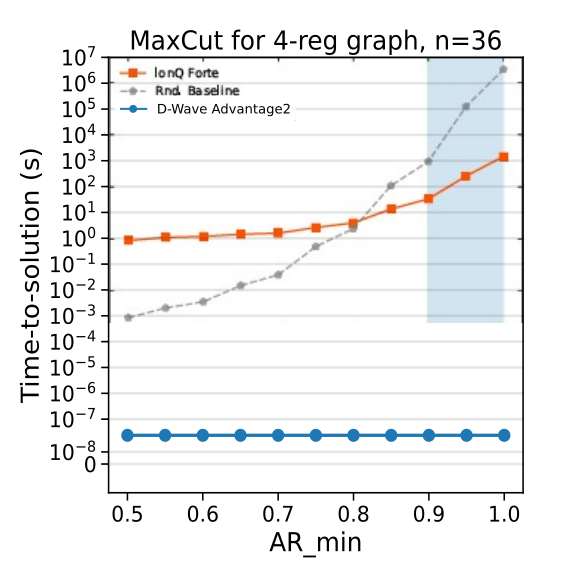
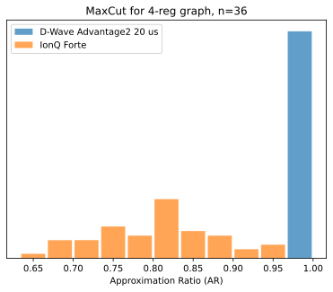

.. _qpu_vignette_maxcut:

====================================================
Quantum Annealing versus LR-QAOA on Max-Cut Problems
====================================================

This is a response to the paper "Measuring what matters: A scalable framework for application-
level quantum benchmarking" [Abo2026]_ by authors at IonQ.
Part of the paper uses LR-QAOA, a variational quantum algorithm, to solve max cut problems
on regular and fully-connected graphs on IonQ Forte. This report compares the results to those
from quantum annealing on D-Wave's Advantage2 system.

Problem Instances
=================

The problems are instances of max cut on 3- and 4-regular graphs on 24 and 36 vertices and
fully-connected graphs on 12 and 16 vertices, with one instance per class. The graphs and
optimal solutions are given in the `GitHub repository <https://github.com/ionq-publications/apps-benchmark/tree/main>`_.

The max cut problem is to partition the vertices of a graph into two sets such that the number
of edges (or the sum of the weights of the edges) between the two sets is maximized.
The Hamiltonian can be expressed as:

.. math:: H[s] = \sum_{(i,j) \in E(G)} w_{ij} s_i s_j,

where :math:`E(G)` is the set of edges in the graph, :math:`w_{ij}` is the weight of the edge
between vertices :math:`i` and :math:`j`, and :math:`s_i` is a spin variable.

Methodology
===========

Since the problem graphs are relatively small compared to the size of D-Wave's Advantage2,
the graphs can be embedded multiple times into a single QPU and sampled from simultaneously.
The best solution from each read is taken to compute the approximation ratio of that sample.
D-Wave's minorminer is used to find parallel minor embeddings of the problem graphs onto the
Advantage2 Zephyr hardware graph topology. The number of embeddings found for each problem
instance is given in the table below:

.. table:: Number of embeddings per problem instance
   :width: 60%

   +---------------------------+----------------------+
   | Graph Type                | Number of Embeddings |
   +===========================+======================+
   | Clique with n=12          | 113                  |
   +---------------------------+----------------------+
   | Clique with n=16          | 66                   |
   +---------------------------+----------------------+
   | 3-regular graph with n=24 | 147                  |
   +---------------------------+----------------------+
   | 3-regular graph with n=36 | 94                   |
   +---------------------------+----------------------+
   | 4-regular graph with n=24 | 127                  |
   +---------------------------+----------------------+
   | 4-regular graph with n=36 | 71                   |
   +---------------------------+----------------------+

Parallel minor embeddings can be found using D-Wave's minorminer. For this study, embeddings were
selected based on a maximum chain length of 4 and best average chain length out of 10.

The problems were run with the ParallelEmbeddingComposite and ScaleComposite with extended J ranges
on D-Wave's Advantage2_system1.
The following code shows an example of creating binary quadratic model (BQM) for a max cut problem,
embedding it multiple times into the QPU, sampling from the QPU, and returning the sampleset.

.. testcode::

    import networkx as nx
    import dimod
    from minorminer import find_embedding
    from dwave.system import ParallelEmbeddingComposite, DWaveSampler
    from dwave.preprocessing.composites import ScaleComposite

    # create problem graph
    G = nx.random_regular_graph(2, 10)

    # create bqm for max cut on G
    bqm = dimod.BinaryQuadraticModel(vartype = dimod.SPIN)

    for u, v, g_data in G.edges(data = True):
        bqm.add_quadratic(int(u), int(v), g_data.get('weight', 1))

    # find parallel minor embeddings of G into the QPU graph
    qpu_sampler = DWaveSampler(solver='Advantage2_system1')
    qpu_graph = qpu_sampler.to_networkx_graph()

    num_embeddings = 10
    parallel_embeddings = []

    for _ in range(num_embeddings):
        embedding = find_embedding(G.edges, qpu_graph)
        if len(embedding) > 0:
            parallel_embeddings.append(embedding)
            qpu_graph.remove_nodes_from([node for val in embedding.values() for node in val])

    # create sampler with parallel embeddings and scale composite
    embedded_sampler = ParallelEmbeddingComposite(ScaleComposite(qpu_sampler), embeddings=parallel_embeddings)

    # sample from the QPU
    sampleset = embedded_sampler.sample(
        bqm,
        num_reads=5,
        annealing_time=20,
        quadratic_range=qpu_sampler.properties["extended_j_range"],
        bias_range=qpu_sampler.properties["h_range"],
        auto_scale=False
    )

Results
=======

Time-to-Solution
----------------

The computation of time per sample used for the results below follows the conventions
from the paper. In the `Benchmarking Verification Report <https://cdn.prod.website-files.com/68836d4838193cb461ebc7d2/69dd6ffef477113de9cb64a0_IonQ_Benchmarking_TTS_Verification_Report.pdf>`_,
the time per shot is computed by taking the total runtime, subtracting some unspecified
overhead time and dividing by the number of shots, which is 5,000. This gives a time per shot of
0.89 seconds for IonQ Forte. Since it is unclear how much overhead was removed, the time per
sample for D-Wave's Advantage2 system is taken to be the annealing time plus the readout time.
For max cut on the 4-regular graph with 36 nodes and 20 :math:`\mu s` annealing time, the time
per sample is 2.37e-08s for D-Wave's Advantage2.

The approximation ratio (AR) of a solution is the energy of that solution divided by the
energy of the optimal solution. The time-to-solution (TTS) at 99% confidence for a specified
value of AR_min is calculated as :math:`TTS = N_{shots}*t_{shot}`, where
:math:`N_{shots} = \ln(0.01)/\ln(1-p_s)`. Here, :math:`p_s` is the proportion of samples whose
AR is greater than or equal to AR_min. The reported TTS is modified to be the maximum
of the computed TTS and the time per sample (:math:`t_{shot}`). Since more than 99% of the
samples from D-Wave's Advantage2 system are at or above all values of AR_min in the plot,
the TTS for D-Wave is equal to the time per sample, which is 2.37e-08s.

The time-to-solution results are displayed in :numref:`Figure %s <vignetteMaxCutTTS>`.
D-Wave's Advantage2 system observes a speedup of 7 to 10 orders of magnitude over IonQ Forte.

    D-Wave's Advantage2 system observes a speedup of 7 to 10 orders of magnitude over IonQ Forte.

Sample Distribution
-------------------

In the `Benchmarking Verification Report <https://cdn.prod.website-files.com/68836d4838193cb461ebc7d2/69dd6ffef477113de9cb64a0_IonQ_Benchmarking_TTS_Verification_Report.pdf>`_,
the estimated time per shot for IonQ Forte is 0.89s. For the max cut problem on the 4-regular
graph with 36 nodes, the percentage of samples above 90% AR is approximately 10% for IonQ Forte.
For D-Wave's Advantage2 with 20 :math:`\mu s` annealing time and 2.37e-08s per sample, the
percentage of samples above 90% AR is 100%. In fact, when taking the best solution found for
each sample of the parallel embeddings of the problem in the QPU, all have an AR of 100%,
corresponding to the optimal solution.

The sample distributions shown in :numref:`Figure %s <vignetteMaxCutHistogram>` include all samples
across all embeddings from D-Wave's Advantage2 system.

    Each sample from D-Wave's Advantage2 system is greater than all samples from IonQ Forte.

Approximation Ratios and Time per Sample
----------------------------------------

The table below shows the approximation ratios and time per sample for IonQ's Aria-1
and Forte-1 systems and D-Wave's Advantage2 system. The reported approximation ratio
(AR) is the mean AR across all samples for a given problem instance. The effective
approximation ratio (AR_eff) is the mean effective AR, which is the AR rescaled
with respect to a random baseline (AR_rand), where :math:`AR_{rand} = \mu_{rand} + 3\sigma_{rand}/\sqrt{5,000}`.
Here, :math:`\mu_{rand}` and :math:`\sigma_{rand}` are the mean and standard deviation
of the ARs taken from 5,000 random samples.

In the original table from the paper, the values
are purported to be effective AR, but some values appear to be regular AR based on
the appearance of the plots. Using the calculated values of AR_rand, the missing values
(whether AR or AR_eff) are estimated and added to the table. The values
reported for D-Wave's Advantage2 system are mean AR and AR_eff with 20 :math:`\mu s`
annealing time.

The results show that quantum annealing on D-Wave's Advantage2 system finds a better mean
approximation ratio for all problems and with much shorter sample times compared to LR-QAOA
on IonQ's Forte and Aria systems. All but one of the mean AR values for D-Wave's Advantage2
system are 1, corresponding to the optimal solution.

.. table:: Approximation Ratios and Time per Sample
   :width: 100%

   +------------------+--------------------------+---------------------------+----------------------------------+-------------------------------+---------------------------------------+
   | Problem Instance | IonQ Aria-1 AR (AR_eff)* | IonQ Forte-1 AR (AR_eff)* | IonQ Forte-1 Time per Sample (s) | D-Wave Advantage2 AR (AR_eff) | D-Wave Advantage2 Time per Sample (s) |
   +==================+==========================+===========================+==================================+===============================+=======================================+
   | 3-reg, n=24      | --                       | 0.8390(0.6123)            | --                               | 1.0(1.0)                      | 2.36e-08                              |
   +------------------+--------------------------+---------------------------+----------------------------------+-------------------------------+---------------------------------------+
   | 3-reg, n=36      | --                       | 0.7841(0.5280)            | --                               | 1.0(1.0)                      | 2.37e-08                              |
   +------------------+--------------------------+---------------------------+----------------------------------+-------------------------------+---------------------------------------+
   | 4-reg, n=24      | --                       | 0.8668(0.6365)            | --                               | 1.0(1.0)                      | 2.38e-08                              |
   +------------------+--------------------------+---------------------------+----------------------------------+-------------------------------+---------------------------------------+
   | 4-reg, n=36      | --                       | 0.8009(0.5197)            | 0.89                             | 1.0(1.0)                      | 2.37e-08                              |
   +------------------+--------------------------+---------------------------+----------------------------------+-------------------------------+---------------------------------------+
   | FCW, n=12        | 0.8711(0.3728)           | 0.8669(0.3821)            | --                               | 1.0(1.0)                      | 2.44e-08                              |
   +------------------+--------------------------+---------------------------+----------------------------------+-------------------------------+---------------------------------------+
   | FCW, n=16        | --                       | 0.8459(0.2504)            | --                               | 0.995(0.9757)                 | 2.33e-08                              |
   +------------------+--------------------------+---------------------------+----------------------------------+-------------------------------+---------------------------------------+

