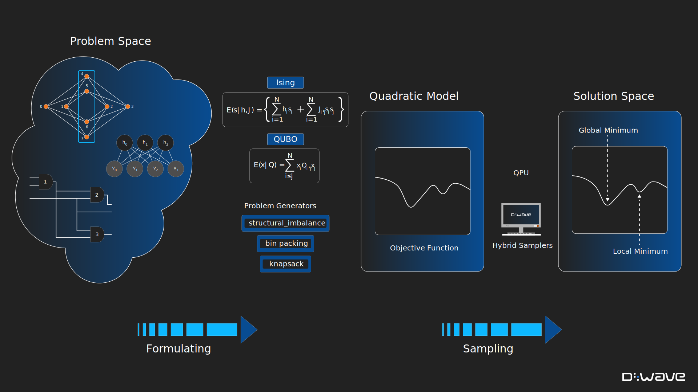
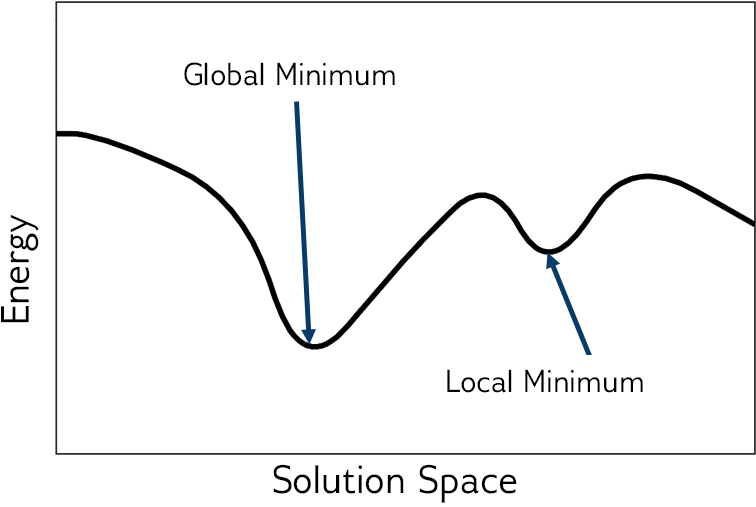
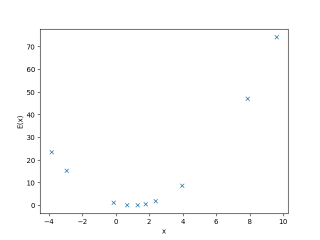

.. |figSolutionOverview| replace:: dummy

.. start_workflow_intro

The two main steps of solving problems using quantum computers are:

1.  **Formulate**\ [#]_ **your problem as an objective function**

    An :term:`objective function` (cost function) is a mathematical expression
    of the problem to be optimized; for quantum computing, these are
    quadratic and (for some :term:`hybrid` :term:`solvers <solver>`) nonlinear
    :ref:`models <concept_models>` that have lowest values (energy) for good
    solutions to the problems they represent.

2.  **Find good solutions by sampling**

    :ref:`Samplers <concept_samplers>` are processes that sample from low-energy
    states of objective functions. Find good solutions by submitting your model
    to one of a variety of |dwave_short|'s quantum, classical, and hybrid
    quantum-classical samplers.

.. todo:: Ask Michael to refresh this graphic

    Solution steps: (1) a problem known in "problem space" (a circuit of Boolean
    gates, a graph, a network, etc) is formulated as a model, mathematically or
    using Ocean functionality, and (2) the model is sampled for solutions.

.. note::
    Samplers run---either remotely (for example, in the
    `Leap <https://cloud.dwavesys.com/leap/>`_ service) or locally on your
    CPU---on compute resources known as :term:`solvers <solver>`. (Note that
    some classical samplers actually brute-force solve small problems rather
    than sample, and these are also referred to as solvers.)

.. [#]
    For quantum computing, as for classical, solving a problem requires that it
    be formulated in a way the computer and its software understand. For
    example, if you want your laptop to calculate the area of a $1 coin, you
    might express the problem as an equation, :math:`A=\pi r^2`, that you
    program as :code:`math.pi*13.245**2` in your Python terminal. For a laptop
    with Python software, this formulation---a particular string of alphanumeric
    symbols---causes the manipulation of bits in a CPU and memory chips that
    produces the correct result.

.. end_workflow_intro

.. |figObjectiveFunction| replace:: dummy

.. start_objective

To express a problem for a |dwave_short| :term:`solver` in a form that enables
solution by minimization, you need an *objective function*, a mathematical
expression of the energy of a system. When the solver is a :term:`QPU`, the
energy is a function of binary :ref:`variables <concept_variables>` representing
its qubits\ [#]_\ ; for quantum-classical :term:`hybrid` solvers, the objective
function might be more abstract\ [#]_\ .

    Energy of the objective function.

For most problems, the lower the energy of the objective function, the better
the solution. Sometimes any low-energy state is an acceptable solution to the
original problem; for other problems, only optimal solutions are acceptable. The
best solutions typically correspond to the *global minimum* energy in the
solution space; see the figure above.

There are many ways of mapping between a problem---chains of amino acids forming
3D structures of folded proteins, traffic in the streets of Beijing, circuits of
binary gates---and an objective function to be solved (by sampling) with a
|dwave_short| quantum computer, :term:`hybrid` solver, or locally on your CPU.
The :ref:`qpu_index_examples_beginner` and :ref:`opt_index_examples_beginner`
show some simple objective functions to help you begin.

For more detailed information on objective functions, how |dwave_short| quantum
computers minimize objective functions, see the
:ref:`qpu_quantum_annealing_intro` section; for techniques for reformulating
problems as objective functions, see the :ref:`qpu_reformulating` section.

For code examples that formulate models for various problems, see
`D-Wave's examples repo <https://github.com/dwave-examples>`_  and many example
customer applications on the `D-Wave website <https://www.dwavesys.com/>`_.

.. [#]
    If you are solving your problem directly on a |dwave_short| quantum
    computer, the system is the qubits of a quantum processing unit
    (:term:`QPU`) and your objective function represents the states of the
    qubits as binary variables, and the physical biases and couplings applied to
    these qubits as, respectively, linear and quadratic coefficients. By
    formulating an objective function such that lowest energy states represent
    good solutions to your problem, you can solve your problem by minimizing the
    objective function. In the case of a |dwave_short| quantum computer, the QPU
    uses :term:`quantum annealing` to seek the minimum of the energy landscape
    for its qubits with the biases and couplings applied by your objective
    function.

.. [#]
    For hybrid solvers, some parts of the objective function are minimized using
    classical heuristics and some by the QPU.

.. end_objective

.. start_simple_objective_example

As an illustrative example, consider solving a simple equation, :math:`x+1=2`,
not by the standard algebraic techniques but by formulating an objective that
at its minimum value assigns a value to the variable, :math:`x`, that is also
a good solution to the original equation.

Taking the square of the subtraction of one side from another, you can formulate
the following objective function to minimize:

.. math::

    \text{E}(x) &= [2-(x+1)]^2

    &= (1-x)^2

In this case minimization, :math:`\min_x{(1-x)^2}`, seeks the shortest distance
between the sides of the original equation, which occurs at equality (with the
square eliminating negative distance).

.. end_simple_objective_example

.. start_samplers

:ref:`Samplers <concept_samplers>` are processes that sample from low-energy
states of objective functions. Having formulated an :term:`objective function`
that represents your problem (typically as a quadratic or nonlinear
:ref:`model <concept_models>`), you sample it for solutions.

|dwave_short| provides quantum, classical, and quantum-classical hybrid samplers
that run either remotely (for example, in |dwave_short|'s Leap service) or
locally on your CPU.

*   QPU Solvers

    |dwave_short| currently supports |dwave_5kq| quantum computers.

*   Quantum-Classical Hybrid Solvers

    Quantum-classical hybrid is the use of both classical and quantum resources
    to solve problems, exploiting the complementary strengths that each
    provides. For an overview of, and motivation for, hybrid computing, see:
    `Medium Article on Hybrid Computing <https://medium.com/d-wave/three-truths-and-the-advent-of-hybrid-quantum-computing-1941ba46ff8c>`_.

    |dwave_short| provides two types of hybrid solvers:
    :ref:`Leap service's hybrid solvers <opt_index_hybrid_solvers>`, which are
    cloud-based hybrid compute resources, and hybrid solvers developed in Ocean
    software's :ref:`dwave-hybrid <index_hybrid>` tool.

*   Classical Solvers

    You might use a classical solver while developing your code or on a small
    version of your problem to verify your code.

    For information on classical solvers, see the :ref:`qpu_classical_intro`
    section.

.. end_samplers

.. |figSimpleRandomSampler| replace:: dummy
.. |simple_objective_example_ref| replace:: dummy

.. start_simple_sampler_example

As an illustrative example, consider solving by sampling the objective,
:math:`\text{E}(x) = (1-x)^2` found in the |simple_objective_example_ref|
example above to represent equation, :math:`x+1=2`.

This example creates a simple sampler that generates 10 random values of the
variable :math:`x` and selects the one that produces the lowest value of the
objective:

>>> import random
...
>>> x = [random.uniform(-10, 10) for i in range(10)]
>>> e = list(map(lambda x: (1-x)**2, x))
>>> best_found = x[e.index(min(e))]

One particular execution found this best solution:

>>> print('x_i = ' + ' , '.join(f'{x_i:.2f}' for x_i in x))     # doctest: +SKIP
x_i = 7.87, 1.79, 9.61, 2.37, 0.68, -2.93, 3.96, 1.30, -3.85, -0.13
>>> print('e_i = ' + ', '.join(f'{e_i:.2f}' for e_i in e))      # doctest: +SKIP
e_i = 47.23, 0.63, 74.19, 1.89, 0.10, 15.44, 8.77, 0.09, 23.50, 1.28
>>> print("Best solution found is {:.2f}".format(best_found))   # doctest: +SKIP
Best solution found is 1.30

The figure below shows the value of the objective function for the random values
of :math:`x` chosen in the execution above. The minimum distance between the
sides of the original equation, which occurs at equality, has the lowest value
(energy) of :math:`\text{E}(x)`.

    Values of the objective function, :math:`\text{E}(x) = (1-x)^2`, versus
    random values of :math:`x` selected by a simple random sampler.

.. end_simple_sampler_example

